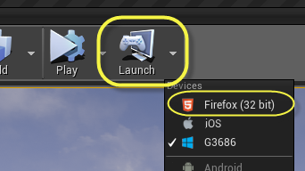
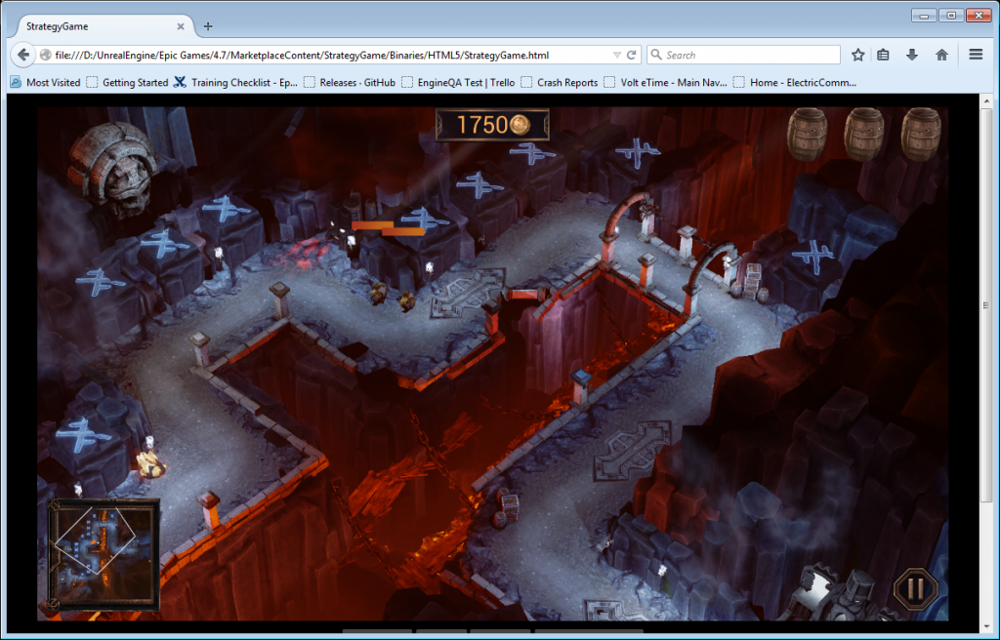

高人氣遊戲《戰爭機器 (Gears of War)》製作公司「Epic Games」在發表 Unreal Engine 4.7 的同時，一併加入了 HTML5 匯出功能並成為該引擎 Windows 版本的標準功能。屬於全球最進階遊戲引擎之一的 Unreal Engine，也透過此功能在瀏覽器上達到更令人驚艷的遊戲畫面。開發者將能夠以 Unreal Engine 4.7 打造遊戲內容、立刻編譯至 Web 之上，並只要輕鬆點擊滑鼠就能用自己所選的瀏覽器開始遊戲。

Epic Games 在 WebGL 與 HTML5 上持續數個月的開發成果，已進入 Unreal Engine 4 原始碼，並於去年漸趨成熟。雖然目前仍為預備釋出 (Pre-release) 版本，但 HTML5 輸出結果足以讓開發者建構遊戲內容並提供反饋意見。Mozilla 很高興能持續支援 Epic Games 將此絕佳的遊戲引擎導入 Web。

Unreal Engine 4 輸出效果的截圖

在即將到來的遊戲開發者大會 (Game Developer Conference，GDC) 上，Mozilla 會透過該技術的不同角度發表系列文章，期能將原生引擎帶入 Web。我們亦將於展位上呈現多項新一代的 Web 技術，包含 Unreal Engine 4 所打造的「WebVR」。此引擎所輸出的內容亦將用於展示 Firefox 開發者工具之功能，及其在此類型內容的應用方式。

Mozilla 另將參與 Epic 的 HTML5 匯出功能展示活動。有興趣的開發者可於當地時間的 3 月 5 日 (Thu.) 14:00，於 Twitch 觀看現場直播；或至 [www.twitch.tv/unrealengine](https://www.twitch.tv/unrealengine)。

若要進一步了解 Epic Games 的新聞與介紹，可參閱其[部落格](https://www.unrealengine.com/blog/unreal-engine-47-released)上的相關說明。

可至 Firefox 展位 (South Hall Booth #2110) 關心 Web 的未來趨勢，或到 Epic Games 展位 (South Hall Booth #1024) 進一步了解 Unreal Engine 4.7。

原文連結：[Unreal Engine 4.7 Binary Release Includes HTML5 Export](https://blog.mozilla.org/blog/2015/02/24/unreal-engine-4-7-binary-release-includes-html5-export-3/)
