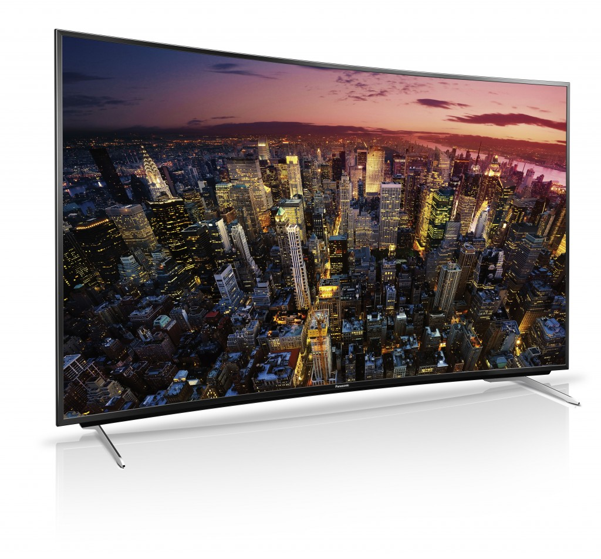

Mozilla、KDDI、LG U+、Telefonica、Verizon 攜手打造新型態 Firefox OS 行動裝置

並與 Orange 及 ALCATEL ONETOUCH 同步發表首款搭載聯發科處理器 Firefox OS 手機

以捍衛 Web 自由與開放為使命的 Mozilla，即將於巴塞隆納所登場的世界通訊大會 (MWC 2015) 上，發表更多 Firefox OS 生態系統的合作夥伴與新款裝置。Mozilla 除了宣佈將與 Verizon、KDDI 等多家電信商合作開發新型態行動裝置，Orange 電信與 AlCATEL ONETOUCH 也將於第二季於非洲與中東等 13 國推出首款搭載聯發科 (MediaTek) 處理器的 Firefox OS 手機。

過去一年，Firefox OS 不僅實現了全球最親民價格的智慧型手機，更成功拓展至 4K Ultra HD TV 上。Mozilla 總裁宮力博士指出：「在兩年前，Firefox OS 還是一個概念與承諾。而在 MWC 2014 ，我們已讓多種不同規格與價位區間的裝置搭載 Firefox OS。時至今日，我們很高興 Firefox OS 不僅能突破行動電話的範疇，登上數十款數位裝置，並現身於全球各大洲的多國市場，成功引領開放式行動平台的創新風潮。此外，我們也很榮幸 Firefox OS 平台已有來自全球 3 家主要行動晶片大廠的奧援。」

#### Firefox OS 於 MWC 2015 的重要發表：

- Mozilla 、 KDDI 、 LG U+ 、 Telefonica 、 Verizon Wireless 合作打造新形態行動裝置，將重新定義直覺且簡單易用的裝置： 這些公司協力合作支持 Mozilla 社群，將於 2016 年推出多樣化的 Firefox OS 新手機，從折疊式 (Flips)、滑蓋式 (Sliders)，乃至於直立式 (Slates)。新款裝置將在功能型手機的既有功能 (撥打電話、文字簡訊) 以及智慧型手機的進階功能 (多樣化 App、相機、影片、內容、瀏覽、音樂播放、電子郵件、網路瀏覽、電子郵件、LTE、VoLTE) 之間取得平衡。

- [Orange 電信宣佈](https://www.orange.com/en/press/Orange-Mobile-World-Congress-2015/Virtual-Press-Room) 將以新數位行動服務帶領 Firefox OS 進入 13 個新市場： Orange 將進入廣大的非洲與中東地區，以美金 $40 起的費率，透過 Orange Klif 提供行動數位服務，包含資料、語音、文字等內容傳輸組合，期望將訂立新的行動費率標準。此一新服務勢必將掀起另一波區域性的數據與智慧型手機的普及風潮，將行動網路帶給以往無法接觸到 Web 的數百萬人。 Orange 所獨家提供的 3G Firefox OS 智慧型手機，將今年第二季開始發行於 Orange 的 13 個新市場，包含埃及 (Egypt)、塞內加爾 (Senegal)、突尼西亞 (Tunisia)、喀麥隆 (Cameroon)、波札那 (Botswana)、馬達加斯加 (Madagascar)、馬利 (Mali)、象牙海岸 (The Ivory Coast)、約旦 (Jordan)、尼日 (Niger)、肯亞 (Kenya)、模里西斯 (Mauritius)、萬那度 (Vanuatu)。當然後續將有更多國家加入。而 ALCATEL ONETOUCH 也於今日同步發表與 Orange 合作此一新款手機的相關細節：

- ALCATEL ONETOUCH 以最新款「Orange Klif」拓展行動網路，其為首款搭載聯發科晶片 Firefox OS 手機： [Orange Klif](https://www.alcatelonetouch.com/global-en/news/pressroom.html) 可達最高 21 Mbps 連線速度，並搭載雙 SIM 卡功能、兩百萬畫素相機、micro-SD 記憶卡插槽。除了高度最佳化的 Firefox OS 之外，亦能真正無縫接軌 Web 瀏覽體驗，提供可立即上網的強大套件。Orange Klif 也是第一款搭載聯發科 (MediaTek) 處理器的 Firefox OS 手機。

- Mozilla 也揭櫫下一版 Firefox OS 的相關細節，例如更強化的效能、支援多核心處理器、更注重隱私的功能、更多對於 WebRTC 的支援、從右至左語言(Right to left language support)、NFC 付款架構等。

- [KDDI Corporation 亦於本週稍早宣佈對 Monohm 的投資計畫](https://news.kddi.com/kddi/corporate/english/newsrelease/2015/02/27/960.html)。位於美國的 Monohm，是以 Firefox OS 為平台，開發創新的物連網 (IoT) 裝置。Monohm 首款產品「Runcible」將現身於 MWC 2015 的 Mozilla 展區。

Firefox OS 生態系統則會繼續加入新的合作夥伴與裝置，擴及[松下電器 (Panasonic) 的 4K Ultra HD TV](https://news.panasonic.co.uk/pressreleases/panasonic-unveils-new-my-home-screen-2-0-tv-user-interface-powered-by-firefox-os-1120532) ，到全球最平民價位的智慧型手機。

Cherry Mobile 執行長 Maynard Ngu 表示：「幾個月前，Cherry Mobile 才剛發表了菲律賓境內的第一支 Firefox OS 智慧型手機 Cherry Mobile ACE，同時也是全球價格最親民的智慧型手機。我們很高興看到 ACE 仍持續獲得市場的正面反應，並協助許多功能性手機的消費者轉用智慧型手機。透過與 Mozilla Firefox OS 的密切合作，我們將繼續帶來更多高品質的平價手機。」

在今天的發表活動之後，Firefox OS 將搭配全球具領導地位的電信共發售 17 款手機，並於明年在超過 40 個國家上巿。

Firefox OS 釋放了 Web 平台的力量，並跨越市場與裝置種類而持續擴充版圖，引領我們朝向物聯網 (Internet of Things；IOT) 邁進。而其開放的 Web 技術，更有利於開發者、電信商、硬體製造商持續打造創新且客製化的 App 與產品，讓消費者能悠遊於連網裝置之間。

#### 於行動裝置上建構行動內容

Mozilla 另於今天發表 Webmaker 測試版 (Beta)。此免費且開放原始碼的行動內容建構 App，可大幅簡化傳統的 Web 建構方式。Webmaker 可支援 Android 與 Firefox OS，亦可透過最新版行動瀏覽器而用於其他裝置之上，並將於今年稍晚提供超過 20 種語言版本。若需要更多資訊，可至 [webmaker.org/localweb](https://webmaker.org/localweb)。

#### 更多 Mozilla at MWC 2015 相關訊息

- Mozilla 展區資訊：西班牙巴塞隆納 Fira Gran Via, Hall 3, Stand 3C30

- 了解更多 Mozilla 在 MWC 的內容：[http://www.mozilla.org/mwc](https://www.mozilla.org/mwc)

- 即時 Mozilla 訊息，請參閱美商謀智部落格：[http://blog.mozilla.com.tw/main](https://blog.mozilla.com.tw/main)

- 最新 Mozilla 新聞發佈，請參閱美商謀智新聞室：http://blog.mozilla.com.tw/press

 

原文連結：[Firefox OS Proves Flexibility of Web: Ecosystem Expands with More Partners, Device Categories and Regions in 2015](https://blog.mozilla.org/blog/2015/03/01/firefox-os-proves-flexibility-of-web-ecosystem/)
