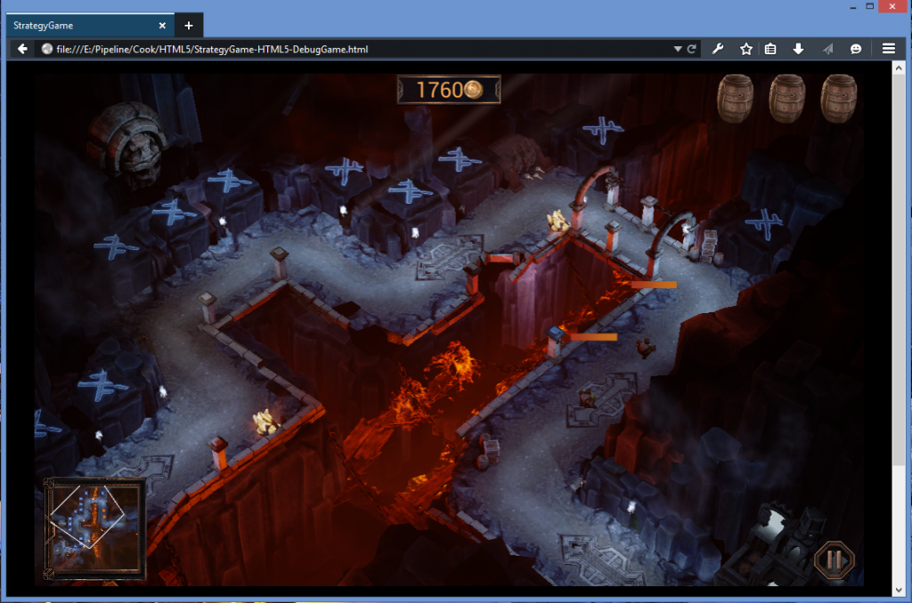
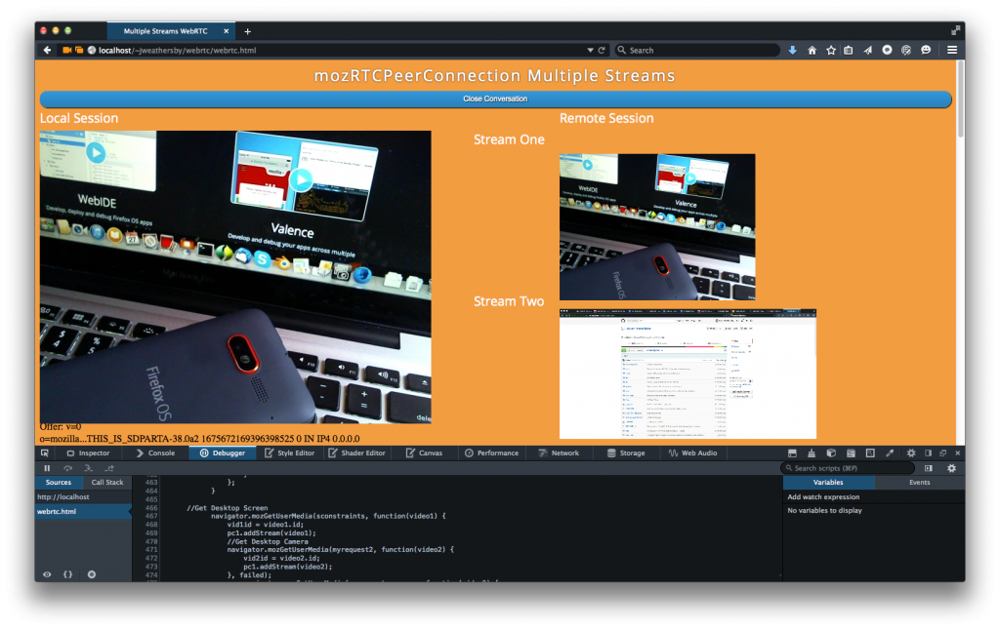
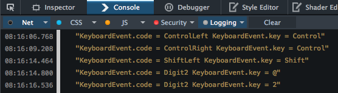
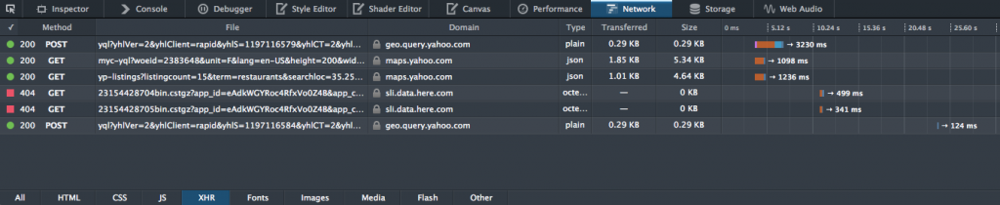
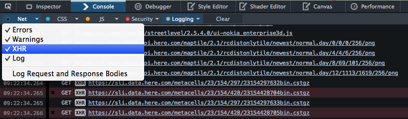

### 現提供 64 位元版本，當然還有更多功能

Mozilla 在慶祝 Firefox 十歲生日的同時，亦發表了 Firefox 開發者 (Developer) 版本，也是首款特別為開發者所打造的瀏覽器。我們在當時另一併宣佈了 Firefox 的 64 位元版本計畫。今天很高興向大家宣佈此計畫的下個階段：除了已支援的 OS X 與 Linux 平台之外，64 位元的 Firefox 開發者版本現已可安裝於 Windows 上使用。

若要透過瀏覽器提供豐富體驗且能媲美桌機版 App 的品質，64 位元版本絕對是重要的一步。先來看看此版本中值得搶先一提的功能。如果你還沒下載開發者版本，那還在等什麼？

在 Windows 的 64 位元開發者版本中執行 Unreal 展示程式

#### 可執行更大型的 App

32 位元版本瀏覽器受限於 4GB 位址空間。而這種空間容量又會因眾多規格所造成的分化 (Fragmentation) 問題而更為狹小，同時 Web App 只會越來越大。若遊戲是以瀏覽器為執行平台，且要達到如原生 App 的高效能 ─ 即如 Epic Games 公司的「Unreal Engine」─ 則往往遠超出傳統 Web App 的容量。這些遊戲具備大量檔案，且必須儲存於記憶體以利同步載入。

對這類大型 App 來說，64 位元瀏覽器就可決定是否能順利執行該 App。以 asm.js 移植遊戲為例，若使用 32 位元瀏覽器，則只建議保留 512mb 的記憶體「Heap」容量。但 64 位元版本 Firefox 就可達到最高 2GB 容量。

Emscripten 亦可協助移植 C 與 C++ 程式碼，並在 Web 上達到原生 App 的效能。若要進一步了解應如何在 asm.js/emscripten 版本的 App 上，以各種方式儲存與存取檔案系統。可參閱 Alon Zakai 所撰寫的〈[Synchronous Execution and Filesystem Access in Emscripten](https://hacks.mozilla.org/2015/02/synchronous-execution-and-filesystem-access-in-emscripten/)〉一文。

#### 更快的執行速度與更高的安全性

64 位元 Firefox 的速度只會更快。我們透過新的暫存器與指令來加速 JavaScript 程式碼。

對 asm.js 程式碼來說，更大的位址空間有利於使用硬體記憶體保護功能，以安全移除 asm.js  存取記憶體  Heap 的邊界檢查 (Bounds check)。此提升效果甚為顯著。依照[arewefastyet.com](https://arewefastyet.com/#machine=29&view=breakdown&suite=asmjs-apps) 所提供的 asmjs-apps-*-throughput 測試結果，可達到 8% ~ 17% 的幅度。

而更大的 64 位元位址空間，亦同樣提升了「[位址空間配置隨機載入](https://www.wikiwand.com/en/Address_space_layout_randomization) (Address Space Layout Randomization，[ASLR](https://www.wikiwand.com/en/Address_space_layout_randomization))」的效率，讓 Web 內容在瀏覽器上達到更出色的效果。

#### Firefox 開發者版本增加＼提升之處

除了 64 位元所提升的效能之外，Firefox 38 開發者版本同樣依循每六週更新的慣例，提供多項新功能。以下先說明其中數項功能。若要進一步了解細節與處理中的錯誤，可參閱[版本說明](https://www.mozilla.org/en-US/firefox/38.0a2/auroranotes/)。

WebRTC 的變化

從 2013 年起的 WebRTC 相關文章，我們說明了 WebRTC 在[mozRTCPeerConnection](https://developer.mozilla.org/en-US/docs/Web/API/RTCPeerConnection) 的[某些替代方案及限制](https://hacks.mozilla.org/2013/09/webrtc-update-and-workarounds/)。其中提過的一項替代方案，是關於如何在一組 mozRTCPeerConnection 中增添 [MediaStreams](https://developer.mozilla.org/en-US/docs/Web/API/MediaStream_API)，並在現有的對話連線上重新協商 (Renegotiation)。

新的 Firefox 開發者版本則修正了這些問題。我們現在可在單一 WebRTC 對話中，新增多個媒體串流 (相機、畫面分享、音訊串流) 至同一 mozRTCPeerConnection 之內。如此可讓開發者針對各額外串流來呼叫[addStream](https://developer.mozilla.org/en-US/docs/Web/API/RTCPeerConnection/addStream) 函式，藉此依序觸發相對應的[onAddStream](https://developer.mozilla.org/en-US/docs/Web/API/RTCPeerConnection/onaddstream) 事件。

重新協商作業讓通話期間亦能修改串流，例如在對話期間分享畫面串流。現已不需再重新建立對話連線。

多重串流的 WebRTC

我們另剛宣佈〈[Firefox 38 開始支援 WebRTC 所需的 Perfect Forward Secrecy (PFS)](https://hacks.mozilla.org/2015/02/webrtc-requires-perfect-forward-secrecy-pfs-starting-in-firefox-38/)〉。接下來將透過更多文章逐一探討 WebRTC 建置實例的細節，敬請期待。

BroadcastChannel API

只要網頁內容的來源及其所使用的瀏覽器均相同，現均可透過 BroadcastChannel API 在瀏覽器內容之間傳遞簡單的訊息。可參閱〈[BroadcastChannel API 現已進入 Firefox 38](https://blog.mozilla.com.tw/posts/7083)〉進一步了解。

支援 KeyboardEvent.code

[KeyboardEvent.code](https://developer.mozilla.org/en-US/docs/Web/API/KeyboardEvent/code) 現已預設啟用。此「code」的屬性可讓開發者決定應按下哪個實體按鍵，而不需要修改鍵盤配置或鍵盤狀態。

KeyboardEvent.code 的屬性

可參閱 UI Events Specification (一般為 DOM Level 3 Events) 中的[「motivation」](https://dvcs.w3.org/hg/dom3events/raw-file/tip/html/DOM3-Events.html#code-motivation)，了解更多使用條件的範例。

XHR 記錄

「[網路監測器 (Network Monitor)](https://developer.mozilla.org/en-US/docs/Tools/Network_Monitor)」現可顯示大量的[XMLHttpRequests](https://developer.mozilla.org/en-US/docs/Web/API/XMLHttpRequest/Using_XMLHttpRequest) 資訊，但往往是用主控台 (Console) 搭配網路請求來進行程式碼的除錯。在最新的 Firefox 開發者版本中，現可於主控台的記錄 (Logging) 篩選設定中啟用 XMLHttpRequests 的資料顯示。

網路監測器的 XHR Request

主控台中的 XHR 記錄作業

讓我們知道你的想法

此版本另強化了更多功能。[立刻下載](https://www.mozilla.org/en-US/firefox/developer/all/)並通知其他人吧！

當然，你也能參考[開發者版本的說明](https://www.mozilla.org/en-US/firefox/38.0a2/auroranotes/)。歡迎隨時透過 [UserVoice 頻道](https://ffdevtools.uservoice.com/forums/246087-firefox-developer-tools-ideas)分享你的意見，或建議未來的可能功能。

原文連結：[Firefox Developer Edition 38: 64-bits and more](https://hacks.mozilla.org/2015/03/firefox-developer-edition-38-64-bits-and-more/)
