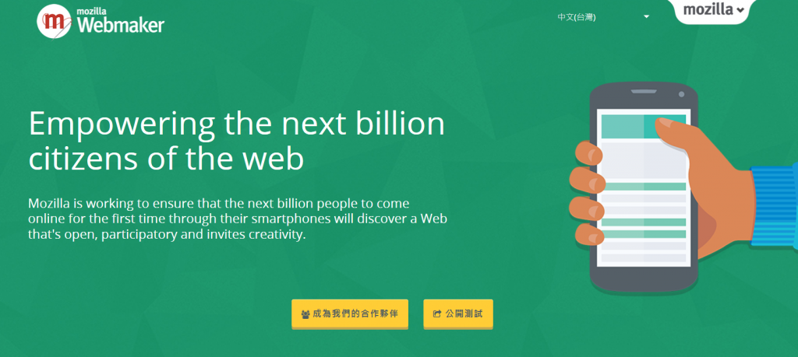

在巴塞隆納的世界行動通訊大會 (MWC) 上，Mozilla 發表「Webmaker」[App](https://webmaker.org/localweb) 測試版本。此免費且獨立的 Web 發佈工具，將是 Mozilla 提升全球數位素養的重要一步。

Webmaker App 是根據孟加拉 (Bangladesh)、印度 (India)、肯亞 (Kenya) 當地一年期[研究](https://webmaker.org/localweb#moi-understanding-users)的結果而發想。此份研究指出 1). 剛接觸智慧型手機的使用者仍往往須耗時學習，並容易受限於基本 App (如 Facebook)，甚至[不知道＼未意識到](https://qz.com/333313/milliions-of-facebook-users-have-no-idea-theyre-using-the-internet/)自己已經上網了。另外，2). 使用者渴望能打造本地相關的內容，當然也能因此受益良多。

Webmaker App 就是為了滿足這類需求所設計，可讓任何人在開啟自己的第一支智慧型手機時，隨即迅速發佈 App 或網站。學生能為同儕建立數位布告欄，教師能建立並發佈課程計畫，商家亦可設計網頁以推銷自己的產品。

針對剛接觸智慧型手機的使用者，要讓他們在上網同時就迅速打造東西，也協助這些人能逐漸做出更完整的內容。此數位素養的「先做再說」概念，將鼓勵大家成為主動的創造者，而不只是被動的消費者而已。在接下來幾年內，對數十億首次接觸網路且受到「我為何，又該如何使用網路」問題困擾的人來說，這個心態絕對關鍵。

Webmaker App 免費並開放源碼，且提供超過 20 種語言的版本。使用者只要透過文字簡訊、Facebook、WhatsApp，以及其他更多程式，就能用簡單的網址分享自己的作品。用 Webmaker 建構的內容可載入任何行動版瀏覽器。目前開放測試的版本可用於 Android、Firefox OS，及其他新版的行動瀏覽器。今年稍晚就會規劃完整版本。

建構完整的 Webmaker App，一直是 Mozilla 長遠的面對面學習方案。由志願的自造者、輔導員、教育者所組成的學習網路，已於超過 80 個國家中運作。這些志工均透過 Webmaker App 與其他工具，在學校、圖書館，以及其他公共場所舉辦非正式的工作坊，期能協助大家了解 Web 運作方式，並設計出日常生活相關的內容。光是去年一年，Mozilla 志工就在 450 座城市舉辦了 2,513 場工作坊。

而所有提升數位素養的活動，都是由合作夥伴主導而成。Mozilla 的[合作夥伴](https://webmaker.org/localweb#partner)包含非政府組織、行動服務營運商，以及其他全球性的組織，希望讓最需要的人都能接觸到我們的數位素養專案。仍不斷有高影響力的夥伴加入我們，並分享其對 Open Web、當地內容、協助使用者的熱忱。

在數十億名剛接觸 Web 的人真正上網時，就能發現此平台可供建立內容並依自己的需求量身打造，以豐富每天的生活、工作、學習等活動。雖然這聽起來是很大的野心，但 Mozilla 已準備好實踐此一理想。如果你想參與或進一步了解我們的數位素養方案，可至 [webmaker.org/localweb](https://webmaker.org/localweb)。

─ By [Mark Surman](https://blog.mozilla.org/blog/author/markmozillafoundation-org/)

原文連結：[Webmaker App Takes Fresh Approach to Digital Literacy](https://blog.mozilla.org/blog/2015/03/01/webmaker-app-takes-fresh-approach-to-digital-literacy/)
