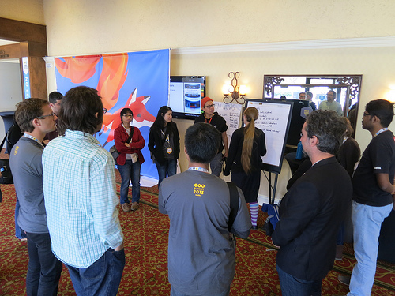
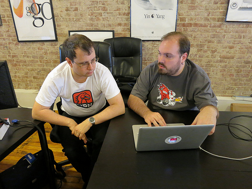

最近十年來，Mozilla 開發者社群網站 (Mozilla Developer Network，[MDN](https://developer.mozilla.org/)) 已經成為[數百萬名](https://wiki.mozilla.org/images/c/ce/MDN-2014-Review.pdf) Web 與行動開發者的重要技術資訊來源。雖然目前每個月都有數百名開發者為 MDN 熱情貢獻，但我們知道還是有許多 Web 高手尚未參與。MDN 與 Web 絕對能受益於這些人的知識＼技術，因此 Mozilla 要啟動研究方案，激勵這些高手貢獻己身所長。

Tristan Nitot 於 Summit 2013 所攝。

#### 方案性質為何

兼差型的「[MDN 研究方案](https://developer.mozilla.org/en-US/fellowship)」，是為期 7 週、每週 5 ~ 10 小時的教育與領導方案，並將讓 Web＼行動開發高手搭配 Mozilla 的工程＼教學專家，合力打造高影響力的重要 Web 專案。研究員可透過 App 開發、撰寫 API 說明、針對專案於 MDN 上設計課程等方式來貢獻。專案導師也會為研究員提供實機操作課程，且 Mozilla 專家另將訓練並傳授課程開發技巧，達到教學相長的效果。

#### 方案概述

以下提供其中幾項技術主題，以及由首批 MDN 研究員確認過的相關專案作業。

- [ServiceWorkers](https://developer.mozilla.org/en-US/docs/Web/API/ServiceWorker) 主要作為 Web App、瀏覽器、網路 (若有可用網路) 之間的代理伺服器 。[ServiceWorkers](https://developer.mozilla.org/en-US/docs/Web/API/ServiceWorker) 也是 Web App 是否成功的關鍵，除了能提供不錯的離線經驗，亦可存取推播通知與背景同步 API。 你所能參與的部分： 撰寫展示用的 Web App (全新或現成均可)，以呈現 Service Worker 的功能，並提供 API 的詳細說明。[ServiceWorkers](https://developer.mozilla.org/en-US/docs/Web/API/ServiceWorker) 主要作為 Web App、瀏覽器、網路 (若有可用網路) 之間的代理伺服器 。[ServiceWorkers](https://developer.mozilla.org/en-US/docs/Web/API/ServiceWorker) 也是 Web App 是否成功的關鍵，除了能提供不錯的離線經驗，亦可存取推播通知與背景同步 API。

- WebGL 是 OpenGL 家族的最新成員，為即時繪圖 (Immediate-mode) API。 在發佈 WebGL 2.0 規格的標準化結果之後，[WebGL](https://developer.mozilla.org/en-US/docs/Web/WebGL) 將在今年新加入酷炫的新功能。 你所能參與的部分： 擬定 MDN 線上課程，指導剛接觸圖像運算的 WebGL API 開發者。

- Web App 效能 。影響[App 效能](https://developer.mozilla.org/en-US/Apps/Build/Performance)的因素眾多，如所提供的內容、互動性、繪圖作業等。要找到並突破效能瓶頸，就必須為瀏覽器的繪圖與連線作業打造工具，另需考量使用者的感受 (這也往往更重要)。 你所能參與的部分： 擬定 MDN 線上課程，指導開發者能夠熟用效能工具，並開發高效能的 Web App。

- TestTheWebForward 。Mozilla 是[TestTheWebForward](https://testthewebforward.org/) 進入 W3C 的重要推手。此為社群所主導的 Open Web 平台測試機制。 你所能參與的部分： 審核現有的多樣技術規格，找出說明文件與實際情況之間的差距。重新界定目前的測試作業，以因應跨瀏覽器的測試需求。

- MDN 課程開發。MDN 為數百萬名開發者提供可信賴的資源。而在 2015 年，MDN 另將透過「Content Kits」工具包加大服務範圍。此工具包內含程式碼範例、影片截圖與展示，還有更多內容。 你所能參與的部分： 監督關鍵 Web 技術的課程設計，並開發程式碼範例、影片、互動實作，以及其他重要教學要素。你也可以針對某個主題領域提案 (例如 Web 的虛擬實境、網路安全、CSS 等)，或依照你的專長領域配合 Mozilla 專案的優先順序一起合作。

WebGL 專案導師[Nick Desaulniers](https://github.com/nickdesaulniers) 就說：「我很期待能與研究員合作，打造更平易近人的初階即時繪圖機制。」你可參閱[MDN Fellowship](https://developer.mozilla.org/en-US/fellowship) 頁面以進一步了解個專案資訊，如專案導師以及所需的技術與經驗類型。

Tristan Nitot 所攝。

#### 申請方式

如果你有興趣參與任何專案，可至[網站](https://developer.mozilla.org/en-US/fellowship)上取得相關資訊，並於 4 月 1 日之前申請加入。我們將於 5 月宣佈入選的研究員，再於 6 月齊聚研究員與導師，讓大家互相熟悉之後就開始專案。接下來的六週內，你能在家中與自己的導師配合進行專案。你會收到導師或其他開發者的反饋意見，逐步修正自己工作的方向。

時間如下：

- 即日起到 4 月 1 日：申請！

- 4 月：面談最後的候選人。

- 5 月：宣佈入選的研究員。

- 6 月 (確切日期與位置再宣佈)：於 Mozilla Space 宣佈研究方向。

- 6 月 29 日到 8 月 3 日：進行自己的專案並定期參加團隊會議，逐步修正自己的工作。

- 8 月 11 ~ 12 日：結束。

#### 適合你的專案……

你的程式碼、文件、自信，而且你要願意和廣大社群分享自己的技術。你可能想要跳脫目前的窠臼，為 Mozilla 的「保持 Web 的開放」等[使命](https://www.mozilla.org/en-US/mission/)盡一份力。也許你也想對更多人分享自己的專業知能。

如果你想要有機會去：

- 貢獻 Mozilla 的專案，讓自己的技術專業能影響更多人。

- 能與 Mozilla 技術導師密切合作，延伸自己的專業領域。

- 能與 Mozilla 導師合作，將最佳教學實例整合到自己的作品之中。

前往[MDN Fellowship 網站](https://developer.mozilla.org/en-US/fellowship)並於 4 月 1 日之前申請。也歡迎你呼朋引伴一起加入！

原文連結：[Announcing the MDN Fellowship Program](https://hacks.mozilla.org/2015/03/mdnfellowshiplaunch/)
