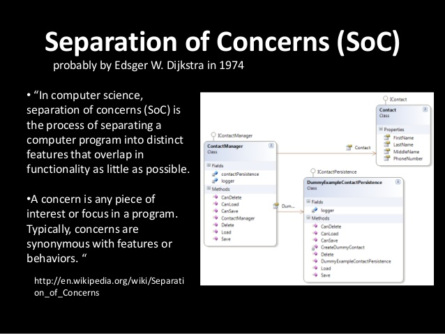

十多年來，Web 都是透過 XMLHttpRequest (XHR) 在 JavaScript 中達到非同步請求。XHR 雖然好用，但因為缺乏「Separation of concerns (SoC)」，所以算不上是很好的 API。其輸入、輸出、狀態，全都是經由存取單一物件進行管理，且透過事件來追蹤狀態。同樣的，事件架構的模型，並無法妥善配合 JavaScript 最近所著重的「Promise」與「產生器 (Generator)」架構之非同步程式設計方式。

為了修正大多數的問題，我們針對 HTTP 協定所使用的基本構成元件，透過 [Fetch API](https://developer.mozilla.org/en-US/docs/Web/API/Fetch_API) 將之導入 JavaScript。另外也導入 fetch() 公用函式，以簡化網路的資源檢索作業。

用以定義此 API 的 [Fetch 規格](https://fetch.spec.whatwg.org/)，則明確定義了瀏覽器在提取資源時的語法。若整合 ServiceWorkers 即可：

- 提升離線經驗。

- 在平台中使用 Web 的基礎元件，以成為 [Web 的一份子](https://extensiblewebmanifesto.org/)。

在本文發表之時，Fetch API 已經進入 Firefox 39 (目前為 Nightly 版本) 與 Chrome 42 (目前為開發版本)。而 Github 亦提供 [Fetch 的自動補完函式庫 (Polyfill](https://github.com/github/fetch))。

#### 功能偵測

現在只要檢查 Headers、Request、Response，或是 window＼worker 範圍上的fetch，就能偵測是否支援 Fetch API。

#### 簡單的提取 (Fetching)

Fetch API 最有用、最高階的部份就是 fetch() 函式。在最簡單的形式之下，此函式可取得一組網址並回傳一組 Promise 以取得回應結果 (Response)。且將擷取此回應結果作為 Response 物件。

		
		

fetch("/data.json").then(function(res) {
  // res instanceof Response == true.
  if (res.ok) {
    res.json().then(function(data) {
      console.log(data.entries);
    });
  } else {
    console.log("Looks like the response wasn't perfect, got status", res.status);
  }
}, function(e) {
  console.log("Fetch failed!", e);
});
			
				
					
				
					123456789101112
				
						fetch("/data.json").then(function(res) {  // res instanceof Response == true.  if (res.ok) {    res.json().then(function(data) {      console.log(data.entries);    });  } else {    console.log("Looks like the response wasn't perfect, got status", res.status);  }}, function(e) {  console.log("Fetch failed!", e);});
					
				
			
		

如果是要提交某些參數，就會像：

		
		

fetch("http://www.example.org/submit.php", {
  method: "POST",
  headers: {
    "Content-Type": "application/x-www-form-urlencoded"
  },
  body: "firstName=Nikhil&favColor=blue&password=easytoguess"
}).then(function(res) {
  if (res.ok) {
    alert("Perfect! Your settings are saved.");
  } else if (res.status == 401) {
    alert("Oops! You are not authorized.");
  }
}, function(e) {
  alert("Error submitting form!");
});
			
				
					
				
					123456789101112131415
				
						fetch("http://www.example.org/submit.php", {  method: "POST",  headers: {    "Content-Type": "application/x-www-form-urlencoded"  },  body: "firstName=Nikhil&favColor=blue&password=easytoguess"}).then(function(res) {  if (res.ok) {    alert("Perfect! Your settings are saved.");  } else if (res.status == 401) {    alert("Oops! You are not authorized.");  }}, function(e) {  alert("Error submitting form!");});
					
				
			
		

看到這裡，你想進一步了解 Fetch API，或是正好需要相關功能嗎？請回到[原文](https://hacks.mozilla.org/2015/03/this-api-is-so-fetching/)觀看更多詳細的程式碼範例！

原文連結：[This API is so Fetching!](https://hacks.mozilla.org/2015/03/this-api-is-so-fetching/)
