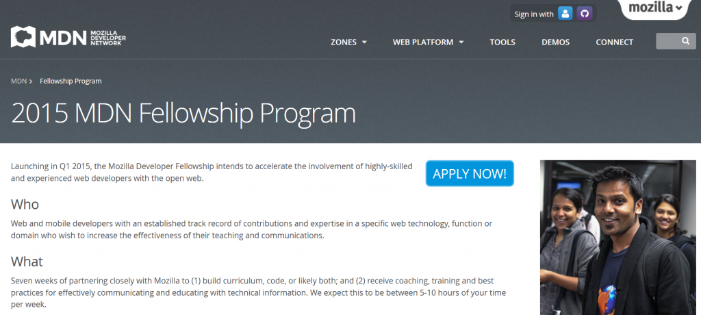

如果你才剛看到這篇文章，想進一步了解《[MDN 研究方案](https://blog.mozilla.com.tw/posts/7258/)》的來龍去脈，可先參閱此篇[召集令](https://blog.mozilla.com.tw/posts/7258/)。當然，Mozilla 隨時歡迎你加入我們的任何專案。但請注意，「MDN 研究方案」有報名期限的喔！

我是 Chris Mills。和大家聊聊今年由我負責輔導 [MDN 研究方案](https://developer.mozilla.org/en-US/fellowship)的課程開發部分。

每當我為 [Mozilla 開發者社群網站 (Mozilla Developer Network，MDN)](https://developer.mozilla.org/en-US/) 撰寫文章時，就代表自己的作品每個月都能觸及約三百五十萬人，並作為他們的參考資訊。想到這個，我心中就頓時湧現無比的滿足與成就感。除此之外，這些素材更造福了許多專業開發者，同時也有越來越多學生 (例如透過我們的 [Learning Zone](https://developer.mozilla.org/en-US/Learn)) 到此獲得資訊。我們不只協助大家進行手上的東西，也從旁培養個人的 Web 素養與未來職涯。

你也想成為一份子嗎？歡迎[報名參加](https://developer.mozilla.org/en-US/fellowship)課程開發研究方案。你可依照自己的興趣開發課程，讓學習素材能對外傳授你的熱忱所在。只要不超出 MDN 與我們的目標範疇，你也可提議自己感興趣的主題。

MDN 主題範疇就是重要的 Web 或 Mozilla 技術。我們目前已經有「[WebGL](https://developer.mozilla.org/en-US/docs/Web/WebGL)」與「[Service Workers](https://developer.mozilla.org/en-US/docs/Web/API/ServiceWorker_API)」主題的研究方案，現想接著開發 Web 動畫、Firefox OS App、一般遊戲開發等課程。當然，如果有人能談談 ECMAScript 6 的新功能也不錯。

整體課程可囊括不同的媒體類型，如說明文章、範例程式碼、實作習題、展示影片，還有更多。任何合理且有用的學習素材，只要你高興提供，我們也就樂於接受。

我們將根據你的專業背景與想法，另考量 Mozilla 所排定的優先順序，再一同產出最佳主題的素材。

我們希望你是資深的 Web 開發者，嫻熟 JavaScript、CSS、HTML 及＼或其他重要技術。我們當然歡迎有人翻譯相關課程，但我們目前希望先以英文版的素材為主，所以也需要你能流暢讀＼寫英文。

還在等什麼？[進一步了解並立刻申請加入！](https://developer.mozilla.org/en-US/fellowship)

原文連結：[Mozilla Fellowships #1: Become a curriculum developer!](https://blog.mozilla.org/community/2015/03/17/mozilla-fellowships-1-become-a-curriculum-developer/)
