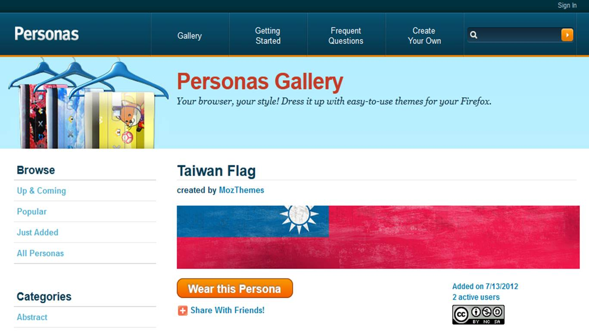
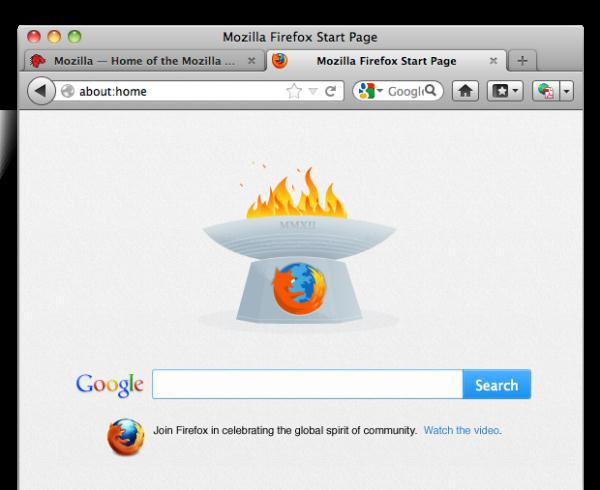

【美商謀智訊息】以推動網路平等、自由、開放為宗旨的全球非營利組織－Mozilla 基金會，2012年推出以HTML5 為基礎的行動作業系統Firefox OS。Mozilla 一直以來與全球開放社群的志工們，一起為美好的網路環境努力。今天Mozilla Taiwan 邀請您一起為代表台灣的運動員加油，Firefox 特別推出應景國旗個性面板，同時慶祝開放精神與社群團結，您可在[附加元件－國旗個性面板](https://www.getpersonas.com/en-US/gallery/Designer/mozthemes)找到相關圖素，也可透過客製化打造專屬國旗，與Firefox全球數億名愛好者一起慶祝榮譽時刻！此外，搶先公告Firefox 瀏覽器首頁即將推出神祕驚喜，集創意與Web 技術（如CSS、JavaScript 和HTML5）的Firefox 聖火，邀您見證榮耀，為世界加油！

Firefox 邀您即刻更換國旗個性面板，為台灣加油！

Firefox 首頁聖火，邀您見證榮耀，為世界加油！

 附加元件－國旗個性面板：http://www.getpersonas.com/en-US/gallery/Designer/mozthemes

Firefox 個性面板：[https://addons.mozilla.org/zh-TW/firefox/personas/?sort=up-and-coming](https://addons.mozilla.org/zh-TW/firefox/personas/?sort=up-and-coming)

關於Firefox 個性面板

Firefox 附加元件中深受使用者喜愛的功能，資料庫中超過三萬種不同的設計來個人化您的瀏覽器，使用者只需將滑鼠游標移動至某個設計的上面就能預覽，點選後即可輕鬆換上。
