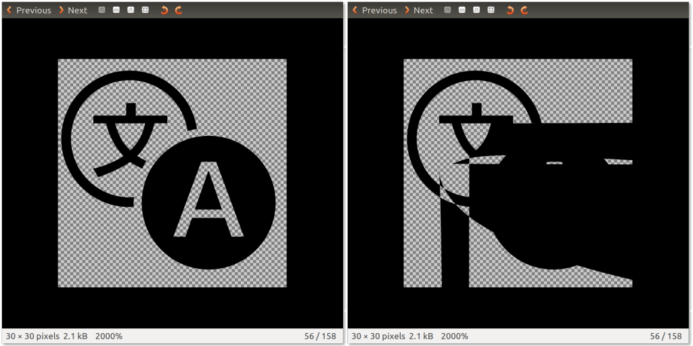
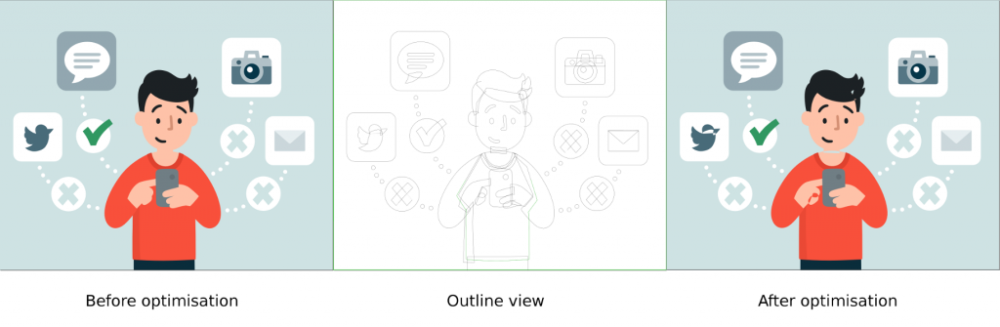

[SVG](https://developer.mozilla.org/en-US/docs/Web/SVG) 就是 XML 基礎的向量圖像格式，除了本身即具備多個優點之外，最值得注意的就是其輕量化的特色。且既然 SVG 是文字格式，也就能透過簡單的文字編輯器檢視並修改，且套用 GZIP 壓縮就能獲得極佳的效果。

這個特色對網頁尤其重要。網頁內容必須儘量達到輕量化的要求，特別是行動裝置的頻寬甚為有限。你應該要最佳化自己的 SVG 檔案，以利 App 能儘快載入並顯示。

本文則會透過專屬工具來最佳化 SVG 圖像，也會帶你了解如何進一步產生最輕量化的圖像。

#### 簡介 svgo

SVG 最佳化作業，就如同最小化 CSS 或其他文字架構的格式 (如 JavaScript 或 HTML)，主要就是移除無用的字間空白與多餘的字元。

在縮減 SVG 圖像的檔案體積時，我推薦專為 node.js 所撰寫的「[svgo](https://github.com/svg/svgo)」工具。下列為其安裝指令：

		
		

$ npm install -g svgo
			
				
					
				
					1
				
						$ npm install -g svgo
					
				
			
		

最基本的指令列如下：

		
		

$ svgo --input img/graph.svg --output img/optimised-graph.svg
			
				
					
				
					1
				
						$ svgo --input img/graph.svg --output img/optimised-graph.svg
					
				
			
		

如果要保留原始圖像，則請指定 --output 參數，否則 svgo 會以最佳化過後的版本取代之。

svgo 也會對原始檔案套用多項變更，如去除無用的指令、標籤、屬性；降低路徑定義中數字的精確度；或將屬性排序以獲得更好的 GZIP 壓縮效果。

這些作業可在簡單圖像上運作無虞，但如果遇上複雜圖像，則可能讓整個檔案都變成亂碼。

#### svgo 外掛程式

多虧外掛式的架構，svgo 極為「模組化」。

在最佳化複雜圖像時，我發現有兩組 svgo 外掛程式會造成主要問題：

- convertPathData

- mergePaths

只要停用上述兩項外掛，大都能獲得正確的結果：

		
		

$ svgo --disable=convertPathData --disable=mergePaths -i img/a.svg
			
				
					
				
					1
				
						$ svgo --disable=convertPathData --disable=mergePaths -i img/a.svg
					
				
			
		

convertPathData 會使用相對符號與縮寫符號，進而轉換路徑資料。但某些環境並無法完全識別此語法，所以你會看到如下的結果：

由 Gnome Image Viewer 顯示原始 SVG 圖像 (左)，以及 svgo 最佳化過後的版本 (右)。

但請注意，這個最佳化過的圖像還是可在所有瀏覽器中正確顯示，所以你可能願意續用這個外掛程式。

另一個也會造成錯誤圖像的外掛程式「mergePaths」，則是整合相同類型的路徑，藉以減少原始檔案中 <path> 標籤的數量。但只要兩組路徑重疊就會造成問題。

可看到右圖人物的脖子與手部都產生了繪圖差異，而「Twitter」圖示也發生同樣問題。中間的輪廓圖可看到人物頭部是由三組路徑線條重疊而成。

我建議可先讓 svgo 啟用所有外掛程式，一旦發現錯誤就先停用上述兩組外掛。

如果最佳化結果仍與原始圖像有所差異，就必須逐一停用各個外掛程式，以找出真正產生錯誤的外掛程式。可參閱此 [svgo 外掛程式](https://github.com/svg/svgo/tree/master/plugins)清單。

#### 進一步最佳化

svgo 已經很好用。但在某些特殊情況下，你可能想更進一步壓縮 SVG 圖像。如此就必須深入了解檔案格式並手動進行最佳化。

在這種情況下，我最愛用免費且開放源碼的「[Inkscape](https://inkscape.org/)」工具，並可用於大多數的平台上。

如果你想使用 svgo 的 mergePaths 外掛程式，就必須自行整合重疊的線條。方法如下：

用 Inkscape 開啟圖像檔案，找出相同類型的 (填色＼線條) 路徑。選擇全部 (按著「Shift」不放即可點選多個路徑)。點擊「Path」再找到「Union」。這樣就把全部三組路徑整合成一組路徑。

構成人物頭部的三組路徑已整合完畢。右圖則是輪廓檢視圖。

針對相同類型且重複的路徑進行上述作業，接著就再次啟用 mergePaths 外掛程式，繼續使用 svgo。

另外可手動進行的最佳化作業：

- 將線條轉換為路徑，就能整合類似類型的路徑。

- 手動裁切路徑，就可避免使用 clip-path 。

- 可從重複路徑上移除被蓋住的路徑，並整合到類似的路徑，即可避免圖層繪製的問題。(就以上圖來說，可看到人物的頭髮輪廓線應該蓋住頭部，但頂端頭髮是在頭部以上，所以並無法整合三組頭髮線條。)

#### 最後考量要點

這些手動最佳化作業極為耗時，所以請審慎考慮之後再行動！

在最佳化 SVG 圖像時的絕佳經驗之一，就是確保最終檔案的每組樣式 (相同填色與線條類型) 都僅有一組路徑，並且不使用 <g> 標籤將路徑「包」成物件。

我們在 Firefox OS 中所使用的「[gaia-icons](https://github.com/gaia-components/gaia-icons)」圖示字型，即是以 SVG 符號所產生。而我注意到：只要能最佳化此圖示字型，就能讓字型檔案再大幅輕量化，且不會影響視覺上的效果。

不論你是透過 SVG 在 App 上嵌入圖像，或建立字型檔案，都請記得要最佳化。讓你的消費者獲得更好的使用經驗！

原文連結：[Optimising SVG images](https://hacks.mozilla.org/2015/03/optimising-svg-images/)
