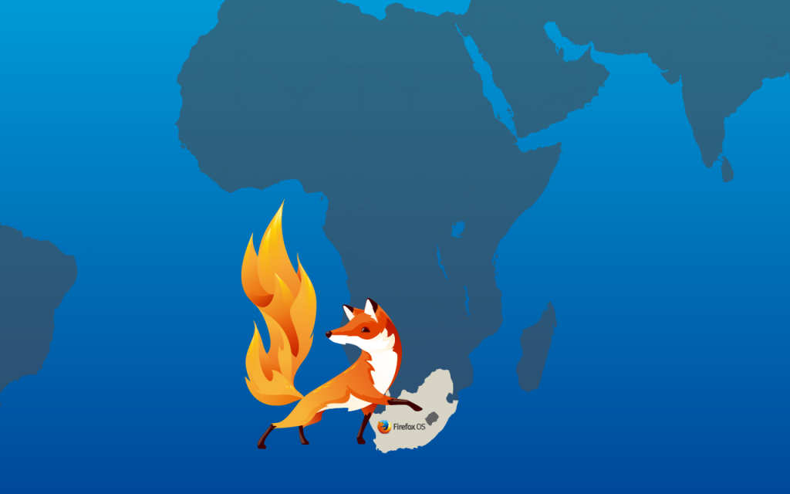

在與 MTN 的合作關係之下，我們很高興宣佈 Firefox OS 現已登陸南非。透過南非電信商 MTN 搭配 ALCATEL ONETOUCH 的「FIRE E」手機方案，以 Web 為架構的 Firefox OS 作業系統，正式進入南非市場。

Mozilla 總裁宮力博士表示：「我們將 Firefox OS 視為 Mozilla 使命的一部份，要將 Web 力量交到大家的手上。很高興能看到 MTN 現於南非發表第一款Firefox OS 裝置，讓數百萬人都能用負擔得起的價格享受行動網路。」

南非是 Firefox OS 裝置進入非洲地區的前哨站。到今天為止，Firefox OS 現已遍及五大洲，與各地夥伴合作現身於 32 個市場之中。如 [MWC 期間所宣佈的](https://blog.mozilla.com.tw/posts/7166/)，Firefox OS 今年將登陸於更多非洲地區市場。

原文連結：[Firefox OS Arrives in South Africa](https://blog.mozilla.org/blog/2015/04/02/firefox-os-arrives-in-south-africa/)
