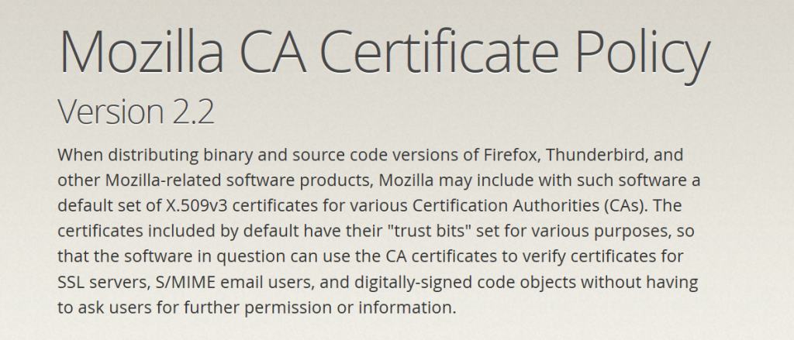

在 [Mozilla 的根憑證](https://wiki.mozilla.org/CA:Overview)鍊中，我們最近注意到一組中繼憑證 (Intermediate certificate) 被載入至防火牆裝置，用以執行 SSL 中間人 (Man-In-The-Middle，MITM) 流量管理。在攔截流量的期間，又為其無所有權的網域產生憑證。[憑證機構 (Certificate Authority，CA)](https://wiki.mozilla.org/CA:FAQ) 告知我們此一行為並不符合其政策與實作規範，且違反其客戶與之簽訂的合約。所以 CA 已經從防火牆裝置中撤銷了該中繼憑證。而這並非 Firefox 所專有的問題。為了保護 Mozilla 的使用者，我們已將此撤銷憑證的資訊加進[OneCRL](https://blog.mozilla.org/security/2015/03/03/revoking-intermediate-certificates-introducing-onecrl/)。Firefox 37 即已搭載此「[OneCRL](https://blog.mozilla.org/security/2015/03/03/revoking-intermediate-certificates-introducing-onecrl/)」機制，以利將撤銷資訊直接傳送到 Firefox 之中。

#### 問題

中國互聯網絡信息中心 (China Internet Network Information Center，CNNIC)，是由中華人民共和國國家互連網信息辦公室 (Cyberspace Administration of China，CAC) 轄下的非營利組織，負責[NSS](https://developer.mozilla.org/en-US/docs/Mozilla/Projects/NSS) 之內的「CNNIC Root」與「China Internet Network Information Center EV Certificates Root」憑證，用以簽發一般大眾與組織的憑證。CNNIC 曾發出一組無限制且標記為「測試用」的中繼憑證，直到 2015 年 4 月 3 日為止共兩週的效期。有客戶將此憑證載入防火牆裝置以執行 SSL MITM，而其網路內的使用者存取其他伺服器時，防火牆裝置為其未擁有的網域產生了憑證。就 [Mozilla 的 CA 憑證政策](https://www.mozilla.org/projects/security/certs/policy/)而言，[Mozilla CA Program](https://wiki.mozilla.org/CA:Overview) 憑證鍊內的憑證則禁止採用這類的使用方式。

#### 影響

供 MITM 所用的中繼憑證，可讓該憑證持有人解密並監控其網路內的通訊作業，卻不會觸發瀏覽器的警示訊息。攻擊者只要具備 SSL 偽憑證並可控制受害者的網路，就能在大多數使用者不知情的狀態下模擬網站。這類憑證可欺騙使用者「現正進入來自於網域所有者的受信任網站」，但其內卻包含惡意內容或軟體。我們認為此 MITM 裝置影響範圍限於 CNNIC 客戶的內部網路。

#### 狀態

針對防火牆裝置所誤用的已撤銷中繼憑證，Mozilla  已將之新增至 Firefox 37 所搭載的[OneCRL](https://blog.mozilla.org/security/2015/03/03/revoking-intermediate-certificates-introducing-onecrl/) 之中。另將透過[mozilla.dev.security.policy](https://www.mozilla.org/en-US/about/forums/#dev-security-policy) 討論區中釐清此 CA 所應採取的額外行動。過去只要發生類似情形，標準反應行動則包含索取[額外稽核紀錄](https://bugzilla.mozilla.org/show_bug.cgi?id=835538)，以確認該 CA 更新了自己的簽發程序，並對特定網域使用名稱限制，以[限縮 CA 的繼承範圍](https://bugzilla.mozilla.org/show_bug.cgi?id=952572#c2)。

#### 使用者所應採取的行動

Mozilla 建議所有使用者應升級到 Firefox 最新版本。[Firefox 37](https://wiki.mozilla.org/RapidRelease/Calendar) 與未來的版本 (包含 Firefox 38 ESR) 均將納入[OneCRL](https://blog.mozilla.org/security/2015/03/03/revoking-intermediate-certificates-introducing-onecrl/) 以處理此憑證的註銷，以及將來類似的註銷案例。

感謝[Google](https://googleonlinesecurity.blogspot.com/2015/03/maintaining-digital-certificate-security.html) 向我們回報此問題。

 ─ Mozilla 安全團隊

原文連結：[Revoking Trust in one CNNIC Intermediate Certificate](https://blog.mozilla.org/security/2015/03/23/revoking-trust-in-one-cnnic-intermediate-certificate/)
