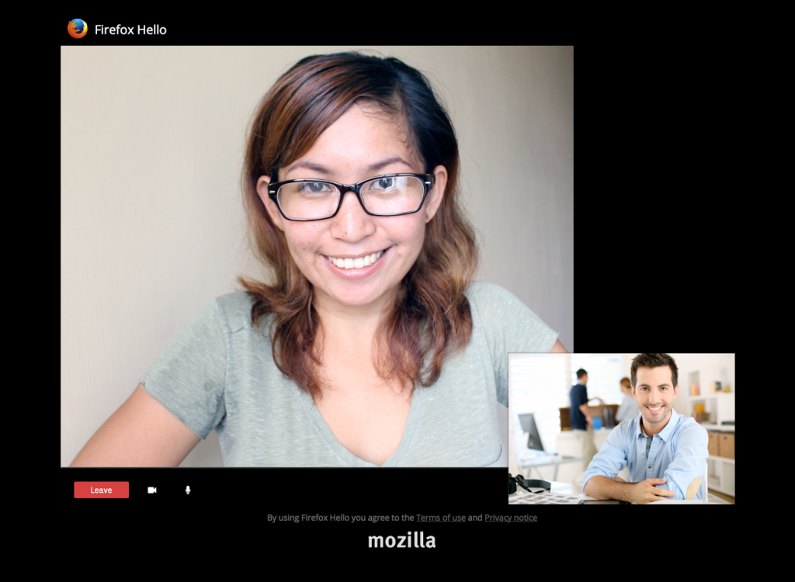

以 Firefox 37 所重新撰寫的 JSEP (Javascript Session Establishment Protocol) 引擎為基礎，現在 Firefox 38 已能支援多重串流 (即單一 PeerConnection 可容納相同類型的多重 Track) 與重新協商 (即 Renegotiation，單一 PeerConnection 可交換多次的 Offer/Answer)。雖然這類功能仍有些許限制，但可說已漸趨完備。

Firefox Hello 中的新對話視窗

#### 多重串流與重新協商功能

你可能想問這些功能好用在哪？舉例來說，你現在只要單一 PeerConnection 就能處理多通視訊電話 (即多重串流)，也能即刻新增＼移除這些通話 (即重新協商)。你也能在現有視訊電話上新增分享畫面，而不再需要另外的 PeerConnection。以下列出新功能的幾項優點：

- 如果你就是 App 開發者，則能大幅簡化你的作業

- 減少 [ICE](https://developer.mozilla.org/en-US/docs/Glossary/ICE) 的次數 (即 Interactive Connectivity Establishment，用來建立瀏覽器之間連線作業的通訊協定)，進而縮短通話作業建立的時間

- 在使用「BUNDLE」(已預設啟動) 的情況下，瀏覽器與 TURN 均只需要更少的通訊埠

現在已有多項 WebRTC 服務在使用多重串流 (目前的方法仍有所限制，可參閱下列) 或重新協商。也就是說，實際測試這些功能仍頗為受限，且可能還有臭蟲存在。如果你正著手開發相關功能也遇到難題，歡迎隨時到 irc.mozilla.org 上的 #media 發問，也能協助我們找出問題所在。

另外必須注意，Google Chrome 目前對多重串流的建構實作尚未能與 Firefox 互通，原因是 Chrome 仍未實作多重串流的規格 (稱為「Unified Plan」，可參閱其在 [Google Chromium Bug tracker](https://code.google.com/p/chromium/issues/detail?id=465349) 中的進度)。相反的，Google 現在仍在使用較舊版的提案 (即所謂替代方案)。而這兩種方式尚互不相容。

另外也需注意的是，如果你負責維護或使用的 WebRTC 閘道可支援多重串流，使用上述「替代方案」的效果其實也算不錯，且未來仍須更新。現在正是著手支援上述統一規格的好時機。

看到這裡，你是否更了解 WebRTC 的新進度了呢？請回到[原文](https://hacks.mozilla.org/2015/03/webrtc-in-firefox-38-multistream-and-renegotiation/)參閱相關程式碼，以及原文下方「附錄」中的範例。

原文連結：[WebRTC in Firefox 38: Multistream and renegotiation](https://hacks.mozilla.org/2015/03/webrtc-in-firefox-38-multistream-and-renegotiation/)
