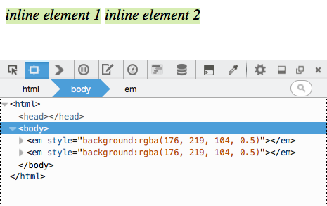
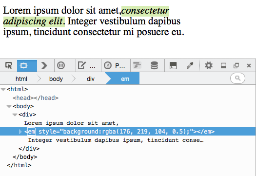
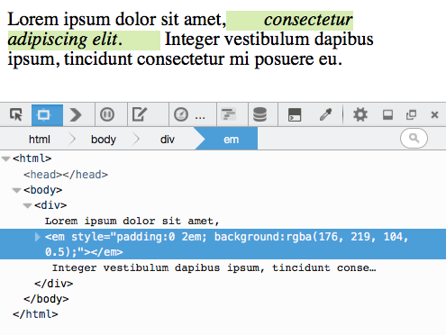
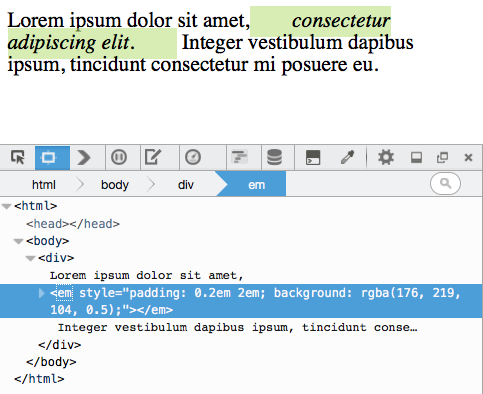
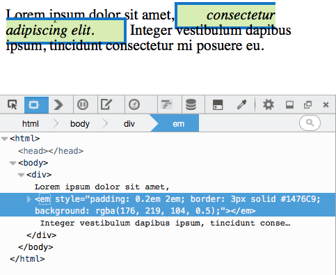
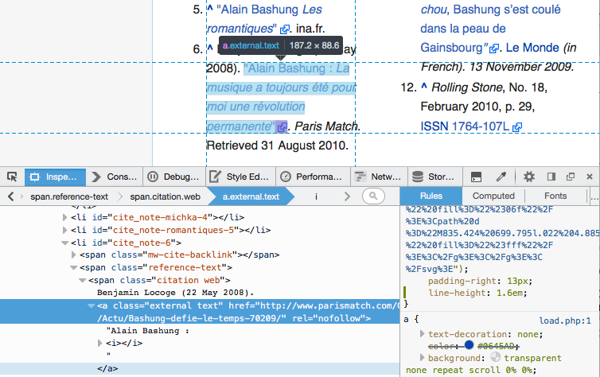

在網頁上，所有元素均繪製為方塊狀。而「[Box model](https://developer.mozilla.org/en-US/docs/Web/CSS/box_model)」則負責描述元素的 content、padding、border、margin，是如何決定該元素所佔用的空間，及其與頁面上其他元素之間的關係。

根據元素的「[display](https://developer.mozilla.org/en-US/docs/Web/CSS/display)」屬性，其 Box 可能為 Block box 或 Inline box 之一，且其針對 Box model 的套用方式也有所不同。我們將透過本文說明 Box model 套用到 Inline box 的方法，並使用 [Firefox 開發者工具的新功能針對 Inline 元素](https://developer.mozilla.org/en-US/docs/tools)呈現 Box model。

#### Inline Box 與 line Box

Inline box 水平排列於 line Box 中：

如果單一行的水平空間不足以容納所有元素，就會在第一行下方再建立另一個 Line box。一個 Inline 元素就可能被分割為兩行：

#### Inline box 的 Box model

即使 Inline box 分割超過一行，邏輯上仍是單一的 Box。也就是說，任何水平的「padding」或「border」或「margin」值，均只會套用到該 Box 所佔用的第一行至最後一行為止。

舉例來說，下方截圖以綠色強調的「span」即分割而跨了兩行。而其水平 padding 並不會套用到第一行末端，也不會影響第二行的起頭：

同樣的，任何元素所套用的垂直 padding、border、margin，均不會推擠到其上或下的任何元素：

但請注意，元素仍會套用垂直的 padding 與 border，且 padding 也會推擠 border：

如果必須調整行與行之間的高度，則請以 [line-height](https://developer.mozilla.org/en-US/docs/Web/CSS/line-height) 代替。

#### 以開發者工具檢視 Inline 元素

在對配置問題進行除錯時，重要的是能讓工具呈現出完整的圖像。這類工具之一就是「強調器 (Highlighter)」，所有瀏覽器的開發者工具均有提供。你可透過此工具選擇元素，以進行更完整的檢驗，同時也能獲得配置的相關資訊。

上圖範例即為 Firefox 39 的強調器，其反白的部分即為分割後橫跨數行的 Inline 元素。

強調器的顯示方式，可協助你對齊元素、提供完整的節點尺寸，並覆蓋色塊圖層以呈現 Box model。

從 Firefox 39 開始，針對分割 Inline 元素的 Box model 圖層，將顯示由該元素所佔用的各個獨立行列。在上述範例中，淺藍色顯示的即為內容區域，並分割成 4 行。另外也定義了該節點的正確 padding，即為強調器以紫色顯示的 padding 區域。

若要了解 Box model 套用至 Inline 元素的方式，則強調各個獨立行的 Box 就很重要，也能協助開發者檢查「行」與「行」之間的空隙，以及 Inline box 的垂直對齊狀況。

原文連結：[Understanding the CSS box model for inline elements](https://hacks.mozilla.org/2015/03/understanding-inline-box-model/)
