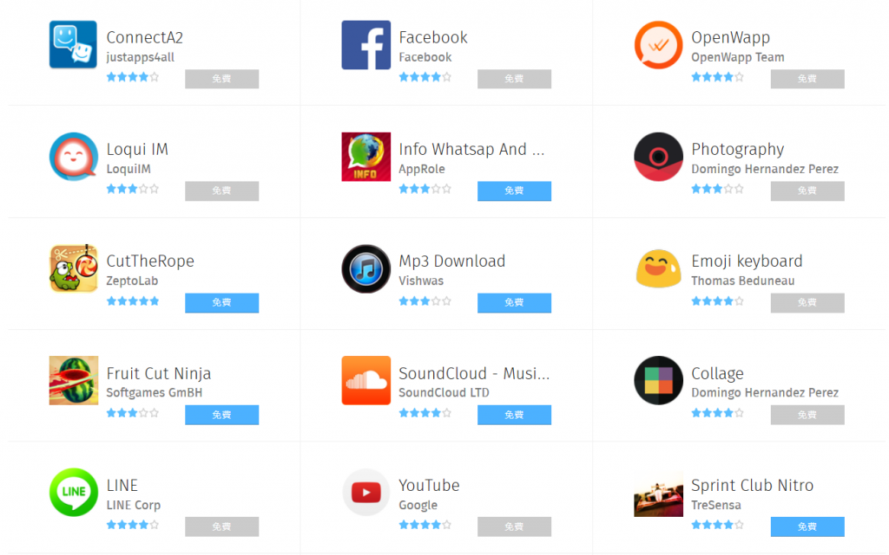

針對許多 [Firefox OS](https://www.mozilla.org/en-US/firefox/os/) 或 [Firefox 桌面版](https://www.mozilla.org/en-US/firefox/desktop/) Web App 的開發者，現可透過 Mozilla 的「[fxpay](https://developer.mozilla.org/en-US/Marketplace/Monetization/In-app_payments_section/fxPay_iap)」函式庫而輕鬆支援付款服務。Mozilla 的付款系統除了接受信用卡付款之外，另已能讓多國消費者透過自己名下的電話費帳單支付款項，更符合行動商務的趨勢。

[首次釋出的 fxpay](https://hacks.mozilla.org/2014/09/introducing-fxpay-for-in-app-payments/) 函式庫已修正許多錯誤並納入新功能。而根據開發者的反饋意見，我們也決定打造可支援原生「[Promises](https://developer.mozilla.org/en-US/docs/Web/JavaScript/Reference/Global_Objects/Promise)」([已導入](https://github.com/jakearchibald/es6-promise)較舊版的瀏覽器) 的靈活新介面，以更妥善的處理錯誤。本文將說明應如何透過收據來檢索產品、處理付款、恢復已購買的產品。

如果你已經直接用 [mozPay API 設定了應用程式內付款 (In-app payments)](https://developer.mozilla.org/en-US/Marketplace/Monetization/In-app_payments_section/mozPay_iap) 功能，則可考慮轉用 [fxpay](https://developer.mozilla.org/en-US/Marketplace/Monetization/In-app_payments_section/fxPay_iap) 以享受由 Mozilla 服務所供應的產品，及其附加功能 (如桌機付款) 的便利性。不論你的決定為何，至少要確認自己的 [JWT 函式庫已針對最近的安全漏洞修正完畢](https://jwt.io/#libraries)。

先來動手試試吧！在[安裝 fxpay 函式庫](https://developer.mozilla.org/en-US/Marketplace/Monetization/In-app_payments_section/fxPay_iap#Installation)之後，即可透過某些[假產品](https://developer.mozilla.org/en-US/Marketplace/Monetization/In-app_payments_section/fxPay_iap#Working_with_Fake_Products)進行測試。

		
		

fxpay.configure({fakeProducts: true});
fxpay.getProducts()
  .then(function(products) {
    products.forEach(function(product) {
      addBuyButtonForProduct(product);
    });
  })
  .catch(function(error) {
    console.error('error getting products: ' + error);
  });
			
				
					
				
					12345678910
				
						fxpay.configure({fakeProducts: true});fxpay.getProducts()  .then(function(products) {    products.forEach(function(product) {      addBuyButtonForProduct(product);    });  })  .catch(function(error) {    console.error('error getting products: ' + error);  });
					
				
			
		

如此將檢索某些已預先設定的假產品，讓你能輕鬆把玩相關功能。一旦你在 Firefox Marketplace 的「開發者交流中心 (Developer Hub)」上[設定實際產品](https://developer.mozilla.org/en-US/Marketplace/Monetization/In-app_payments_section/fxPay_iap#Set_Up_Your_Products)之後，就能移除此設定值以搭配實際產品。

以上方的範例函式為例，你可為各個產品添增「購買」按鈕如下：

		
		

function addBuyButtonForProduct(product) {
  var button = document.createElement('button');
  button.textContent = 'Buy ' + product.name;
  button.addEventListener('click', function () {
 
    fxpay.purchase(product.productId)
      .then(function(purchasedProduct) {
        console.log('product purchased! ', 
                    purchasedProduct);
      })
      .catch(function(error) {
        console.error('error purchasing: ' + error);
      });
 
  });
  document.body.appendChild(button);
}
			
				
					
				
					1234567891011121314151617
				
						function addBuyButtonForProduct(product) {  var button = document.createElement('button');  button.textContent = 'Buy ' + product.name;  button.addEventListener('click', function () {     fxpay.purchase(product.productId)      .then(function(purchasedProduct) {        console.log('product purchased! ',                     purchasedProduct);      })      .catch(function(error) {        console.error('error purchasing: ' + error);      });   });  document.body.appendChild(button);}
					
				
			
		

fxpay 函式庫將透過 [Mozilla 的 Web 服務](https://firefox-marketplace-api.readthedocs.org/en/latest/topics/payment.html) ，於背景處理所有付款程序，所以一旦解決 Promise 問題之後，就能安全的供應產品。到時候 fxpay 亦將於消費者的裝置上安裝收據。即使消費者往後重新安裝同一 App，開發者也可檢查收據以恢復消費者已購買過的產品。

下列則重寫了用以恢復已購買產品的程式碼：

		
		

fxpay.getProducts()
  .then(function(products) {
    products.forEach(function(product) {
    
      if (product.hasReceipt()) {
        product.validateReceipt()
          .then(function(restoredProduct) {
            console.log('restored product from receipt:', 
                        restoredProduct);
          })
          .catch(function(error) {
            console.error('error validating receipt: ' + 
                          error);
          });
      } else {
        addBuyButtonForProduct(product);
      }
    
    });
  });
			
				
					
				
					1234567891011121314151617181920
				
						fxpay.getProducts()  .then(function(products) {    products.forEach(function(product) {          if (product.hasReceipt()) {        product.validateReceipt()          .then(function(restoredProduct) {            console.log('restored product from receipt:',                         restoredProduct);          })          .catch(function(error) {            console.error('error validating receipt: ' +                           error);          });      } else {        addBuyButtonForProduct(product);      }        });  });
					
				
			
		

希望此新的介面可提供更簡易的 In-app payments 體驗。沒人知道自己的 App 到底適用哪種商業模式，所以何不多多嘗試其他概念呢？

另可到 [MDN 上找到完整的 fxpay 使用指南](https://developer.mozilla.org/en-US/Marketplace/Monetization/In-app_payments_section/fxPay_iap)。

原文連結：[Easier in-app payments with fxpay](https://hacks.mozilla.org/2015/04/easier-in-app-payments-with-fxpay/)
