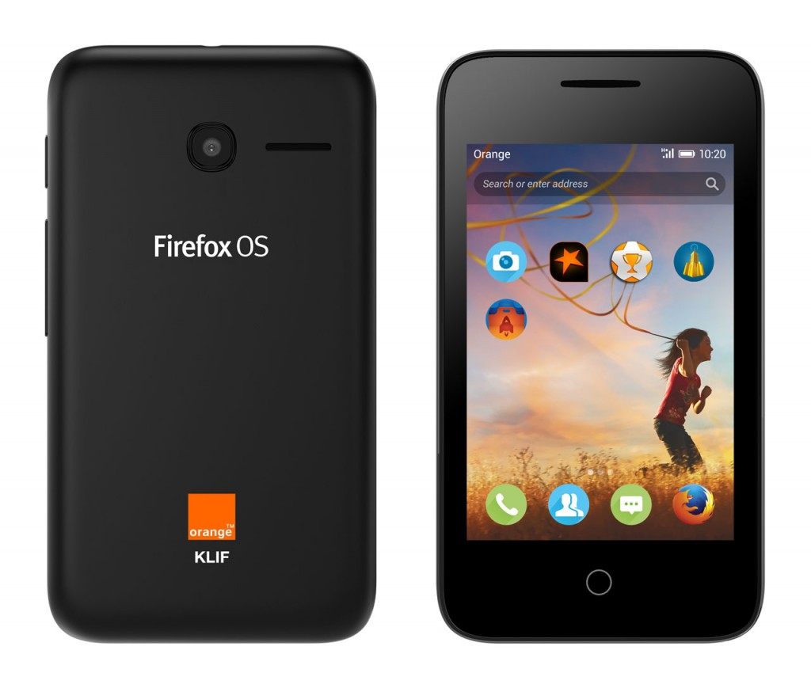

Mozilla 很高興能分享好消息：塞內加爾 (Senegal) 與馬達加斯加 (Madagascar) 將於本週發售非洲的首款 Firefox OS 智慧型手機。此一消息印證了[Mozilla 與 Orange 在世界通訊大會 (MWC 2015) 宣佈的消息](https://blog.mozilla.com.tw/posts/7166)：Firefox OS 智慧型手機將於今年稍晚登上非洲與中東市場。

Mozilla 技術長 Andreas Gal 說：「我們很高興能與 Orange 電信聯手，將行動 Web 帶給非洲與中東地區的大規模新興市場享受。我更開心能看到即將到來的 Firefox OS，確實在當地的 Mozilla 引發不小的話題。」

Firefox OS 是首個完全以 Web 技術打造的開放式行動平台，為行動產業提供更多選擇與控制方式。透過這些發表活動，Mozilla 與 Orange 可進一步實現「將行動 Web 交付其他數百萬人手中」的承諾，而非之前須行動套餐才能達到此目的。Orange 為最新款的 Firefox OS 手機提供了「[Orange Klif](https://www.alcatelonetouch.com/global-en/news/pressroom/Latest_Orange_Klif.html#goStar)」功能。此款 3G 規格的 Firefox OS 智慧型手機交由 Orange 獨家販售。

在這些發表活動之後，Firefox OS 將持續於非洲成長，而 Orange 亦將於接下來數週內於更多國家中發售 Firefox OS 智慧型手機。[Firefox OS 手機另已於今年春季登上南非](https://blog.mozilla.com.tw/posts/7315/)。

原文連結：[Orange Launches First Firefox OS Smartphones in Africa](https://blog.mozilla.org/blog/2015/05/08/orange-launches-first-firefox-os-smartphones-in-africa/)
