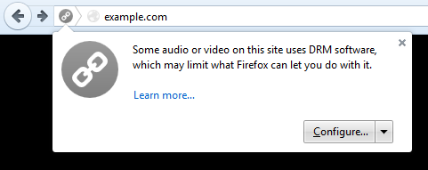

早在一年之前，我們就宣佈將著手開發 Firefox 中的元件，期能以 HTML5 的 video 標籤播放數位版權管理 (Digital Rights Management，DRM) 所包裹的內容。基於 Mozilla 的既有[理念](https://www.mozilla.org/en-US/mission/)以及 DRM 的封閉本質，這項任務著實不易。在[解釋過兩難境地](https://blog.mozilla.com.tw/posts/5579)之後，我們現正啟動 DRM 以提供使用者對瀏覽器所要求的功能，讓大家都能繼續欣賞精采的影片內容。我們不看好 DRM 能成為市場的解決方案，但卻是目前能觀看熱門內容的唯一方法。

Firefox 在今天整合了 Adobe 的「Content Decryption Module (內容解密模組，CDM)」，以能播放 DRM 所包裹的內容。只要你升級或安裝 Firefox 之後，隨即會從 Adobe 下載 CDM。在你第一次進入已使用 Adobe CDM 的網站之後，就會跟著啟動 CDM。包含 Netflix 在內的高階影片服務，都已經開始[在 Firefox 中測試此解決方案](https://www.mozilla.org/firefox/38.0/releasenotes/)。

由於 DRM 屬於不開放的「黑箱」技術，我們以 CDM 為基礎設計了「[安全沙箱 (Security sandbox)](https://hacks.mozilla.org/2014/05/reconciling-mozillas-mission-and-w3c-eme/)」。我們不知道其他瀏覽器是如何處理黑箱問題，但可透過沙箱機制提供必要的安全隔層。此外，我們也提供該如何[從自己 Firefox 移除 CDM 的方法](https://support.mozilla.org/en-US/kb/enable-drm)。Mozilla 認為這些都是重要的安全與選擇機制，讓我們能在整合此類黑箱技術並將負面影響降到最低之餘，也能順利導入此項技術。

Mozilla 也知道並非所有人都喜歡 DRM。所以針對某些不想在自己瀏覽器上安裝 CDM 的使用者，我們提供[另外的 Firefox 下載版本](https://download.cdn.mozilla.net/pub/firefox/releases/38.0/win32-EME-free/)，其中已將 CDM 預設為停用。

如同之前所討論過的，DRM 算是複雜的問題。我們希望使用者能了解其所代表的意涵，所以將透過此[教材](https://stacy.makes.org/thimble/MTUxMzI5MjI4OA==/what-is-drm)介紹 DRM、其產生的挑戰，以及某些內容供應商仍決定採用的理由。

原文連結：[Update on Digital Rights Management and Firefox](https://blog.mozilla.org/blog/2015/05/12/update-on-digital-rights-management-and-firefox/)
