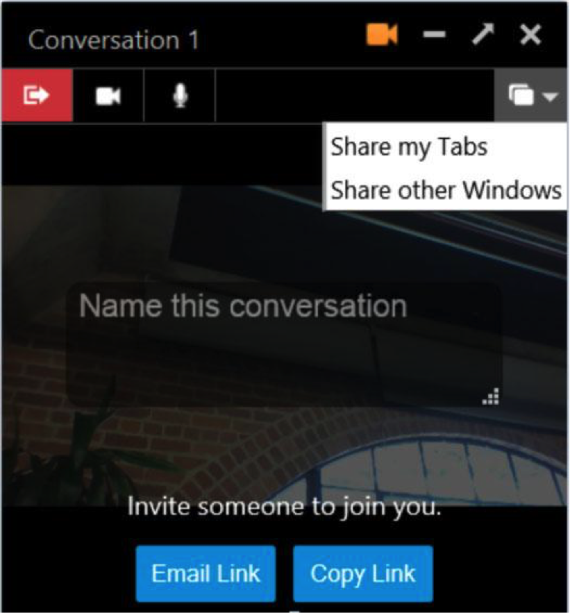
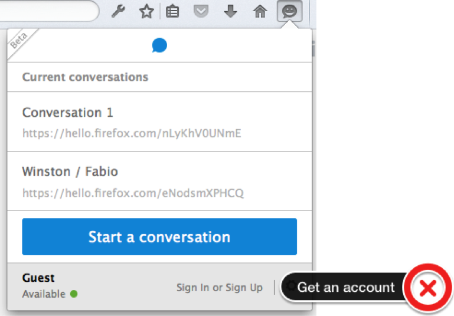
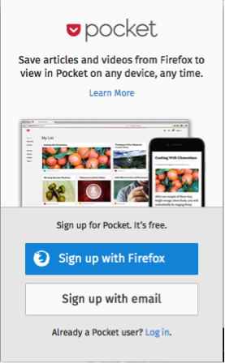
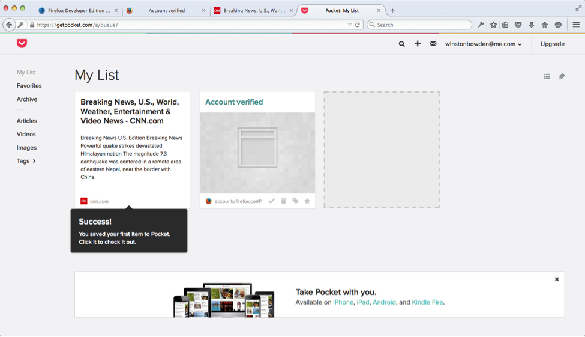

我們現正實驗 Firefox 測試版 (Beta) 的新功能，不論你要聯絡朋友，或尋找網路上的特定內容時，都能有更多選擇。

Firefox Hello 測試版現多了新的分頁分享功能，讓你在和朋友或同事對話的同時，就能即時分享你正觀看網站。我們也正測試新整合的高人氣「Pocket」服務，可讓使用者儲存故事、影片、網站，以待稍後再細細欣賞。

若要測試 Firefox Hello 的分頁分享功能，可依照下列步驟：

- 點擊 Firefox 工具列的「Hello」圖示。

- 開始對話。

- 與對方連線。

- 點擊分享圖示。

如果想體驗 Hello 的更多功能，可自行註冊一組 Firefox Account，接著就能新增聯絡人並直接儲存到自己的 Hello 聯絡人清單之中，往後尋找親朋好友更簡單。

點擊「Hello」圖示並看到電話控制面板右下方，就能發現 Firefox Accounts 的登入選項。

當然，就算你沒有 Firefox Account 也同樣能使用 Firefox Hello。你所要連線的對象只要點擊你提供的連結，就能和你對話。

但若你有 Firefox Account，就能依照下列步驟測試 Firefox Beta 新整合的「口袋 (Pocket)」功能：

- 點擊「Sign up with Firefox」。

- 接著建立自己的帳戶，但必須確認你所登記的電子郵件。

- 開啟自己的郵件信箱，找到我們所寄發訊息中的確認連結。

現在就能使用「Pocket」了。要開始測試此功能，可先前往任何網站並點擊工具列中的口袋圖示。以 Yahoo 新聞網站為例，進入網站之後就點擊口袋圖示，則該網頁就會儲存到你的口袋中。以後都只要點擊 Firefox 的口袋圖示並選擇「檢視清單 (View List)」，就能輕鬆再觀看此內容。你會看到如下的畫面，並可直接檢視或管理已儲存的內容。

「Pocket」現已登上 Firefox Beta 的英文版、德文版、日文版、俄文版、西班牙文版，後續將支援更多語言版本。

原文連結：[Get a Firefox Account and Test New Features in Firefox Beta](https://blog.mozilla.org/futurereleases/2015/05/13/get-a-firefox-account-and-test-new-features-in-firefox-beta/)
