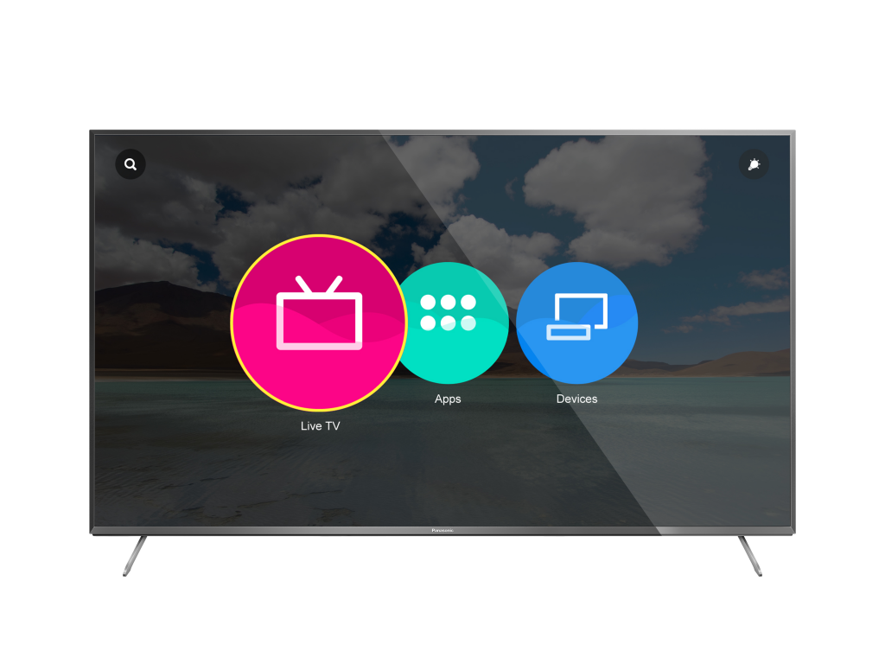

# 台灣將於 6 月開賣

全球首款搭載 Firefox OS 的智慧電視－Panasonic VIERA Smart TV，現已正式於歐洲巿場開賣。此款 Firefox OS 智慧電視，更即將於 6 月在台灣上巿，台灣消費者將可首次購買並體驗 Firefox OS 智慧裝置。

首款搭載 Firefox OS 智慧電視將於 6 月在台上巿。參考圖片為 CX700，實際型號須依上巿產品為準。

Panasonic 集團電視事業部總監 Masahiro Shinada 表示：「透過與 Mozilla 的合作關係，我們得以藉由 Firefox OS 的開放與靈活，建構出更友善、更高自訂度的 TV 使用者介面 (UI) 。我們也因此能提供更好的使用者經驗，並在智慧電視市場中獨樹一格。」

Panasonic 的 2015 年智慧電視系列，共有 CR850、CR730、CX800、CX750、CX700、CX680 等型號搭載 Firefox OS 作業系統 (各國所發售的型號有所不同)。

此款 Firefox OS 智慧電視，除了已在歐洲多國巿場上巿以外，包含日本與台灣在內的亞洲巿場則為下一波上巿國家。繼下周開賣的日本巿場，台灣也將於 6 月展開銷售，台灣消費者將可首度購買 Firefox OS 智慧裝置，體驗 Firefox OS 所帶來的高度自訂與連網能力。

Mozilla 技術長 Andreas Gal 指出：「我們很高興能與 Panasonic 合作，為市場帶來第一款搭載 Firefox OS 的智慧電視。透過由 Firefox 與 Firefox OS 所提供強大功能的裝置，使用者可享受自訂以及快速連網的 Web 經驗，並跨多款裝置攜帶自己最愛的內容 (App、影片、相片、網站)，不會再受限於單一的專利生態系統或品牌之上。」

搭載 Firefox OS 的 Panasonic 智慧電視，針對 HTML5 進行最佳化，可為 Web App 帶來強大效能，並具備高度直覺且可自訂的 UI，讓使用者也能在其他裝置上迅速取得自己最愛的內容、網站、應用程式、電視頻道。透過 Mozilla 所率先開發的 WebAPI，開發者可利用 Web 技術的靈活性，跨越多樣的連網裝置而打造自訂且創新的 App 與經驗。

Firefox OS 為首款真正全以 Web 技術所打造的開放行動平台，可為使用者、開發者、電信商、硬體製造商帶來更多選擇與控制。

原文連結：[First Panasonic Smart TVs powered by Firefox OS Debut Worldwide](https://blog.mozilla.org/blog/2015/05/14/first-panasonic-smart-tvs-powered-by-firefox-os-debut-worldwide/)
