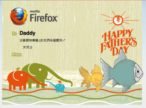

在今天下午於華山舉辦的「[夏日的 Web 樂園](https://moztw.org/events/scp0712/)」活動中，Mozilla Taiwan 以「[網頁透視鏡](https://webmaker.org/en-US/tools/#x-ray-goggles)」帶領許多夥伴製作父親節卡片，正式成為 Webmaker 的一員！

以下是參與攤位活動的作品一覽，別忘了依照您的編號找出自己的作品，寄給親愛的爸爸喔！

[5](https://webmaker.ind.ntou.edu.tw/paste/5/)
[9](https://webmaker.ind.ntou.edu.tw/paste/9/)
[10](https://webmaker.ind.ntou.edu.tw/paste/10/)
[11](https://webmaker.ind.ntou.edu.tw/paste/11/)
[12](https://webmaker.ind.ntou.edu.tw/paste/12/)
[13](https://webmaker.ind.ntou.edu.tw/paste/13/)
[14](https://webmaker.ind.ntou.edu.tw/paste/14/)
[15](https://webmaker.ind.ntou.edu.tw/paste/15/)
[16](https://webmaker.ind.ntou.edu.tw/paste/16/)
[17](https://webmaker.ind.ntou.edu.tw/paste/17/)

[18](https://webmaker.ind.ntou.edu.tw/paste/18/)
[19](https://webmaker.ind.ntou.edu.tw/paste/19/)
[20](https://webmaker.ind.ntou.edu.tw/paste/20/)
[21](https://webmaker.ind.ntou.edu.tw/paste/21/)
[22](https://webmaker.ind.ntou.edu.tw/paste/22/)
[23](https://webmaker.ind.ntou.edu.tw/paste/23/)
[24](https://webmaker.ind.ntou.edu.tw/paste/24/)
[25](https://webmaker.ind.ntou.edu.tw/paste/25/)
[26](https://webmaker.ind.ntou.edu.tw/paste/26/)
[27](https://webmaker.ind.ntou.edu.tw/paste/27/)

[28](https://webmaker.ind.ntou.edu.tw/paste/28/)
[29](https://webmaker.ind.ntou.edu.tw/paste/29/)
[30](https://webmaker.ind.ntou.edu.tw/paste/30/)
[31](https://webmaker.ind.ntou.edu.tw/paste/31/)
[32](https://webmaker.ind.ntou.edu.tw/paste/32/)
[33](https://webmaker.ind.ntou.edu.tw/paste/33/)
[34](https://webmaker.ind.ntou.edu.tw/paste/34/)
[35](https://webmaker.ind.ntou.edu.tw/paste/35/)
[36](https://webmaker.ind.ntou.edu.tw/paste/36/)
[37](https://webmaker.ind.ntou.edu.tw/paste/37/)

[38](https://webmaker.ind.ntou.edu.tw/paste/38/)
[39](https://webmaker.ind.ntou.edu.tw/paste/39/)
[40](https://webmaker.ind.ntou.edu.tw/paste/40/)
[41](https://webmaker.ind.ntou.edu.tw/paste/41/)
[42](https://webmaker.ind.ntou.edu.tw/paste/42/)
[43](https://webmaker.ind.ntou.edu.tw/paste/43/)
[44](https://webmaker.ind.ntou.edu.tw/paste/44/)
[45](https://webmaker.ind.ntou.edu.tw/paste/45/)
[46](https://webmaker.ind.ntou.edu.tw/paste/46/)
[47](https://webmaker.ind.ntou.edu.tw/paste/47/)

[48](https://webmaker.ind.ntou.edu.tw/paste/48/)
[49](https://webmaker.ind.ntou.edu.tw/paste/49/)
[50](https://webmaker.ind.ntou.edu.tw/paste/50/)
[51](https://webmaker.ind.ntou.edu.tw/paste/51/)
[52](https://webmaker.ind.ntou.edu.tw/paste/52/)
[53](https://webmaker.ind.ntou.edu.tw/paste/53/)
[54](https://webmaker.ind.ntou.edu.tw/paste/54/)
[55](https://webmaker.ind.ntou.edu.tw/paste/55/)
[56](https://webmaker.ind.ntou.edu.tw/paste/56/)
[57](https://webmaker.ind.ntou.edu.tw/paste/57/)

[58](https://webmaker.ind.ntou.edu.tw/paste/58/)
[59](https://webmaker.ind.ntou.edu.tw/paste/59/)
[60](https://webmaker.ind.ntou.edu.tw/paste/60/)
[61](https://webmaker.ind.ntou.edu.tw/paste/61/)
[62](https://webmaker.ind.ntou.edu.tw/paste/62/)
[63](https://webmaker.ind.ntou.edu.tw/paste/63/)
[64](https://webmaker.ind.ntou.edu.tw/paste/64/)
[65](https://webmaker.ind.ntou.edu.tw/paste/65/)
[66](https://webmaker.ind.ntou.edu.tw/paste/66/)
[67](https://webmaker.ind.ntou.edu.tw/paste/67/)

[68](https://webmaker.ind.ntou.edu.tw/paste/68/)
[69](https://webmaker.ind.ntou.edu.tw/paste/69/)

另外您也可以繼續使用「網頁透視鏡」及 Mozilla Taiwan 提供的三個範本，請參考以下連結：

- [網頁透視鏡說明](https://webmaker.org/tools/#x-ray-goggles)與[安裝指南](https://webmaker.org/en-US/tools/x-ray-goggles/install/)

- Mozilla Taiwan 的父親節卡片範本   
