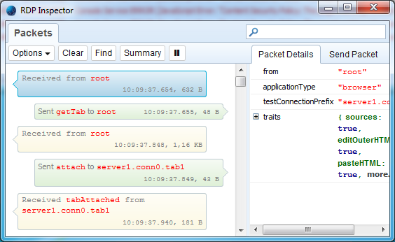
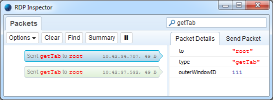
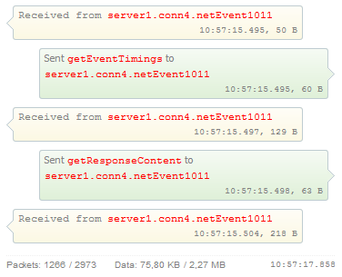
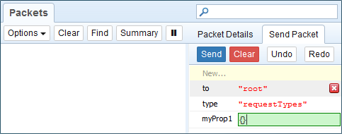
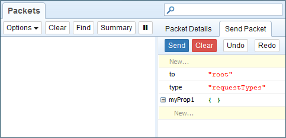
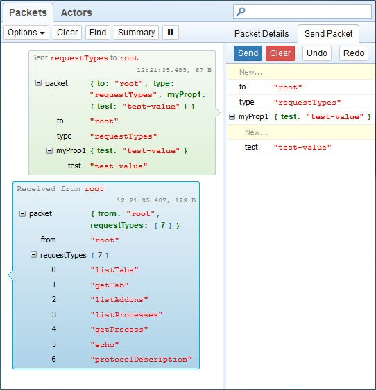
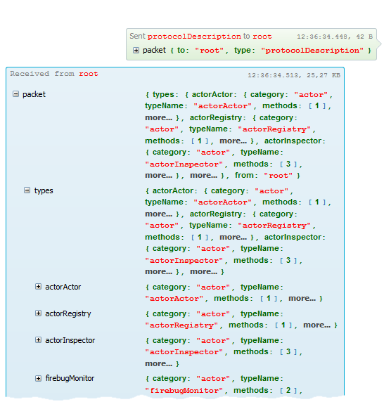

[RDP Inspector](https://addons.mozilla.org/en-US/firefox/addon/rdp-inspector/) 為 Firefox 的擴充套件，可攔截 (Intercept) 遠端除錯協定 (Remote Debugging Protocol，[RDP](https://developer.mozilla.org/en-US/docs/Tools/Remote_Debugging))，以檢驗所有送出＼接收的資料。

若想建構新的遠端功能，以擴充 Firefox 原生的開發者工具；或想了解內建工具是如何透過內部通訊協定，進而溝通後端除錯伺服器，均可利用此擴充套件。

#### 開始上手

可從 [addons.mozilla.org](https://addons.mozilla.org/en-US/firefox/addon/rdp-inspector/) (另必須安裝 Firefox 38 以上的版本) 安裝最新版的RDP Inspector。另可在此找到[原始碼](https://github.com/firebug/rdp-inspector)。

安裝完畢之後，就能在瀏覽器視窗的右上角看到新的 RDP Inspector 按鈕。

點擊按鈕即可開啟 RDP Inspector 主控台視窗。

主控台會顯示透過線路傳輸的所有封包，右側面板亦將顯示封包的細節。

上圖則為從伺服器所接收到的第一個封包 (來自於 root，搭配 applicationType="browser")。

這也是「開發者工具的工具箱」與「後端伺服器」之間開始連線的方式。

#### 篩選封包

封包清單可能很長，所以可進一步篩選。舉例來說，如果只要看送至 Root Actor 的 getTab 封包，則可於主控台視窗的右上角搜尋欄中鍵入「getTab」。

小訣竅：也可按下快捷鍵「Ctrl+F」，即可使用瀏覽器的搜尋列於封包清單中搜尋。

#### 摘要資料

開發者有時候必須知道已傳送＼接收的總封包數或總位元數，以協助最佳化通訊協定的流量，並加快新功能或現有功能的速度。

而主控台亦可隨時取得此彙總資訊。只要按下工具列中的「摘要 (Summary)」按鈕即可。

下圖則是以「網路 (Network)」面板選擇 http://www.washingtonpost.com/ 頁面載入時間的摘要 (可觀看封包清單的底部)。

可看出來共傳送了 1266 組封包；接收 2973 組封包；傳送 75.80 KB；從伺服器接收 2.27 MB 的資料。

#### 和伺服器聊天

當然也可傳送測試封包給伺服器後端。你可用自己的屬性整合出新封包、將之傳送到伺服器、獲得回應；整個過程就如同是開發者工具箱送出的封包一般。你只要點選側邊面板的「傳送封包 (Send Packet)」、設定某些屬性，再按下「傳送 (Send)」按鈕即可。

若要建立新的封包屬性，可點擊面板上方的「New…」(即底色為黃色的第一行)，並鍵入其名稱即可。

在按下「Enter」鍵之後，就會將新屬性安插到清單的最後。

其預設值為「尚未定義 (undefined)」，且只要點擊鍵值文字輸入框即可變更。你必須透過引號才能插入字串。另可於鍵值文字輸入框中鍵入 {}，以建立新的物件 (JSON packet sub-tree)。

封包準備完畢即可按下「Send」按鈕，並檢查清單中顯示的新封包。

上圖則顯示我們所傳送的 test 屬性。你也可觀看除錯伺服器的回應狀況。

小訣竅：你可能想設定「Show Packet Details Inline」選項 (打開工具列中的「Options」按鈕)，以於封包清單中直接觀看所有封包的屬性。如此一來，你就不需一直在「Packet Details」與「Send Packet」面板之間切換。

#### 審視 (Introspecting) 通訊協定的封包

如果你想知道後端伺服器所提供的服務並進一步測試，則以下為相關案例。這些可能同時為原生或自訂 (已安裝) 的後端 API。此協定可支援下列封包型態 (可用於動態的審視作業)。

- requestTypes 傳送至任何 Actor，可取得其所支援封包類型 (函式) 的清單。

- protocolDescription 傳送至 Root Actor，可取得所有後端服務 (即 Actor) 及其函式的清單。

前一張截圖已可看到 requestTypes 的回應，並可發現 protocolDescription 就是你傳送到 Root Actor 的封包類型之一。

下圖則顯示 protocolDescription 封包請求的回應。

很棒吧？現在你可以和自己的通訊協定聊天了！

你可到[專案的 Wiki 頁面](https://github.com/firebug/rdp-inspector/wiki)進一步了解 RDP Inspector，並可提報你所發現的任何問題或臭蟲。當然，我們隨時歡迎你反應的意見。

#### ─ By Jan ‘Honza’ Odvarko

原文連結：[RDP Inspector: An extension for Firefox Developer Tools](https://hacks.mozilla.org/2015/05/rdp-inspector-an-extension-for-firefox-developer-tools/)
