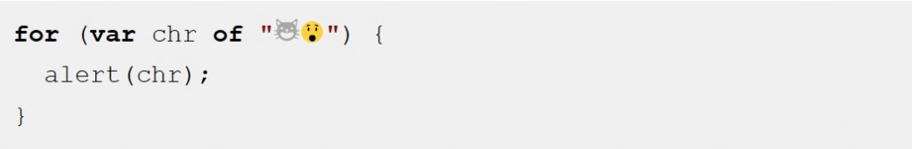

歡迎觀看此系列新文。我們將概略介紹 JavaScript 的新版本「ECMAScript 6」，亦稱為「ES6」。

本文重點在於可巡訪各個元素的 [for – of](https://developer.mozilla.org/en-US/docs/Web/JavaScript/Reference/Statements/for...of) 迴圈，另外還有後半段繼續介紹迭代器 (Iterator)。

圖片出處：https://carlosazaustre.es/blog/ecmascript-6-el-nuevo-estandar-de-javascript/

你都如何巡訪陣列上的每一元素？在 JavaScript 於二十年前剛出現時，你必須如下處理：

		
		

for (var index = 0; index < myArray.length; index++) {
  console.log(myArray[index]);
}
			
				
					
				
					123
				
						for (var index = 0; index < myArray.length; index++) {  console.log(myArray[index]);}
					
				
			
		

而從 ES5 開始，你可使用內建的 [forEach](https://developer.mozilla.org/en-US/docs/Web/JavaScript/Reference/Global_Objects/Array/forEach) 函式：

		
		

myArray.forEach(function (value) {
  console.log(value);
});
			
				
					
				
					123
				
						myArray.forEach(function (value) {  console.log(value);});
					
				
			
		

這樣雖然有變短一點，但還是有個缺點：你無法用 [break](https://developer.mozilla.org/en-US/docs/Web/JavaScript/Reference/Statements/break) 陳述式中斷此迴圈，也不能使用 [return](https://developer.mozilla.org/en-US/docs/Web/JavaScript/Reference/Statements/return) 陳述式從封閉函式取得回傳值。

如果能有 for– 迴圈語法可巡訪陣列的元素，不就太好了嗎？

那試試 [for – in](https://developer.mozilla.org/en-US/docs/Web/JavaScript/Reference/Statements/for...in) 迴圈如何？

		
		

for (var index in myArray) {    // don't actually do this
  console.log(myArray[index]);
}
			
				
					
				
					123
				
						for (var index in myArray) {    // don't actually do this  console.log(myArray[index]);}
					
				
			
		

但這麼做有幾個缺點：

- 指派到此程式碼 index 的值，都是 “ 0 “、" 1 “、" 2 " 等字串而非實際數字。如果你不想要字串運算 ( "2" + 1 == "21" )，這個特性就不算方便。

- 迴圈主體不僅會執行陣列元素，也會執行其他人所添增的[expando](https://developer.mozilla.org/en-US/docs/Glossary/Expando) 屬性。舉例來說，如果你的陣列具備 myArray.name 這種可列舉的屬性，則此迴圈將搭配 index == "name" 額外執行一次。即使是在陣列的原型鏈 (Prototype chain) 上的屬性也會巡訪過。

- 最讓人訝異的，就是此程式碼在某些情況下，其巡訪陣列元素的順序可能和你預測的不一樣。

簡單來說，for–in 是為了能在純粹的舊 Object 上，針對字串鍵值的運作所設計。所以對 Array 來說就沒那麼好用。

#### 強大的 for-of 迴圈

記得[上一篇介紹文](https://blog.mozilla.com.tw/posts/7403)提到，ES6 將繼續相容現有的 JS 程式碼。因為有數百萬個網站都在使用 for–in，有些網站也的確用在陣列上。所以若要「修正」for–in 在陣列上的行為，就能達到絕佳的改進效果。而 ES6 要改善此問題的唯一方式，就是添增某些新的迴圈語法：

		
		

for (var value of myArray) {
  console.log(value);
}
			
				
					
				
					123
				
						for (var value of myArray) {  console.log(value);}
					
				
			
		

在上述都齊備了之後，看來似乎也沒那麼讓人印象深刻的地方。我們可以先看看 [for – of](https://developer.mozilla.org/en-US/docs/Web/JavaScript/Reference/Statements/for...of) 是否真的這麼有戲？簡單來說：

- 若要巡訪陣列元素，這是目前最簡單、直接的語法

- 其可避免 for – in 的所有陷阱

- 與 forEach() 不同，[for – of](https://developer.mozilla.org/en-US/docs/Web/JavaScript/Reference/Statements/for...of) 可搭配 break 、 continue 、 return

for–in 迴圈用以巡訪物件屬性；for–of 迴圈則是純粹巡訪資料 (Data)，如陣列中的值。

但不止於此。

#### 可支援 for-of 的其他集合 (Collection)

for–of 不僅用於陣列，亦可用於大多數類似陣列的物件，如同 DOM 的 [NodeList](https://developer.mozilla.org/en-US/docs/Web/API/NodeList)。

亦可用於字串上，將字串當做 Unicode 字元的序列：

這也能用在 Map 與 Set 物件上。

啥？你沒聽過 Map 與 Set 物件？這兩個是 ES6 中的新物件。我們會再透過另一篇專文說明。如果你已經在使用其他程式語言的 Map 與 Set，應該就不會太驚訝了。

舉例來說，Set 物件可削減複製的次數：

		
		

// make a set from an array of words
var uniqueWords = new Set(words);
			
				
					
				
					12
				
						// make a set from an array of wordsvar uniqueWords = new Set(words);
					
				
			
		

一旦你取得 Set，也許就會想在其內容之上建構迴圈。很簡單：

		
		

for (var word of uniqueWords) {
  console.log(word);
}
			
				
					
				
					123
				
						for (var word of uniqueWords) {  console.log(word);}
					
				
			
		

Map 就有點不同了。Map  中的資料是以鍵值對 (Key-value pair) 所構成，所以你可透過解構 (Destructuring) 將「key」與「value」拆成獨立的變數：

		
		

for (var [key, value] of phoneBookMap) {
  console.log(key + "'s phone number is: " + value);
}
			
				
					
				
					123
				
						for (var [key, value] of phoneBookMap) {  console.log(key + "'s phone number is: " + value);}
					
				
			
		

「解構」也是 ES6 的新功能，我們亦將以另一篇文章介紹。要寫的太多了，都必須筆記一下以免忘了。

你看到這裡應該有點概念了：JS 已經具備極為不同的集合類別，而且還越來越多。for–of 則是要當做吃苦耐勞的迴圈陳述式，要讓開發者能順利用在這些類別上。

for–of 並無法搭配純粹的舊 Object。但如果你想迭代某一物件的屬性，則可使用 for–in (也就是其功能) 或內建的 Object.keys()：

		
		

// dump an object's own enumerable properties to the console
for (var key of Object.keys(someObject)) {
  console.log(key + ": " + someObject[key]);
}
			
				
					
				
					1234
				
						// dump an object's own enumerable properties to the consolefor (var key of Object.keys(someObject)) {  console.log(key + ": " + someObject[key]);}
					
				
			
		

看到這裡，你應該已經初步了解強大的 for–of 迴圈了吧？可別錯過《[深入 ES6 系列：迭代器與 for-of 迴圈 (下)](https://blog.mozilla.com.tw/posts/7491/)》，跟大家一起看完新的「迭代器 (Iterator)」。

原文連結：[ES6 In Depth: Iterators and the for-of loop](https://hacks.mozilla.org/2015/04/es6-in-depth-iterators-and-the-for-of-loop/)
