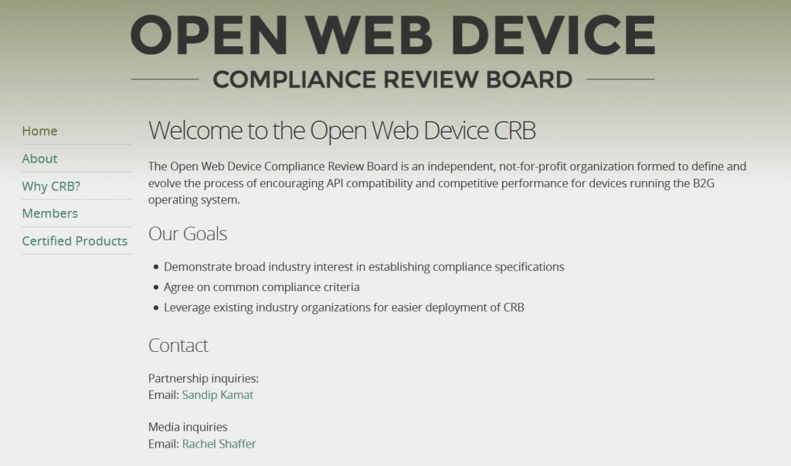

#### 此一聲明代表了開放源碼行動生態系統的重要開發關鍵

Open Web Device 審查委員會 (Compliance Review Board，CRB) 與 Mozilla、Telefónica、ALCATEL ONETOUCH、德國電信 (Deutsche Telekom)、高通 (Qualcomm Technologies, Inc.) 等會員，共同宣佈第一款通過 CRB 認證的手持裝置。獨立運作的 CRB 將持續推動 API 規範並確保其效能具備高競爭力，旨在促成 Open Web 裝置生態系統的成功。

通過認證的兩款裝置分別為 Alcatel ONETOUCH Fire C 與 Alcatel ONETOUCH Fire E。ALCATEL ONETOUCH 另擁有 CRB 所授權的標準實驗室。

OEM 廠商必須向 CRB 報請裝置認證，先由 CRB 授權實驗室針對 Open Web API 與重要效能基準進行測試，再交由 CRB 的主題內容專家 (SME) 檢驗相關結果，並以參考平台裝置 (Reference device) 比對 CRB 所訂定的效能基準，最後確認各種重要使用條件下的效能與相容性，才算完成整個認證程序。此兩款 ALCATEL ONETOUCH 裝置均通過了 CRB 授權實驗室的檢驗程序，且符合 CRB 的所有認證規範。

不論裝置供應商是否為 CRB 的會員，均可查閱公開的認證程序。CRB 的網站 www.openwebdevice.org 也將公佈認證作業的進度。

CRB 認證測試作業均交由 CRB 所授權的工業級實驗室進行，約於三天之內完成各認證申請案例。CRB 亦提供平台予其他產業申請認證。

高通的產品管理資深副總 Jason Bremner 說：「身為 CRB 的創始會員，我們很高興能看到委員會完成本身的主要任務之一，即以標準 Web API 與效能指標進行 Firefox OS 裝置的認證。我們期待其他公司也能一同跟進，在改良自家產品開發週期的同時，亦能兼顧使用者經驗並相容標準的 Web API。」

ALCATEL ONETOUCH 資深副總 Alain Lejeune 表示：「身為 CRB 會員之一，以及此兩款經認證裝置的製造商，ALCATEL ONETOUCH 很開心能與所有會員一同踏出步伐並見證相關成就。ALCATEL ONETOUCH 將於來年為 CRB 與 Firefox OS 生態系統繼續做出貢獻。此一消息不僅讓我們倍感榮幸，也將鼓舞更多 Firefox OS 夥伴努力完成認證。」

Mozilla 技術長 Andreas Gal 也說：「過去三年來，Mozilla 透過 Firefox OS 證明 Open Web 技術絕對是強大可用的行動平台。CRB 認證制度將證明該款裝置確實能提供絕佳且一致的使用者經驗，且在減少時間及成本的同時，更能橫跨市場與營運商達到必要的品質。今天宣佈的消息，無疑將鼓勵其他裝置自造者更努力達到此一肯定。」

TELEFÓNICA S.A. 組織設備部門主管 Francisco Montalvo 另表示：「TELEFÓNICA 提供許多可讓行動消費者接觸 Open Web 生態系統的機會。在將 CRB 作為產品認證規範之後，可協助所有夥伴確實將豐富的 Web 內容送入已認證裝置並兼顧絕佳的品質。我們很高興能參與此一成就。」

德國電信創新實驗室的矽谷創新中心副總裁 Louis Schreier 接著說：「德國電信很榮幸能與高通、Mozilla、Telefónica、ALCATEL ONETOUCH 密切合作開發 Firefox OS。同為 CRB 的創始會員之一，我們專注於API 規範與效能，以其能統一需求、測試、驗收等準則，讓授權實驗室能獨立進行一致的測試作業。」

可至 [https://openwebdevice.org](https://openwebdevice.org/) 進一步了解 Open Web Device 審查委員會。

#### 有關 CRB

Open Web Device 審查委員會 (CRB) 為獨立運作組織，期能促進 Open Web 裝置生態系統的成功。CRB 為電信營運商、裝置 OEM 商、晶片供應商、測試解決方案廠商的合作成果，且透過特定程序推動 API 相容性，並確保裝置可提供高競爭性的效能。相關標準即基於 Mozilla 的使用者隱私與控制權原則而得。

原文連結：[Open Web Device Compliance Review Board Certifies First Handsets](https://blog.mozilla.org/blog/2015/05/18/open-web-device-compliance-review-board-certifies-first-handsets-2/)
