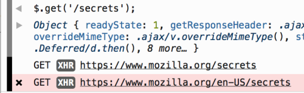
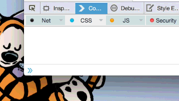

〈Trainspotting〉系列文章將重點提示 Firefox 最新版本的已上線功能。Firefox 現固定每六個星期釋出新版本，而我們稱此種模式為「Release trains」。

又已經六個禮拜了嗎？Firefox 38 已經正式上線了，而且還為 Web 平台新增了許多東西。下列是幾項重點：

若要完整了解相關變化與元件，可參閱《[Firefox 38 版本說明](https://www.mozilla.org/en-US/firefox/38.0/releasenotes/)》。

#### 支援適應性圖像

Firefox 現可同時支援 <picture> 元素與  了！另還有[許多](https://www.smashingmagazine.com/2014/05/14/responsive-images-done-right-guide-picture-srcset/)其他[精采](https://demosthenes.info/blog/936/Responsive-Images-For-Designers-The-HTML5-picture-element)的[文章](https://html5hub.com/html5-picture-element/)可讓你熟悉新技術，開發者當然也能立刻享受[自動補完函式庫 (Polyfill)](https://scottjehl.github.io/picturefill/)。但 Firefox 38 另有需要注意的地方 ─ 只要是使用正確的媒體查詢 (Media queries)，就會載入適應性圖像 (Responsive image)，但目前尚未能對應到 Viewport 的縮放。此問題現已提交到[這裡](https://bugzilla.mozilla.org/show_bug.cgi?id=1135812)並持續追蹤，而且在 Firefox 的近期版本中就會解決。

#### 可在 Web 的 Worker 中取得 WebSockets

Firefox 38 現在可於 Web 的 Worker 中執行程式碼，藉以開啟 WebSocket 連線。這對遊戲或其他協作式的 App 來說十分重要，即可於 UI 以外的獨立執行緒中，處理多人或即時的運算邏輯。

- [進一步了解 WebSockets](https://developer.mozilla.org/en-US/docs/WebSockets)

- [進一步了解 Web Workers](https://developer.mozilla.org/en-US/docs/Web/API/Web_Workers_API)

#### 支援 HTML5 的  標記結構

不再需要笨重的函式庫或擴充套件，只要透過 <ruby> 標記結構 (Markup)，就能讓中文與日文網站達到更好的排版效果。

- [進一步了解 HTML5 的 ](https://hacks.mozilla.org/2015/03/ruby-support-in-firefox-developer-edition-38/)

#### BroadcastChannel ─ 所有視窗都能 postMessage

如果你正用多個分頁或視窗建構 Web App，還要保持全部分頁或視窗同步，那麼一旦有任何事件與狀態改變，接收通知就很痛苦。BroadcastChannel 單純是用戶端的訊息傳遞 API，只要是在相同來源中執行的任何指令碼，都能透過此 API 傳遞訊息予其他的視窗或分頁。

		
		

// one tab
var ch = new BroadcastChannel('test');
ch.postMessage('this is a test');

// another tab
ch.addEventListener('message', function (e) {
    alert('I got a message!', e.data);
});

// yet another tab
ch.addEventListener('message', function (e) {
    alert('Avast! a message!' e.data);
});
			
				
					
				
					12345678910111213
				
						// one tabvar ch = new BroadcastChannel('test');ch.postMessage('this is a test'); // another tabch.addEventListener('message', function (e) {    alert('I got a message!', e.data);}); // yet another tabch.addEventListener('message', function (e) {    alert('Avast! a message!' e.data);});
					
				
			
		

- [進一步了解 BroadcastChannel API](https://hacks.mozilla.org/2015/02/broadcastchannel-api-in-firefox-38/)

#### 開發者工具

來自於 XMLHttpRequest 的網路請求，現均標記於網頁主控台 (Web Console) 之中：

要取得網頁的數值嗎？你可發現網頁主控台現提供特殊的 copy 函式：

#### 還沒完呢！

我還沒機會談談 Firefox 38 另外許多提升的功能與修正的錯誤，直接來看 [Firefox 38 版本說明](https://www.mozilla.org/en-US/firefox/38.0/releasenotes/)、[開發者版本說明](https://developer.mozilla.org/en-US/Firefox/Releases/38)，或此版本修正的[錯誤清單](https://bugzilla.mozilla.org/buglist.cgi?j_top=OR&f1=target_milestone&o3=equals&v3=Firefox%2038&o1=equals&resolution=FIXED&o2=anyexact&query_format=advanced&f3=target_milestone&f2=cf_status_firefox38&bug_status=RESOLVED&bug_status=VERIFIED&bug_status=CLOSED&v1=mozilla38&v2=fixed%2Cverified&limit=0)。

請繼續享受 Firefox 的絕妙經驗！

原文連結：[Trainspotting: Firefox 38](https://hacks.mozilla.org/2015/05/trainspotting-firefox-38/)
