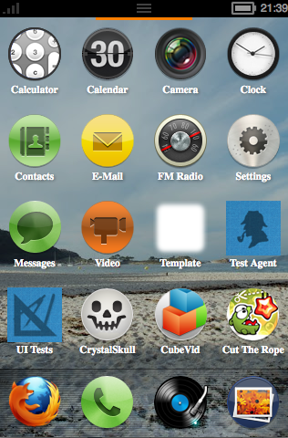

如果你想試試 Firefox OS 長什麼樣子，或者想開發 Mozilla 的 Open WebApp 而需要測試環境，現在 Mozilla 已經開始提供在桌機上可以輕鬆測試 Firefox OS 的方式了。您可以[前往 FTP 下載與您系統對應的程式](https://ftp.mozilla.org/pub/mozilla.org/b2g/nightly/)，接著下載[開發中的 Gaia](https://github.com/mozilla-b2g/gaia)（Firefox OS 的前端）後經過一陣設定，就可以在自己的電腦上測試 Firefox OS：

心動嗎？[下載請往這裡走](https://ftp.mozilla.org/pub/mozilla.org/b2g/nightly/)。但千萬記住，並不是載完以後點兩下就能用了啊！你還得下載開發中的 Gaia 並設定才行。設定的步驟可以參考 [Gaia/Hacking](https://wiki.mozilla.org/Gaia/Hacking)，而 Mozilla QA 團隊的 Tony Chung 寫了[一篇文章，將步驟的精華也列舉而出](https://dknite.wordpress.com/2012/07/18/desktop-builds-now-available-for-firefox-os/)，有興趣的朋友可以參考，也歡迎你將測試結果與大家分享！ 😀
