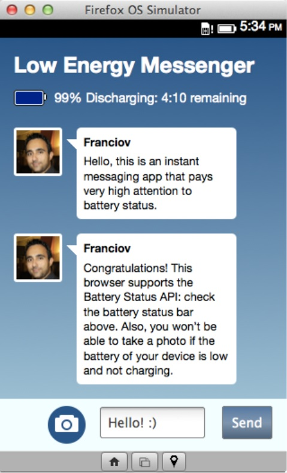
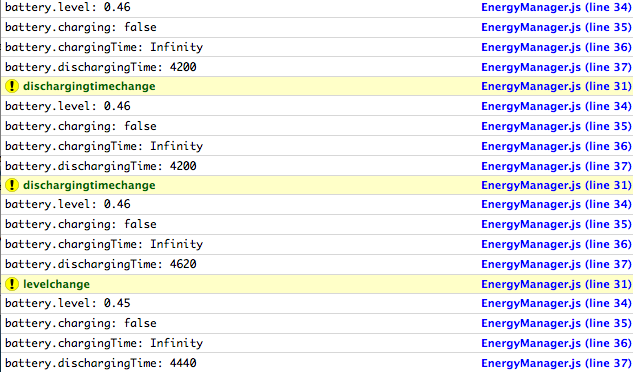

[Web API](https://developer.mozilla.org/en-US/docs/WebAPI) 可讓 Open Web App 透過 JavaScript 存取裝置硬體、資料、感測器，當然也為其他電視、行動裝置、路邊的互動式電子訊息站 (Kiosk)、物聯網 (Internet of Things，IoT) 等應用帶來更多可能性。

多種情況或使用條件都必須知道裝置目前的電池容量。以下舉出幾個例子：

- 公用程式類的 App 會蒐集電池用量的統計數據，或單純的通知使用者最好開始充電，以利繼續上網、玩遊戲、欣賞影片。

- 高品質 App 會最佳化電池的消耗情形，例如電子郵件 App 會在裝置所剩電量不多之時，同時降低向伺服器查詢新進郵件的頻率。

- 在電池即將耗盡之前，文字處理 App 也會自動存檔，避免資料遺失。

- 某一活動展廳所安裝的電視或電子訊息站正在充電，或是連接線發生任何錯誤，都會進行系統檢查。

- 某一模組將檢查空拍機的電池容量，避免在返回基地之前就耗盡電池。

本文則希望以標準化的 Battery Status API 管理電源使用量。

#### Battery Status API

Open Web App 可透過 [Battery Status API](https://developer.mozilla.org/en-US/docs/WebAPI/Battery_Status) 檢查電池狀態的資訊。此 API 現已進入 [W3C 的「建議 (Recommendation)」](https://www.w3.org/TR/battery-status/)階段，且 Firefox 16 就開始支援。目前 Firefox OS、Chrome、Opera、Android 等瀏覽器均已支援，所以現在已可用於多款主要平台。

而 API 在目前 W3C 建議階段，透過「[Promise Objects](https://developer.mozilla.org/en/docs/Web/JavaScript/Reference/Global_Objects/Promise)」的導入而有所改進，現可處理單一裝置上的多個電池狀態。

在撰寫本文的同時，[此於 W3C 上改進的結果](https://www.w3.org/TR/2014/CR-battery-status-20141209/)尚未實作於 Firefox 之中。在你想為 Gecko 貢獻之前，請看下列建構更新的錯誤報告：

- [[1050749](https://bugzilla.mozilla.org/show_bug.cgi?id=1050749)] Expose BatteryManager via getBattery() returning a Promise instead of a synchronous accessor (navigator.battery)

- [[1050752](https://bugzilla.mozilla.org/show_bug.cgi?id=1050752)] BatteryManager: specify the behavior when a host device has more than one battery

接著將簡單透過 Firefox OS 的快速傳訊 App，以及目前可支援的所有瀏覽器上使用 Battery Status API。

#### 「Low Energy Messenger」展示用 App

「Low Energy Messenger」是可發出即時訊息的展示用 App，會密切注意電池的電量。此 App 是以 HTML + CSS + 原生 Javascript 所打造，以及本身所內建的資料。另外該 App 並不包含在網路上執行的 Web 服務，而是實際整合了 Battery Status API 之後提供具體的外觀和感覺。

你可以欣賞 [Low Energy Messenger 運作展示](https://franciov.github.io/low-energy-messenger/)，另有 [Github 上的展示程式碼](https://github.com/franciov/low-energy-messenger/)，還能參閱 MDN 上的《[Retrieving Battery status information](https://developer.mozilla.org/en-US/Apps/Build/gather_and_modify_data/retrieving_battery_status_information)》一文，為你逐步解釋程式碼。

Low Energy Messenger 現有下列特色：

- 一組電池狀態列，提供電池狀態資訊。

- 一組對話區塊，內含所有已接收或已送出的訊息。

- 一組行動功能列，內含一組文字輸入框、一組訊息傳送按鈕、一組拍照按鈕、一組可於 Firefox OS 上安裝該 App 的按鈕。

- 為了在電量偏低時儘量延長電池使用時間，當電量即將耗盡之時，此 App 將停用拍照功能。

App 的狀態列將實際呈現電池電量，並將根據充電狀態改變顯示方式，例如：

Low Energy Messenger 另具備所謂的「[EnergyManager.js](https://github.com/franciov/low-energy-messenger/blob/master/scripts/utils/energy-manager.js)」模組，可透過 Battery Status API 取得上述顯示的資訊並進行檢查。

我們透過 [navigator.getBattery](https://developer.mozilla.org/en-US/docs/Web/API/navigator.getBattery) 函式 (使用 Promises)，或由將於未來停用的 [navigator.battery](https://developer.mozilla.org/en-US/docs/Web/API/navigator.battery) 屬性 (之前 W3C 規格的一部分，現由 Firefox 與 Firefox OS 所使用)，來從 [BatteryManager](https://developer.mozilla.org/en-US/docs/Web/API/BatteryManager) 衍生出電池物件。如上所述，若要了解實作細節或貢獻 Gecko，均可先行[參閱此錯誤報告](https://bugzilla.mozilla.org/show_bug.cgi?id=1050749)。

EnergyManager.js 模組則將透過下列方式，將 API 建構之中的差異降至最低：

		
		

/* EnergyManager.js */
 init: function(callback) {
     var _self = this;
			
				
					
				
					123
				
						/* EnergyManager.js */ init: function(callback) {     var _self = this;
					
				
			
		

		
		

/* Initialize the battery object */
    if (navigator.getBattery) {
       navigator.getBattery().then(function(battery) {
           _self.battery = battery;
           callback();
       });
    } else if (navigator.battery || navigator.mozBattery) { // deprecated battery objects
        _self.battery = navigator.battery || navigator.mozBattery;
        callback();
    }
 }
			
				
					
				
					1234567891011
				
						/* Initialize the battery object */    if (navigator.getBattery) {       navigator.getBattery().then(function(battery) {           _self.battery = battery;           callback();       });    } else if (navigator.battery || navigator.mozBattery) { // deprecated battery objects        _self.battery = navigator.battery || navigator.mozBattery;        callback();    } }
					
				
			
		

navigator.getBattery 函式將回傳一組電池的 [Promise](https://developer.mozilla.org/en/docs/Web/JavaScript/Reference/Global_Objects/Promise)，且透過在 BatteryManager 物件中「解決 (Resolved)」此 Promise 以監控電池狀態，而預計於未來停用的 navigator.battery 屬性將直接回傳 BatteryManager 物件。此外，BatteryManager 的實作也將自動檢查目前是否為較早期的平台，並自動對應較舊版本、具 Vendor 前綴的 API。

若要了解 Battery Status API 的實際運作方式，則記錄到瀏覽器的[網路主控台 (Web Console)](https://developer.mozilla.org/en/docs/Tools/Web_Console) 倒是不錯：

		
		

/* EnergyManager.js */
			
				
					
				
					1
				
						/* EnergyManager.js */
					
				
			
		

		
		

log: function(event) {
    if (event) {
        console.warn(event);
    }
			
				
					
				
					1234
				
						log: function(event) {    if (event) {        console.warn(event);    }
					
				
			
		

		
		

console.log('battery.level: ' + this.battery.level);
    console.log('battery.charging: ' + this.battery.charging);
    console.log('battery.chargingTime: ' + this.battery.chargingTime);
    console.log('battery.dischargingTime: ' + this.battery.dischargingTime);
 }
			
				
					
				
					12345
				
						console.log('battery.level: ' + this.battery.level);    console.log('battery.charging: ' + this.battery.charging);    console.log('battery.chargingTime: ' + this.battery.chargingTime);    console.log('battery.dischargingTime: ' + this.battery.dischargingTime); }
					
				
			
		

而網路主控台 (Web Console) 上的紀錄將呈現如下：

每次只要送出一組事件 (如 dischargingtimechange、levelchange 等等)，則 BatteryManager 物件就會提供更新後的值，以利 App 於任何情況下使用。

#### 結論

Battery Status API 是存取裝置硬體的標準化方式。即使目前仍需要在 Firefox 上執行某些相容性檢查，但已可用於實際的生產環境之中。W3C 規格已足以讓我們用於不同的情境之中，因此該 API 已可因應大多數的實際使用條件。

原文連結：[Let’s get charged: Updates to the Battery Status API](https://hacks.mozilla.org/2015/05/lets-get-charged-updates-to-the-battery-status-api/)
