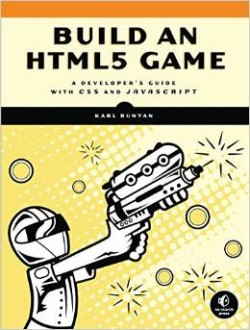
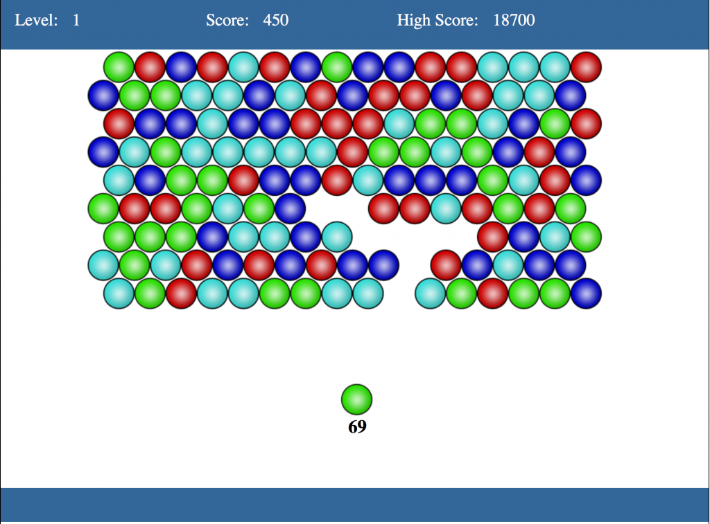

[Mozilla 在去年與 Humble Bundle 合作，為大家提供多款獨立開發遊戲](https://blog.mozilla.com.tw/posts/6521/)，如《超越光速 (Faster Than Light，FTL)》以及《Voxatron》。當然還有其他遊戲透過「Humble Mozilla Bundle」的助力而進入 Web 平台。我們今年規劃要以 JavaScript 的開發活動來玩更大一點，像是可支援 [SIMD](https://docs.google.com/presentation/d/1yc2NDzFJ-0yD980URiTcV3oE_2cQDVzXuH4Rss1fG8s/present#slide=id.p19) 與 SharedArrayBuffer。不用外掛程式就能在 Web 上玩遊戲實在太美妙了。玩家不會再被逼著安裝一堆自己都不知道是什麼的東西，而且一旦他們喜歡遊戲，也只要一個連結就能在社交平台上輕鬆分享。試想多位玩家如同病毒感染一樣蜂擁連線，似乎能創造無限可能！

[我最近專注於 WebGL 的即時繪圖](https://nickdesaulniers.github.io/RawWebGL/#/)之時，才發現這玩意實在強大，讓我必須稍退一步先了解遊戲邏輯的開發作業及不同的發佈管道。我看了幾本有關遊戲開發的書，最近剛看完 Karl Bunyan 所寫的《Build an HTML5 Game》，心想應該分享一下自己的心得。接著針對 HTML5 遊戲的分享與發佈管道，再為大家解釋其他的替代方案。

#### 簡介《Build an HTML5 Game》

《[Build an HTML5 Game (BHG)](https://buildanhtml5game.com/)》一書是針對已具備程式撰寫經驗；曾寫過 HTML、CSS、JavaScript；知道該如何於本端伺服器架設程式碼；並正在開發 2D 一般遊戲的開發者所寫。從概念發想、以小型工作著手，乃至於結束整個開發作業，都用前面幾章架構出良好的閱讀脈絡。該書作者也開宗明義的說此書不會討論進階 3D 視覺效果 (將透過 WebGL 說明)，也不會談到大家所熟悉的遊戲玩法機制 (Game play mechanics) 設計。反之，此書將專心說明該如何使用 HTML5 與 CSS3 來取代 Flash 而達到一般遊戲開發目的。看完全書就能實作出類似《泡泡龍》的消泡泡遊戲。另外可至 [buildanhtml5game.com](https://buildanhtml5game.com/) 找到原始碼、遊戲展示，以及更多實作範例的解決方案。

本書也提到許多遊戲所需，或值得讀者深入研究的 Web API。其中的 API、樣式、函式庫包含：[Modernizr](https://modernizr.com/)、[jQuery](https://jquery.com/)、CSS3 [transitions](https://developer.mozilla.org/en-US/docs/Web/Guide/CSS/Using_CSS_transitions)/[animations](https://developer.mozilla.org/en-US/docs/Web/Guide/CSS/Using_CSS_animations)/[transforms](https://developer.mozilla.org/en-US/docs/Web/Guide/CSS/Using_CSS_transforms)、[Canvas 2D](https://developer.mozilla.org/en-US/docs/Web/API/Canvas_API)、[audio tags](https://developer.mozilla.org/en-US/docs/Web/HTML/Element/audio)、Sprite Atlases、DOM manipulation、[localStorage](https://developer.mozilla.org/en-US/docs/Web/Guide/API/DOM/Storage#localStorage)、[requestAnimationFrame](https://developer.mozilla.org/en-US/docs/Web/API/window/requestAnimationFrame)、[AJAX](https://developer.mozilla.org/en-US/docs/AJAX)、[WebSockets](https://developer.mozilla.org/en-US/docs/WebSockets)、[Web Workers](https://developer.mozilla.org/en-US/docs/Web/API/Web_Workers_API/Using_web_workers)、[WebGL](https://developer.mozilla.org/en-US/docs/Web/WebGL)、[requestFullScreen](https://developer.mozilla.org/en-US/docs/Web/API/Element/requestFullScreen)、[觸控事件 (Tuch Events)](https://developer.mozilla.org/en-US/docs/Web/API/Touch_events)、[「viewport」的 meta tags](https://developer.mozilla.org/en-US/docs/Mozilla/Mobile/Viewport_meta_tag)、[開發者工具](https://developer.mozilla.org/en-US/docs/Tools)等等。

如果你正打算開發 HTML5 遊戲，想找一本還不錯的開發參考書，當然可以試著翻閱本文提到的《[Build an HTML5 Game (BHG)](https://buildanhtml5game.com/)》。而除了這裡提到的參考書之外，你當然也應該要[點擊這裡參閱原文](https://hacks.mozilla.org/2015/06/build-an-html5-game-and-distribute-it/)全文，其內另將為大家概述如遊戲發佈管道、執行環境的選擇、管理後續的更新檔，當然也少不了精采的程式碼。期待你開發出屬於自己的 HTML5 遊戲！

原文連結：[Build an HTML5 game—and distribute it](https://hacks.mozilla.org/2015/06/build-an-html5-game-and-distribute-it/)
