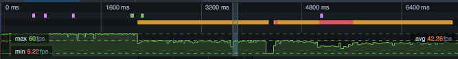
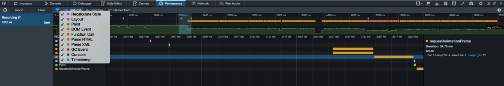
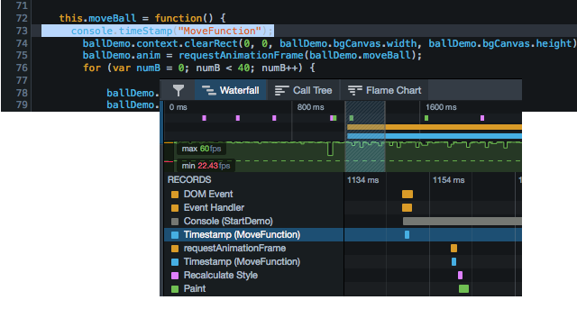
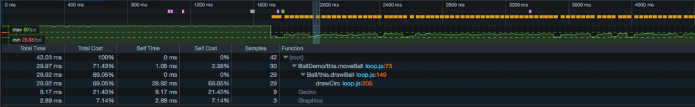
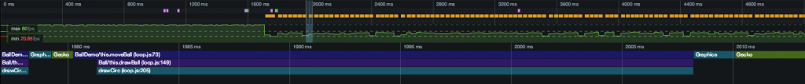
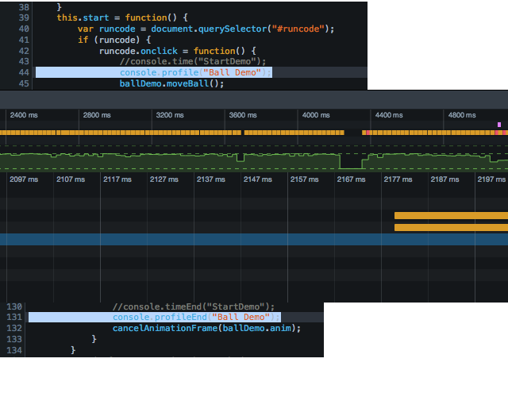
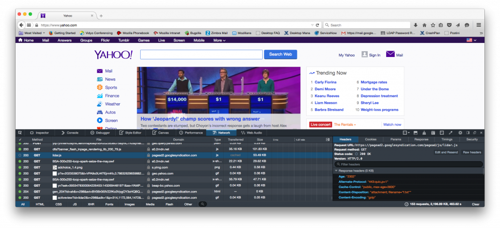
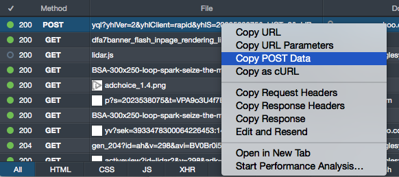
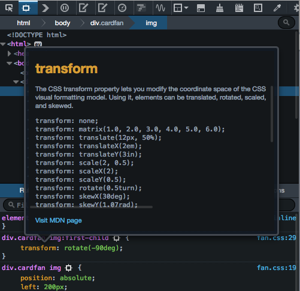
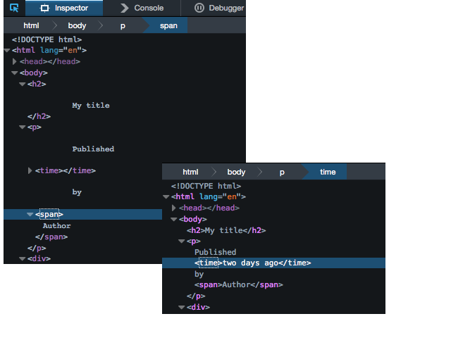

很高興 [Firefox 開發者版本 (Developer Edition)](https://www.mozilla.org/firefox/developer/?utm_source=hacks.mozilla.org&utm_medium=referral&utm_campaign=firefox-performance-tools&utm_content=hacks-blog) 現已具備全新效能工具。目前的 Firefox 開發者版本也就是將來的 Firefox 40 (這裡簡稱 DE 40 )。本文將討論數項 DE 40 的新開發工具，以及對現有工具的修正與改善之處。此外還有精采影片為大家呈現其中幾項功能。

附註：在稍早的五月份[《淺談 Firefox 40 開發者工具》一文](https://blog.mozilla.com.tw/posts/7529/)中，已經介紹了多項新功能。

#### 介紹新的效能工具

Firefox 開發者版本具備新的[效能工具](https://developer.mozilla.org/en-US/docs/Tools/Performance)，讓開發者站在 App 的效能觀點，來進一步了解實際發生的事情。Web 開發者也能透過這些工具而分析任何 App、網站，甚或遊戲的效能。以趣味的角度看看這些工具是如何最佳化 HTML5 遊戲。可參閱另篇《[Power Surge ─ 用 Firefox 開發者版本最佳化此 HTML5 遊戲中的 JavaScript](https://blog.mozilla.com.tw/posts/7562/)》一文。

現在所有效能工具均已納入「效能 (Performance)」分頁之下以方便使用。效能與時間密切相關，所以你現在能以時間軸的方式檢視瀏覽器事件。根據你所想監看的時間尺度，呈現更多細節。

Dan Callahan 將透過下方影片展示效能工具的使用方式。

「效能 (Performance)」分頁具備新的時間軸，包含「[Waterfall](https://developer.mozilla.org/en-US/docs/Tools/Performance/Waterfall)」、「[Call Tree](https://developer.mozilla.org/en-US/docs/Tools/Performance/Call_Tree)」、「[Flame Chart](https://developer.mozilla.org/en-US/docs/Tools/Performance/Flame_Chart)」等檢視模式。

這些檢視模式都能透過時間軸而呈現 App 整體效能的細節。時間軸將顯示壓縮的 Waterfall、最低＼最高＼平均[幀率 (Frame rates)](https://developer.mozilla.org/en-US/docs/Tools/Performance/Frame_rate)，並以圖形化的方式呈現幀率。直接點擊檢視畫面並拖曳到想看的範圍，就能放大該段時間軸細看。此時也會同步更新全部三種檢視模式，顯示你所選擇的特定範圍。

記錄檢視模式，能讓開發者迅速放大觀看幀率問題發生的範圍。

「Waterfall」檢視模式，是以圖形化的時間軸呈現 App 中發生的事件。這些事件包含發生時間的標記，如「reflows」、「restyles」、「garbage collection」、「paint operations」、JavaScript 呼叫函式。透過簡單的篩選按鈕，即可選擇你想在 Waterfall 中顯示的事件。

在特定事件發生時，另可透過如 console.timeStamp() 的[主控台指令](https://developer.mozilla.org/en-US/docs/Web/API/Console)，搭配 Waterfall 上的標記來指定該事件。同樣另可使用 console.time() 與 console.timeEnd() 函式，以圖形化的方式呈現特定時段。

「Call Tree」檢視模式可讓 [JavaScript 效能分析器 (Profiler)](https://developer.mozilla.org/en-US/docs/Tools/Performance/Call_Tree) 呈現特定範圍的結果，看出函式中所耗用的大概時間。此表格另可顯示某一函式呼叫的總耗時，或是特定函式呼叫本身所耗用的時間。這裡的總時間包含了函式內所耗用的全部時間，包含巢狀函式呼叫所耗用的時間。本身耗用的時間就是「特定函式的耗時減去巢狀呼叫函式的耗時」。如果想要找出佔去大部分處理時間的函式，此檢視模式就特別有用。且 Firefox 早已支援此模式，所以對使用過的開發者應該不算陌生。

「Flame Chart」檢視模式是以圖形化的方式呈現選定範圍之內的呼叫堆疊 (這部份類似 Call Tree)。以下圖為例，drawCirc() 函式共超過 25 微秒 (millisecond，ms) 才完成，這段時間就大於 60 fps 幀像產生的「[期限](https://developer.mozilla.org/en-US/docs/Tools/Performance/Frame_rate)」。

我們可建立、儲存、匯入、篩除效能分析檔案。此外也能一次開啟多個分析檔案，以利比對各次執行之間的效能統計數據。你可透過主控台或程式設計的方式建立分析檔案。只要輸入 console.profile("NameOfProfile") 與 console.profileEnd("NameOfProfile")，即可分別開啟＼停止分析檔案。當要在自己的程式碼中開始＼停止效能分析時，就有利於開發者進行微調。

你可到 MDN 上參閱[效能工具的完整說明文章](https://developer.mozilla.org/en-US/docs/Tools/Performance)，其中包含[使用者介面 (UI) 導覽](https://developer.mozilla.org/en-US/docs/Tools/Performance/UI_Tour)、各主要工具參考頁面，以及透過工具診斷 [CSS animations](https://developer.mozilla.org/en-US/docs/Tools/Performance/Scenarios/Animating_CSS_properties) 與[高度依賴 JavaScript 頁面](https://developer.mozilla.org/en-US/docs/Tools/Performance/Scenarios/Intensive_JavaScript)效能問題的範例。

#### 更多功能與改善之處

除了新效能工具的多項方便功能 (大多數都是透過 [UserVoice](https://mzl.la/devtools) 管道直接獲得開發者的反饋意見) 之外，還修正了超過 90 個臭蟲。感謝 Firefox 開發者工具團隊與多位貢獻者過去 8 個星期來的努力。歡迎大家繼續提供任何問題與意見。

此由 Matthew “Potch” Claypotch 所拍攝的影片，即為大家呈現 DE 40 中多項反應頻率最高的功能。

#### 「網路監測器 (Network Monitor)」改善之處

如上面影片，「網路監測器」也提升了多項功能。即使尚未啟動「網路 (Network)」分頁，也同樣能進行資料蒐集。且在載入快取 (而非網路) 的整體資料 (Asset) 時，亦可迅速一瞥這些東西。

現在只要選定某列輸入項，即可透過滑鼠右鍵選單來複製 POST 資料、URL 參數、請求 (Request)＼回應 (Response) 標頭。

#### 整合 CSS 說明文件

Firefox 開發者工具現已整合 CSS 屬性的 MDN 說明文件，讓開發者在進行 Web app 樣式與配置的除錯時，能取得更多資訊。你可對「檢測器 (Inspector)」分頁中的 CSS 屬性按下滑鼠右鍵 (Mac 則是按下 Ctrl + click)，再點選右鍵選單的「顯示 MDN 文件 (Show MDN Docs)」即可。

#### 改善檢測器的配置

在檢測器分頁中，現已清除文字節點配置中的空白字元，讓你的網頁原始碼看來更清楚。

#### 

#### 更多修正之處

另外還有許多修正的地方，像是「動畫檢測器 (Animation Inspector)」的改善、捲動即可檢視右鍵選單，以及提升了檢測器的搜尋功能。你可參閱 [Bugzilla 中的清單](https://mzl.la/1FC3Nbm)已了解此版本所解決的所有問題。

我們同樣要特別感謝所有回報問題、測試修正檔，還有花上許多時間讓 Firefox 開發者工具更好的諸多貢獻者。

原文連結：[New Performance Tools in Firefox Developer Edition 40](https://hacks.mozilla.org/2015/06/new-performance-tools-in-firefox-developer-edition-40/)
