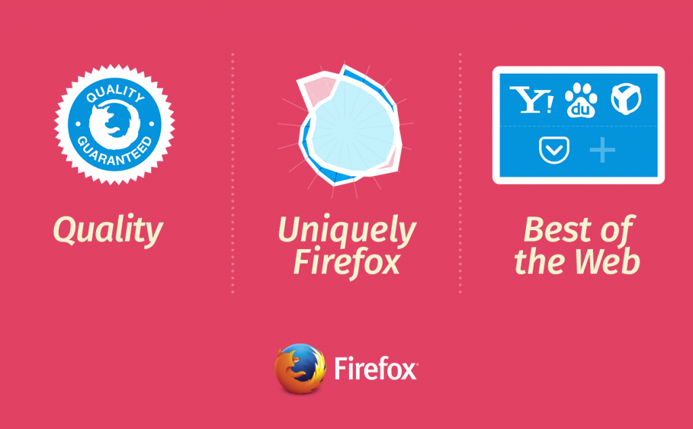

在十多年前，我們決定要提供大家透明、自主、多元選擇的網路，並依循此一[使命](https://www.mozilla.org/mission/)打造出 Firefox。而從那時候開始，瀏覽器就成為使用者體驗 Web 並控制自己線上生活的關鍵角色。

Mozilla 也因此時時問自己：我們該如何讓 Firefox 越來越好，並能持續讓大家用得開心？我們與大多數的科技公司有所不同，所有人都在開放的環境中工作，且環繞本身策略所著重的三大範圍共享某些實驗性的概念。

#### 絕不妥協的品質

我們首重絕佳的使用者經驗，且要讓 Firefox 符合絕大多數嚴苛的品質與效能標準。而透過 [HTML5 影片播放](https://blog.mozilla.org/blog/2015/05/12/update-on-digital-rights-management-and-firefox/)與[遊戲效能](https://blog.mozilla.org/blog/2015/03/03/bringing-native-games-to-the-web-is-about-to-get-a-whole-lot-easier/)等的提升，足可體現我們對 Web 經驗的承諾。Mozilla 很快就會將 Firefox 帶入如 iOS 與 Windows 10 等的新平台，期能提供獨立且高效能的經驗，並成為平台預設瀏覽器的絕佳替代方案。

#### Web 的最佳瀏覽器

Firefox 之所以眾所週知，就是因為能讓使用者完全掌握自己的 Web 經驗，並不斷擴大「現代化瀏覽器」的極限。我們目前於全球擁有更多夥伴與開發者，要向大家突顯 Firefox 創新之處並提供最好的 Web。透過 [Firefox 新搜尋策略](https://blog.mozilla.com.tw/posts/6757/)，我們將推動更多的選擇與創新，另亦根據現有標準打造出新的開放技術，例如與 Telefonica 合作開發的「Firefox Hello」，即是首款將 WebRTC 內建於瀏覽器中的視訊通話工具。Mozilla 另持續率先研究如 WebVR、WebGL、WebRTC 等的開放標準，要讓 Web 進化成為開發平台。

#### 獨一無二的 Firefox

今年稍早，我們向使用者詢問了 Firefox 的獨特之處。相關結果更堅定了我們的觀點：Firefox 必須更為注重效能、信任、品質等特性，以符合 Mozilla 所念茲在茲的使命。

由於 Mozilla 保護使用者的選擇與隱私，因此極為看重使用者對我們的信任。所以我們現正嘗試進一步改善隱私瀏覽與其他特殊功能，並將以單次重大版本總括上述三大範圍的特色。預計今年稍晚就會向 Firefox 使用者分享後續消息。

敬請隨時留意相關發展。

原文連結：[What to Look Forward to from Firefox](https://blog.mozilla.org/futurereleases/2015/07/02/what-to-look-forward-to-from-firefox/)
