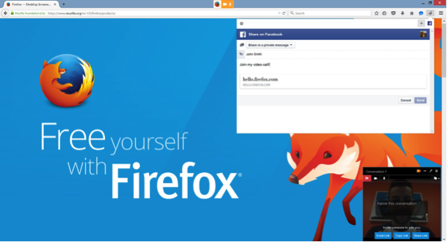

不論你愛用哪個社交網站，想必「社交」現已成為大家徜徉 Web 的重要形式之一。Firefox 就是要讓使用者能掌握自己的線上生活，也希望能讓你在最高人氣的社交網路上輕鬆分享所有事物。「Firefox Share」已於今天正式整合至「Firefox Hello」之中，讓你能輕鬆橫跨 Facebook、Twitter、Tumblr、LinkedIn、Google+，以及更多社交與電子郵件 ([點選此處觀看完整清單](https://activations.cdn.mozilla.net/)) 等高人氣的服務，輕鬆分享 Web 內容，讓你能隨時向所有好友分享 Web 上的大小事。

Mozilla 與合作夥伴 Telefónica 一同開發的「Firefox Hello」現已進入測試版。Firefox Hello 是目前唯一不需登入帳戶或額外下載軟體，即可於瀏覽器內進行視訊對話的聊天工具。我們最近才為 Firefox Hello 新增了[畫面分享](https://blog.mozilla.com.tw/posts/7552/firefox-control-online)功能，讓你在對話期間就能輕鬆分享自己正在欣賞的東西。你完全不需離開目前的瀏覽器分頁，就能透過社交網路或自己慣用的電子郵件服務，將對話連結傳送給好友以邀請對方加入對話。這也包含 Firefox Share 剛[整合的 Yahoo Mail 郵件服務](https://activations.cdn.mozilla.net/yahoomail.html)，讓 Yahoo Mail 使用者同樣可直接透過 Firefox Share 分享 Hello 的對話連結或其他 Web 內容。

#### 更多資訊

[Windows、Mac、Linux 版 Firefox 的版本說明](https://www.mozilla.org/firefox/39.0/releasenotes/)

[Firefox for Android 版本說明](https://www.mozilla.org/firefox/android/39.0/releasenotes/)

[下載 Firefox](https://www.mozilla.org/zh-TW/firefox/channel/)

原文連結：[New Sharing Features in Firefox](https://blog.mozilla.org/blog/2015/07/02/new-sharing-features-in-firefox/)
