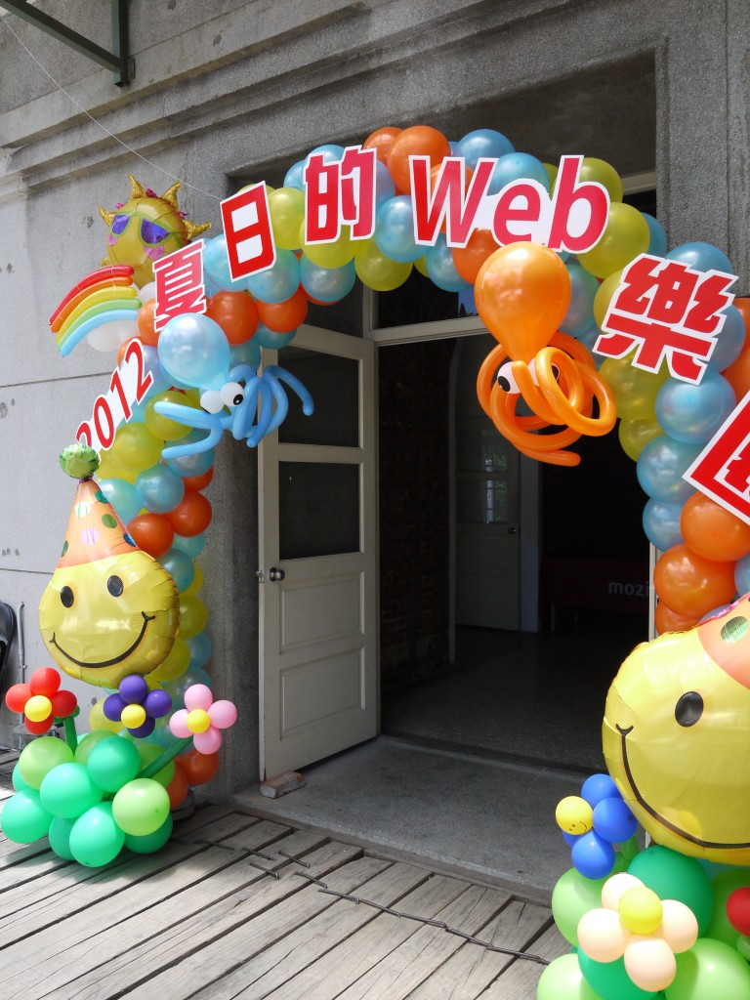
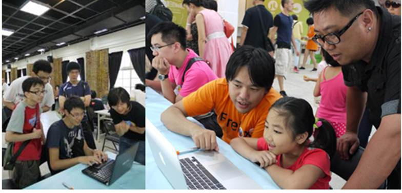
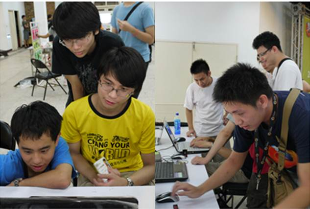
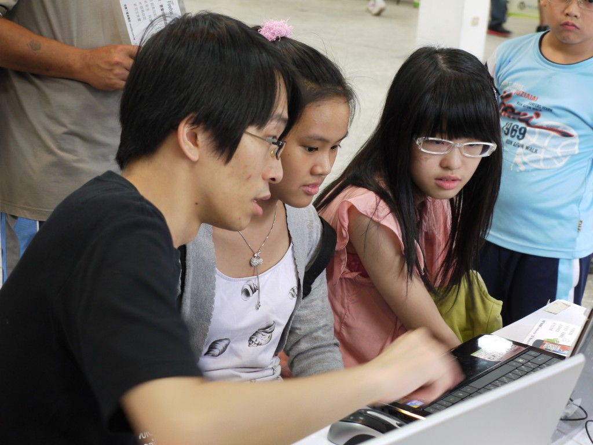
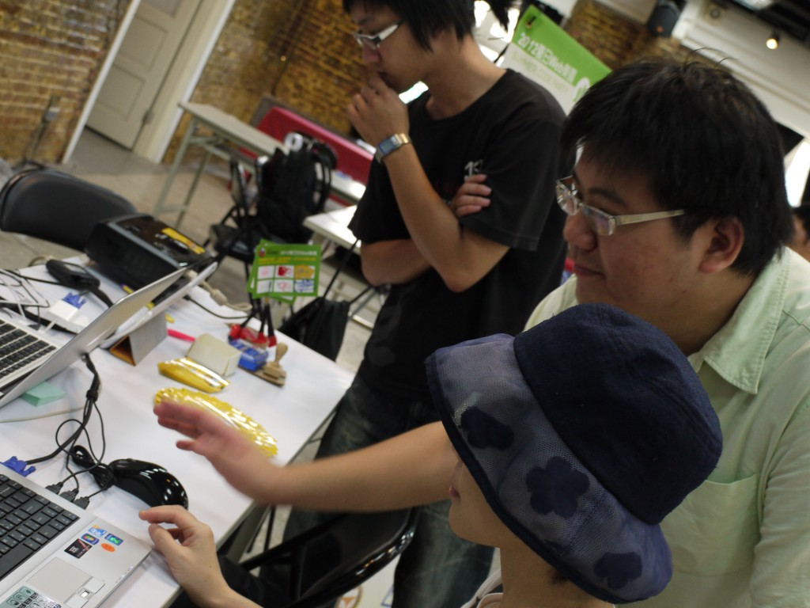
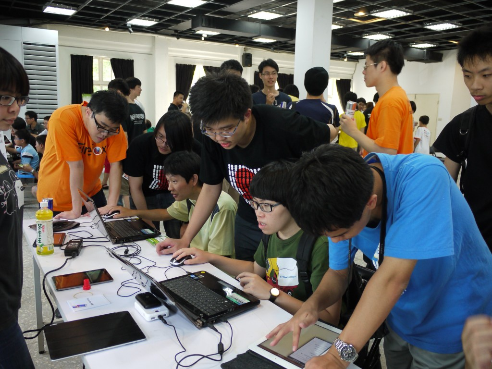
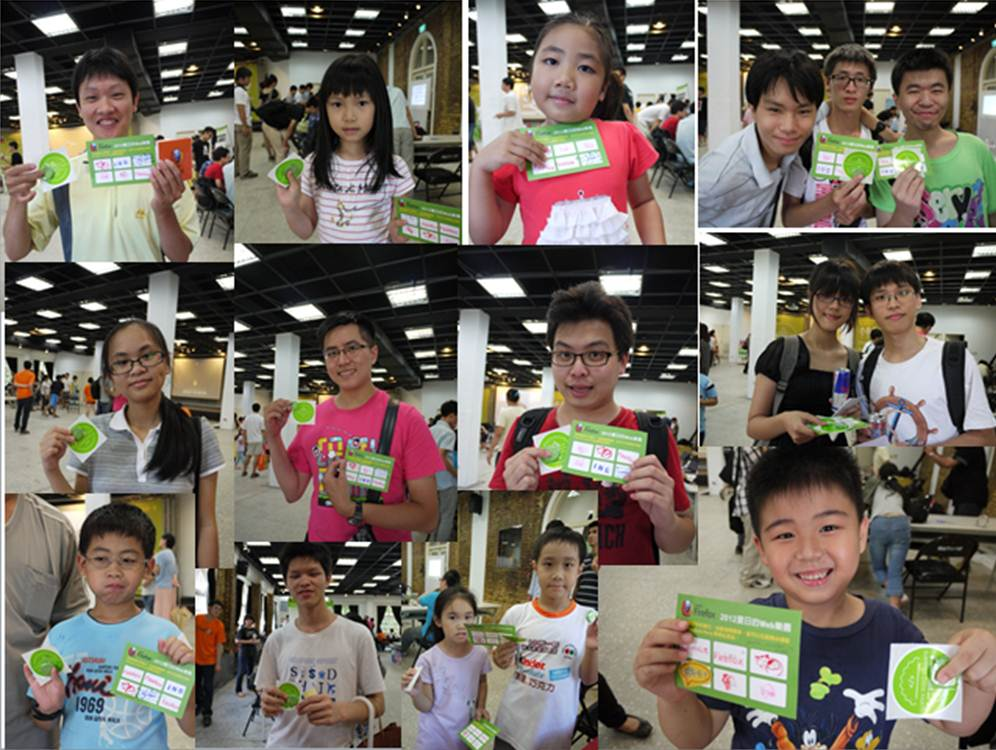
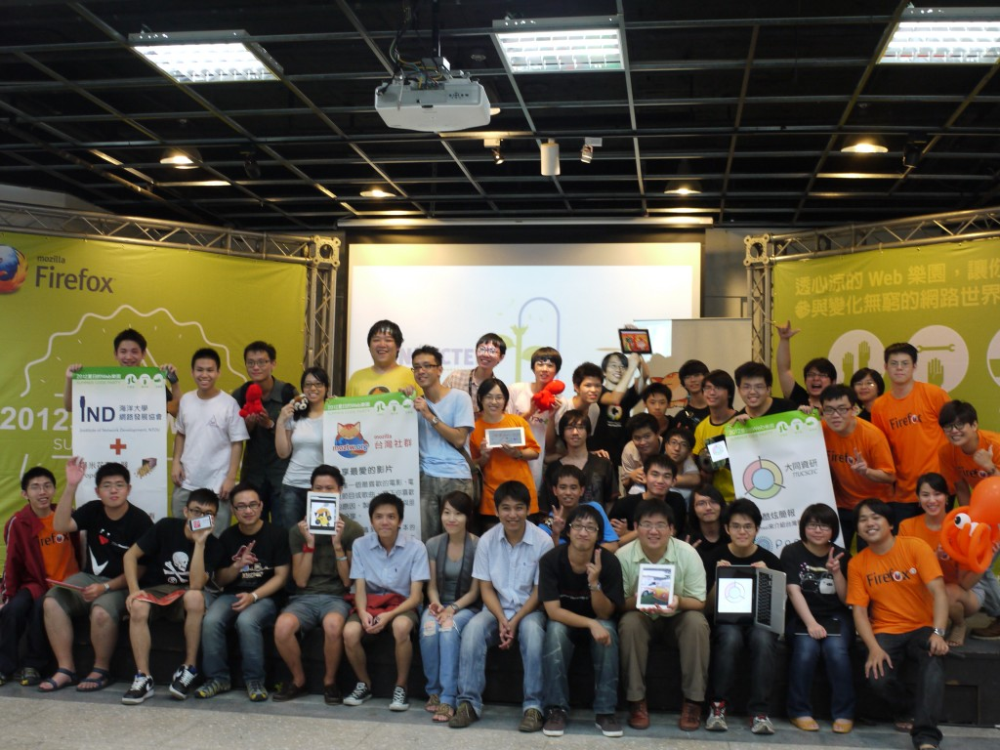

Mozilla Taiwan 協同台灣當地社群，於2012年7月29 在華山1914藝文中心盛大舉辦「夏日的 Web 樂園」(Summer Code Party)。活動採預約報名和現場開放制，在華山半開放式集會空間的特性下，除了預約報名的參加者外，當天也成功吸引到很多年輕/家庭一同共襄盛舉！看到小小朋友們在各攤位前認真的學習，努力在 Web 上留下足跡，只能說真是太可愛啦！這場成功的Web 園遊會，感謝台灣一同參與的在地社群，以及當天參與活動的現場嘉賓，讓我們朝更美好的網路環境大步前進！

Firefox 旗海飄揚，為「夏日的 Web 樂園」揭開序幕！

「夏日的 Web 樂園」氣球拱門歡迎您！

Mozilla Taiwan 帶使用者線上製作父親節卡片，表達滿滿心意！

「海洋大學網路發展協會（IND）」以「海上活動的影片」為底，讓參與者在影片上加上注意事項、步驟等註記並發佈

「MozTW」利用 Mozilla Thimble 讓參與者在網頁上以轉貼連結的方式，分享自己喜歡的影片，並發佈為網頁

「胖卡」利用 Google 的「搜尋故事」工具，讓參與者製作一段記錄搜尋過程的影片並發佈

「大同」利用網路工具做簡報，簡報的題目是「台灣景點介紹」

「Wordpress」：利用 WordPress 撰寫超簡易入門版的部落格

有趣的遊戲攤位，人氣紅不讓！

闖關成功集滿六格，手拿徽章搶當網頁達人，oh yea！

Mozilla Taiwan在台灣的首次「夏日的 Web 樂園」完滿成功，期待下次再見喔！

更多照片請見 Flickr上[MozillaTaiwan](https://www.flickr.com/photos/mozillataiwan/sets/72157629837171139/)：[http://www.flickr.com/photos/mozillataiwan/](https://www.flickr.com/photos/mozillataiwan/)

夏日的 Web 樂園：Mozilla Taiwan 攤位作品一覽：http://blog.mozilla.com.tw/posts/747

Mozilla相關資訊都會透過[Mozilla Taiwan 訊息中心](https://blog.mozilla.com.tw/)、[FB 粉絲頁](https://fb.me/MozillaTaiwan)和[G+ 專頁](https://plus.google.com/u/0/114653167240123163859/posts)第一手傳達給Mozilla的好朋友們，大力歡迎大家加入並關注訊息！
