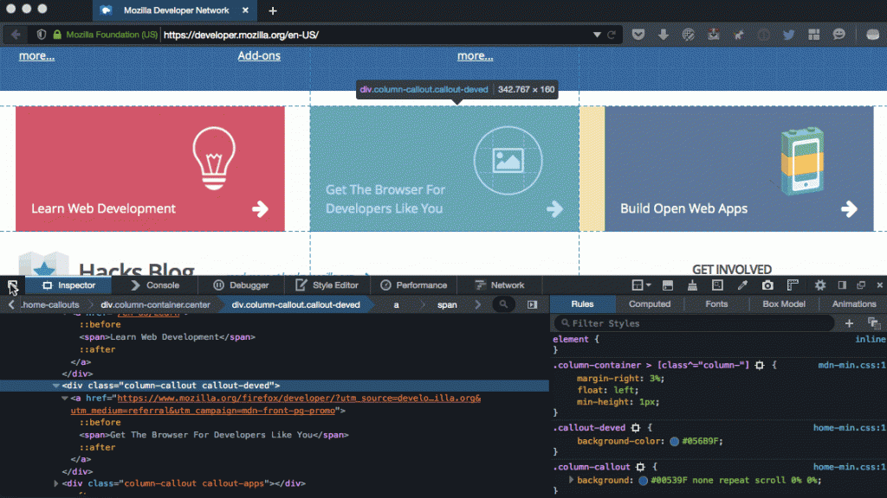
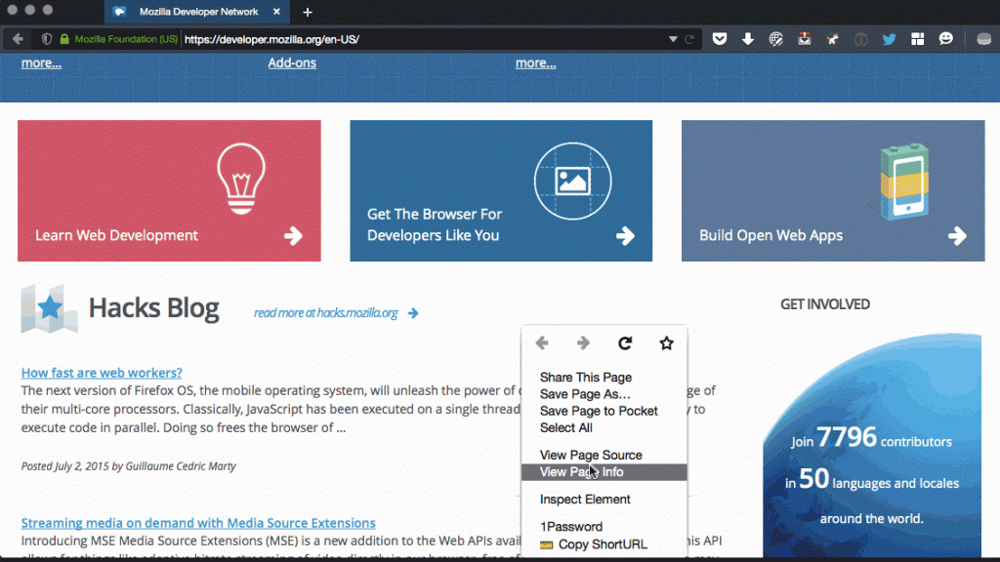
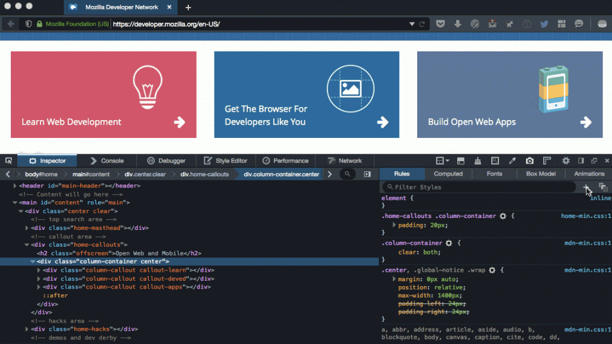
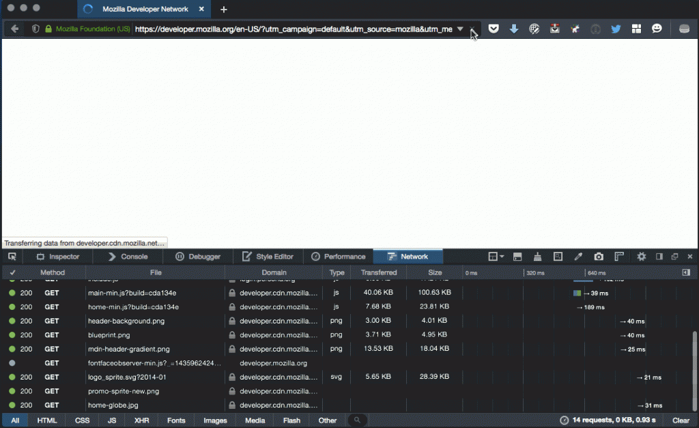

### 於分頁中檢視原始碼、截圖元素、HAR 檔案，還有更多

我們在幾個禮拜前剛介紹了[新的「Performance」效能工具](https://blog.mozilla.com.tw/posts/7600)，也談到 Firefox 開發者工具團隊花了許多心力在使用者所提供的意見之上，其中包含在 [UserVoice 意見反饋管道](https://mzl.la/devtools)與 [Bugzilla](https://bugzilla.mozilla.org/enter_bug.cgi?product=Firefox&component=Developer%20Tools) 所獲得的建議。即使 Firefox 41 版本釋出週期極為短暫，我們仍持續專注於使用者的反饋意見。社群另提出多項新功能並希望能及時加入此一版本。以下是相關簡介：

#### 可針對檢測器 (Inspector) 中選定的節點進行截圖

新貢獻者 Léon McGregor 在 [UserVoice](https://ffdevtools.uservoice.com/forums/246087-firefox-developer-tools-ideas/suggestions/6060256-add-screenshot-of-selected-element-to-inspector) 上提出了有趣建議。雖然之前早已能透過 Graphical Command Line Interface (GCLI) 的「screenshot」指令使用此功能，但現在將該功能加入滑鼠右鍵的選單之後，更進一步提高了使用率。而在截圖完成之後，Firefox 就會將之複製到你所設定的下載目錄中。

對目前所選定的元素進行截圖

- [UserVoice](https://ffdevtools.uservoice.com/forums/246087-firefox-developer-tools-ideas/suggestions/6060256-add-screenshot-of-selected-element-to-inspector)

- [Bugzilla](https://bugzilla.mozilla.org/show_bug.cgi?id=991045)

#### 於分頁中檢視原始碼

從 Firefox 41 開始，只要你按下滑鼠右鍵並點選「檢視原始碼 (View Page Source)」，就會在分頁中開啟 html 原始碼檢視視窗，而不會另外再開啟新的視窗。在許多人的關切之下，我們也希望能儘早推出此一功能，但這個看起來簡單的變化其實牽涉甚廣。請參閱下方 Bugzilla 的連結以了解細節。重要的是，我們確保此功能是從 Firefox 的快取獲得原始碼，而不需再重載新的版本。

「檢視原始碼」現在均以分頁形式開啟

- [UserVoice](https://ffdevtools.uservoice.com/forums/246087-firefox-developer-tools-ideas/suggestions/5895550-view-source-in-a-tab)

- [Bugzilla](https://bugzilla.mozilla.org/show_bug.cgi?id=1067325)

#### 「新增規則」按鈕

在檢視器中工作的同時，若能直接新增規則就再方便不過。使用者透過 Firebug 提出此功能的需求已有一段時間。在此版本釋出之前，我們另外花了一點持間強化此一實作。除了在滑鼠右鍵選單加入此指令之外，也在 UI 之上提供了方便的按鈕。

檢視器中新增了按鈕，讓你能迅速新增 css 規則

- [Bugzilla](https://bugzilla.mozilla.org/show_bug.cgi?id=1136101)

#### 「Copy as HAR」與「Save all as HAR」

另有許多人透過 Firebug 所要求的功能，就是能匯出目前頁面的 [HAR 備份檔案](https://dvcs.w3.org/hg/webperf/raw-file/tip/specs/HAR/Overview.html)。

現可從「網路監測器 (Network Monitor)」直接匯出 HAR 備份檔案

- [Bugzilla](https://bugzilla.mozilla.org/show_bug.cgi?id=859058)

#### 其他重要變更

從 6 月 1 日起算，我們總共修正了 140 筆開發者工具的錯誤。除了團隊的努力之外，也要感謝提報錯誤、測試修正檔、耗時改善此 Firefox 開發者版本的所有人。特別感謝以下修正錯誤的貢獻者：edoardo.putti、fayolle-florent、15electronicmotor、veeti.paananen、sr71pav、sjakthol、ntim、MattN、lemcgregor3、indiasuny000 等人。謝謝大家！

- [Bug 1164210](https://bugzilla.mozilla.org/show_bug.cgi?id=1164210) – $$() should return a true Array

- [Bug 1077339](https://bugzilla.mozilla.org/show_bug.cgi?id=1077339) – Display keyboard shortcuts when hovering panel tabs

- [Bug 1163183](https://bugzilla.mozilla.org/show_bug.cgi?id=1163183) – Show HTML5 Forms pseudo elements in the rule view

- [Bug 1165576](https://bugzilla.mozilla.org/show_bug.cgi?id=1165576) – Netmonitor theme refresh

- [Bug 1049888](https://bugzilla.mozilla.org/show_bug.cgi?id=1049888) – Make the storage actor work in e10s and Firefox OS

- [Bug 987365](https://bugzilla.mozilla.org/show_bug.cgi?id=987365) – Add pseudo-class lock options to rule view

- [Bug 1059882](https://bugzilla.mozilla.org/show_bug.cgi?id=1059882) – Frame selection command button should be visible by default

- [Bug 1143224](https://bugzilla.mozilla.org/show_bug.cgi?id=1143224) – Opening the netmonitor slows down requests on the page

- [Bug 1119133](https://bugzilla.mozilla.org/show_bug.cgi?id=1119133) – Keyboard shortcut to toggle devtools docking mode between last two positions

- [Bug 1024693](https://bugzilla.mozilla.org/show_bug.cgi?id=1024693) – Copy CSS declarations

- [Bug 1050691](https://bugzilla.mozilla.org/show_bug.cgi?id=1050691) – Click on a function on the console should go to the debugger

[立刻下載 Firefox 開發者版本 41](https://mzl.la/1JQwR0o)。讓我們知道你對未來版本的想法，告訴我們[應添增哪些功能](https://mzl.la/devtools)。

原文連結：[Developer Edition 41: View source in a tab, screenshot elements, HAR files, and more](https://hacks.mozilla.org/2015/07/developer-edition-41-view-source-in-a-tab-screenshot-elements-har-files-and-more/)
