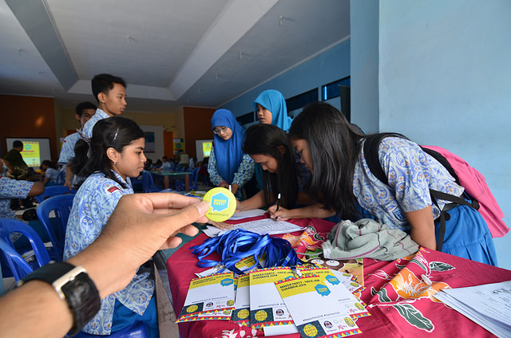

來這裡看看：[Maker Party 現已開跑！](https://teach.mozilla.org/events)

從 7 月 15 日到 31 日這段時間內，全球的 Mozilla 社群成員將以有趣、創意、親手實作的活動，一同對外教導 Web 的大小事。在過去幾年中，我們打造過機器人、教學用的瀏覽器遊戲、原創藝術作品，甚至編出一段酷炫舞步。今年當然同樣迫不亟待做出更有趣的東西！

接下來共 17 天的課程中，我們會分享有關 Web 素養的教學活動，並將特別著重於三大數位技術：Web 上的讀、寫、參與。我們是志趣相投的組織與個人，一同培養共通的 Web 素養，所以當然需要團隊合作。歡迎你參加別人的 Maker Party，甚或自行主持 Maker Party，而且絕對該邀請你的好友、家人、所屬社群會員一同前來。

- 首先登場的 Maker Party 活動就是「[IP 位址追蹤遊戲](https://mozilla.github.io/webmaker-curriculum/ProtectingYourData/session01-ip.html)」，要協助你「讀」懂 Web。透過此活動，你將了解裝置連上網路的方法。不論是筆電、桌機、智慧手機，所有裝置都有其專屬的 IP 位址。你也將了解為何 IP 位址屬於個人資訊，又應如何保護自己的隱私。如果你自己並未申辦網路連線服務，也可透過紙筆體驗此活動的 [lo-fi 版本](https://mozilla.github.io/webmaker-curriculum/ProtectingYourData/session02-secure-passwords.html)。

- 第二個活動就是能在 Web 上「寫」。[Webmaker](https://mozilla.github.io/webmaker-curriculum/MobileWeb/create-webmaker-project.html) 是 Mozilla 開放源碼的新 Android App，可建立並分享原始內容。直覺、簡單的 Webmaker 可讓你迅速上線打造網站，且是專為智慧型手機所設計。你可建立相簿、食譜、生日賀卡，甚或連載漫畫等各種各樣的內容，更能輕鬆向朋友分享並共同創作。你手上沒有裝置或網路服務？沒問題，體驗此活動的 [lo-fi 版本](https://mozilla.github.io/webmaker-curriculum/MobileWeb/design-webmaker-project.html)吧！

- 第三個「[Hack My Media](https://stephguthrie.makes.org/thimble/ODU3ODAxMjE2/hacking-my-media-with-x-ray-goggles)」活動就是參與 Web。透過 Mozilla 的「X-Ray Goggles」工具來比對網站背後的程式碼，接著再重新組合 HTML 打造出自己的網站。可替換照片、標題、其他內容，讓網站確實反映你的個人風格並搭配你所愛用的媒體，再將網址分享給你的朋友。就算沒有網路服務，你也能用此 [lo-fi 版本](https://mozilla.github.io/webmaker-curriculum/WebLiteracyBasics-I/session02-hackthenews.html)。

在你開始規劃自己的 Maker Party 時，請記得我們絕對幫得上忙。除了上面提到的三個活動之外，Mozilla 也有其他互動方式可協助教導 Web 大小事。請參考[教學活動頁面](https://teach.mozilla.org/activities)。

另可到[活動資源頁面](https://teach.mozilla.org/events/resources/)確認你的 Maker Party 發揮影響力：下載所有圖片和裝飾物。我們也會提供如找到最佳地點、邀請媒體，以及其他相關訣竅，協助你規劃自己的活動。不論你的 Maker Party 是三五好友在廚房同樂，甚至找到 50 個同學在教室集合，我們都幫得上忙！請隨時寄信到 [makerparty@mozilla.org](mailto:makerparty@mozilla.org) 告訴我們！

當然別忘了分享你的 Maker Party。在你愛用的社交網站上分享以下這段訊息 (也要寄照片給我們)：

I’m taking part in @Mozilla’s #MakerParty this July! Join us to create cool stuff online and help #TeachTheWeb: [mzl.la/makerparty](https://mzl.la/makerparty)

或

我今年七月正在參加 @Mozilla’s #MakerParty！加入我們在線上打造好玩的東西並幫忙 #TeachTheWeb: [mzl.la/makerparty](https://mzl.la/makerparty)

感謝觀看。現在，快點開趴吧！

原文連結：[Mozilla’s Maker Party Starts Today](https://blog.mozilla.org/blog/2015/07/14/mozillas-maker-party-starts-today/)
