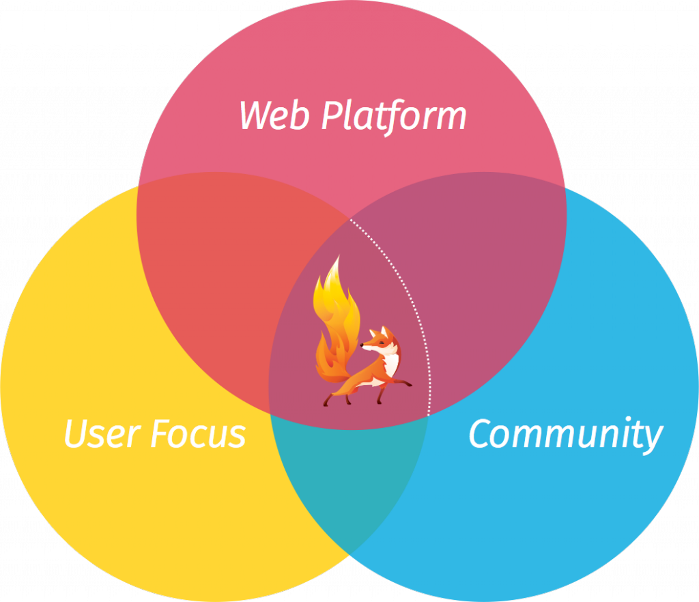

以推動網路、平等、開放為宗旨的 Mozilla，揭示 Firefox OS 發展藍圖。Mozilla 強調，Firefox OS 為實現其行動策略的重要關鍵，目前已展開包含 Ignite、Firefox OS 2.5 等新開發計畫，並積極發掘物聯網 (Internet of Things，IoT) 的發展機會。此外，Mozilla 台灣分公司仍持續肩負 Firefox OS 開發重任，扮演 Mozilla 永續維護 Open Web 的重要角色。

除了[行動版 Firefox (Firefox for Android)](https://www.mozilla.org/zh-TW/firefox/android/) 及其他規劃中的方案之外，[Firefox OS](https://www.mozilla.org/zh-TW/firefox/os/2.0/) 實為 Mozilla 行動策略的重要關鍵。Mozilla 相信：未來若要有健康的行動生態系統，勢必要針對單一供應商的專屬平台，提出開放且獨立的替代方案。這也是 Mozilla 推動開放、創新、充滿機會的線上生活之[核心使命](https://www.mozilla.org/zh-TW/mission/)。

Mozilla 作為開放源碼專案，發展途徑不同於其他科技公司專案，大多數的工作與規劃均可供大眾檢視，在此向大家簡單報告 Firefox OS 下一階段的規劃。

#### Ignite 計畫

Mozilla 在今年稍早宣佈 Firefox OS 正邁向下一個階段，也就是專注於核心產品的使用經驗。除了確保 Firefox OS 清楚明瞭、簡單易用、時尚不落俗套之外，也要透過高擴充性及聰穎設計來兼顧強大功能，讓使用者更能掌握自己的行動連網經驗。

針對下一代 Firefox OS， Mozilla 的目標是打造更強大、更一致的新一代產品經驗與開發者平台，期待能確實體現 Web 的最佳優勢而彰顯 Mozilla 價值。

為了達到上述目標，Mozilla 將整合三大關鍵要素：

- 使用者為核心： 透過使用者導向的設計、研究、產品週期， 確實提供深受大家喜愛的使用經驗。

- Web 平台 ：要將更多 Mozilla 與 Open Web 的東西帶給大家，而不侷限於 Web 技術及其打造的相關產品。

- 社群 ：整合並全力協助由開發者、設計師，還有更多專業人士所組成的全球社群，一同打造 Web 的未來。

根據 Mozilla 心中的願景，我們將以開放源碼的 Firefox OS 單一核心為導向，採取新的「每六個月釋出一主要版本」開發模式。

每一主要版本，均將提供更完善的平台與使用者價值。只要使用者有意解鎖 Android 手機，或在 Android 上安裝「B2GDroid」App 以執行 Firefox OS，都能獲得最新體驗、協助測試新功能，更能為整個專案做出貢獻。若合作夥伴 (如 OEM 與營運商) 願意根據這些主要版本打造並銷售 Firefox OS 裝置，Mozilla 也將全力提供支援。

#### Firefox OS 2.5

Firefox OS 下一主要版本已排定將於今年 11 月釋出。你可從[這裡](https://wiki.mozilla.org/Firefox_OS/Releases/2.5)了解目前規劃。

Firefox OS 2.5 將是最安全、最高可自訂性、最富含當地特色的版本，並將強化 Firefox OS 的使用經驗。除了隱私、個人化、當地內容等功能之外，我們也將[於行動平台上實作桌面版的「View Source」功能](https://youtu.be/kv2uJUKscu0) (附註：我們仍在評估並設計最後的功能) 並修正安全模型，向開發者揭露更多新的[行動 Web API](https://developer.mozilla.org/en-US/docs/WebAPI)。另將提供如同 Firefox 的擴充元件機制，以擴充至使用者介面並新增手機功能。

#### 新產品開發

我們另將逐步增加與重要夥伴在新產品開發上的合作程度、以最近 Firefox OS[智慧電視](https://blog.mozilla.com.tw/posts/7462/)與[智慧功能性手機](https://blog.mozilla.com.tw/posts/7169/)的[消息](https://blog.mozilla.com.tw/posts/7166/)為基礎，更會主動發掘 IoT 與其他連網裝置的機會。

此外，Mozilla 台灣分公司仍將持續扮演 Firefox OS 開發的關鍵角色，也是 Mozilla 永續維護 Open Web 的重要環節。致力為廣大使用者提供更強大的使用者經驗與開發者平台，以確實體現 Web 的最佳優勢並彰顯 Mozilla 價值。

敬請期待更多後續資訊。

原文連結：[What to Look Forward to from Firefox OS](https://blog.mozilla.org/futurereleases/2015/07/17/what-to-look-forward-to-from-firefox-os/)
