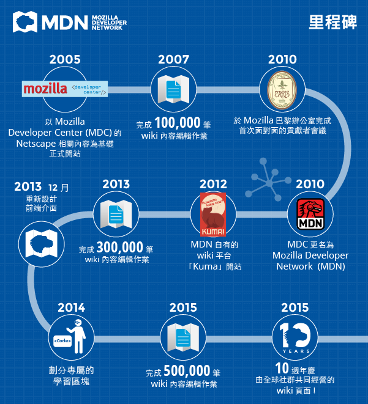

對少數具備多種語言版本的 Web 說明文件網站來說，[Mozilla 開發者社群網站 (Mozilla Developer Network，MDN)](https://developer.mozilla.org/) 的豐富程度絕對是箇中翹楚。Mozilla 很高興能在今天歡慶 MDN 的十歲生日。MDN 於 2005 年 2 月開站，當時仍由小型團隊以 Open Web 為中心，挖掘[DevEdge](https://blog.lizardwrangler.com/2005/02/23/devmo-and-devedge-updates/) (即當時 Netscape 開發資訊) 的有用素材，針對 Web 開發者另外獨立出開放、免費，並交由社群打造的線上資源。不過幾個月後，即於 2005 年 7 月 23 日開設 MDN 的原始 wiki 網站，自此為所有使用者穩定提供親民且優質的內容。

10 年後的今天，不僅文章總數已達 34,500 篇且持續成長中，而且 MDN[全球性的志願者社群](https://developer.mozilla.org/en-US/docs/MDN/Community)較之前更為壯大。目前每個月均超過 4 百萬名使用者，且各月均有 1000 多名志工編輯負責撰寫並翻譯說明文件、線上教學、範例程式碼等學習資源，其中包含 CSS、HTML、JavaScript，以及可讓 Open Web 更豐富多元的任何素材。

不論是初學者、業餘愛好人士，甚至全職的專業人員，MDN 一直為廣大的 Web 開發者提供有用的程式碼實作，期望能激盪更多想法、鼓勵多人協作與創新，最終要能加速茁壯 Open Web。此外，隨著數位產業興起，年輕一代的程式開發能力更受到重視，而類似 MDN 的整合性資源也越來越重要。因此針對剛接觸 Web 的初學者，MDN 已於 2014 年起將相關學習網頁擴充成為「[Learn the Web](https://developer.mozilla.org/en-US/Learn)」專區，其中並內含 Web 常見術語的[字彙庫](https://developer.mozilla.org/en-US/docs/Glossary)，將由 MDN 技術寫手與志工持續新增更多元的內容。

若沒有[活躍的 MDN 貢獻者](https://developer.mozilla.org/en-US/docs/MDN/Community)積極參與，我們絕對不會有上述的成就。這些心血同樣獲得全球開發者的肯定，甚至許多人承認[沒有 MDN 就不會有他們手上的成果](https://storify.com/NewOnMDN/how-has-mdn-helped-you)，至少無法達到現在的水準。

更多相關資訊：

Web：[https://developer.mozilla.org/](https://developer.mozilla.org/)

Twitter：[https://twitter.com/MozDevNet](https://twitter.com/MozDevNet)

原文連結：[MDN celebrates 10 years of documenting YOUR Web](https://blog.mozilla.org/blog/2015/07/23/mdn-celebrates-10-years-of-documenting-your-web/)
