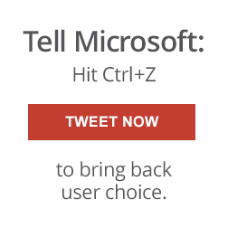

### Mozilla 呼籲微軟 (Microsoft) 應「取消」其 透過 Windows 10 對使用者選擇權的侵略性剝奪行為

Mozilla 就是要[為所有 Web 的使用者提供選擇權、控制權，以及諸多機會](https://www.mozilla.org/zh-TW/mission/)。基於此一理由，我們打造了 Firefox 與其他產品、設立 Mozilla 非營利組織，並努力讓大家所享受的網路經驗能遠遠超出產品本身所代表的價值。

我們有時能看到消費性產品尊重個人選擇的權利；這代表 Mozilla 念茲在茲的理念受到肯定。但隨著 Windows 10 的上市，我們相當失望的發現微軟又大大向後退了一步。在將近 15 年來因[政府介入支持](https://www.wikiwand.com/en/Microsoft_Corp_v_Commission)所累積的可觀成果，又因為 Windows 10 所提供的使用者選擇而幾乎全部抹煞。Windows 10 升級程序現在看起來就是專為阻止消費者取得自己所需要的網路經驗所設計，並用 Microsoft 想餵食給使用者的經驗來取而代之。

一人一「推」給微軟，訴求使用者的選擇權。

從使用者選擇的角度來看，微軟的 Windows 10 實在太過糟糕，就算跟過去的 Windows 版本比較也差得太遠。雖然[技術上是可以](https://blog.mozilla.com.tw/posts/7714/)讓使用者保留之前的設定與預設值，但是新 Windows 10 升級體驗與使用者介面的設計，卻讓這個選項極不明顯，而且設定上更不方便。Mozilla 對自身使命懷抱著無比熱情，時時將使用者擺在第一位，讓大家能隨時掌握自己的線上經驗。所以當我們第一次取得 Windows 10 的開發版本，並發現此軟體將覆寫掉使用者依自己慣用經驗所完成的個人化選擇時，我們立刻就聯絡微軟並要求修正此一問題。很遺憾，就算我們確實向對方反應了相關意見，仍未促成任何實質的改變。

所以我們今天向微軟的執行長發出了一封[公開信](https://blog.mozilla.com.tw/posts/7719/)，再次重申 Windows 10 應該要能讓使用者更簡單、更直覺的保留他們已經完成的設定，也要讓大家能更輕鬆找到新的選項與偏好設定。

在此同時，我們也發佈了[支援教學](https://support.mozilla.org/en-US/kb/how-change-your-default-browser-windows-10)與[線上影片](https://www.youtube.com/watch?v=mEUekKqLJ-E)，將逐步帶領大家在 Windows 10 上找回既有的選擇與設定。

部落格文章：

- [如何於 Windows 10 中重設或選擇 Firefox 為預設瀏覽器](https://blog.mozilla.com.tw/posts/7714)

- [給微軟執行長的一封公開信：請別在選擇與控制權上走回頭路](https://blog.mozilla.com.tw/posts/7719/to-ms-ceo)

原文連結：[Safeguarding Choice and Control Online](https://blog.mozilla.org/blog/2015/07/30/safeguarding-choice-and-control-online/)
