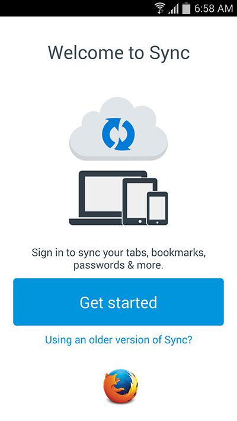

新版「Sync」同步服務是搭配強大好用的「Firefox Accounts」而成，也讓使用者的數量急遽成長。為因應此一現象，Mozilla 已於今年稍早時開始規劃讓[舊版 Sync 使用者轉用 Firefox Accounts](https://blog.mozilla.com.tw/posts/7088/)。隨著整個轉移作業順利進行，也該是為舊版服務畫下完美句點的時候了。

### 我們將於 2015 年 9 月 30 日關閉舊版的 Sync 同步服務

Mozilla 鼓勵舊版服務的使用者應全數升級到 Firefox Account。除了設定步驟更為精簡之外，新版服務更提升了實用性與穩定性。即便使用者遺失整台裝置，仍有機會恢復自己的資料。

只要是 Firefox 37 或更高版本的使用者，都能透過轉移流程指南讓自己無縫接軌。若你使用較舊版本的 Firefox，亦將看到提示通知並可[手動升級](https://support.mozilla.org/zh-TW/kb/how-to-update-to-the-new-firefox-sync)。若是自行架設 Sync 伺服器，或使用非 Mozilla 官方提供的 Sync 服務，都不會受到任何影響。

我們希望能讓 Firefox 使用者儘量順利完成此轉換作業。若你有任何問題、意見，甚至有所顧慮，都歡迎透過 sync-dev@mozilla.org，或 Mozilla IRC 的 #sync 頻道聯絡我們。

#### FAQ

- 2015 年 9 月 30 日當天將發生什麼事？

在 9 月 30 日過後，我們將關閉舊版 Sync 服務的硬體設備，並清除其內的所有資料。其對應的 DNS 名稱將重新導向至靜態的錯誤頁面，並提供適當訊息予尚未升級新服務的使用者。

- 為何這麼急？為何不能以維護模式繼續執行舊版服務就好？

沒有辦法。我們希望使用者不會遇上任何不便的情況。運作舊版 Sync 服務的硬體設備已經老舊不堪，且運行成本所費不貲。Mozilla 將無力負擔舊版服務在 9 月 30 日之後的維護費用。

- 延長支援版本 (Extended Support Release，ESR) 呢？

ESR 使用者現已可支援 Firefox Accounts 以及 Firefox 38 上的新 Sync 服務。之前的 ESR 版本均已於 8 月初結束產品週期。我們鼓勵所有使用者升級為最新版本。

- 我的資料會自動轉移到新伺服器上嗎？

不會。由於新、舊 Sync 系統均使用了高強度的加密功能，因此 Mozilla 不能自行將任何人的資料移植到新伺服器之上。只要你升級帳號完畢，Firefox 就會將你的資料重新上傳至新系統。也就是說，如果你之前就儲存了許多書籤，那請確保升級期間的網路連線夠穩定。

- 升級到新系統有沒有任何安全上的顧慮？

新、舊版 Sync 系統都使用領先業界的安全功能，所有同步資料均經過點對點 (End-to-end) 加密，並搭配只有你自己才知道的金鑰。

舊版 Sync 同樣是透過複雜的配對 (Pairing) 流程，以於裝置之間轉移加密金鑰。我們另[根據既有的帳號密碼而安全轉換](https://blog.mozilla.com.tw/posts/5565)出新金鑰，再於 Firefox Accounts 取代舊的金鑰機制。使用者只管設定高強度的密碼，就能確保只有自己才看得到自己的同步資料。

- Mozilla 會使用我的同步資料對我進行推銷活動，或將資料販售給第三方嗎？

不會。我們遵照 Mozilla[隱私政策](https://accounts.firefox.com/legal/privacy)管理所有人的資料。政策本身不允許類似的用途。此外，Sync 服務提供高強度的加密機制。就算我們真要如此，也無法使用你的同步資料。

- 新的 Sync 系統可相容 Firefox 的主密碼功能嗎？

當然可以。之前只要啟動了主密碼，舊版 Firefox 隨即會停止 Sync 運作。但此問題現已解決。Sync 服務可完全相容最新版 Firefox 的主密碼功能。

- 如果我正運作客製的 Sync 伺服器，或自行架設 Sync 伺服器呢？

這次的轉移作業，僅會影響由 Mozilla 架設的伺服器。如果你自行架設了伺服器，則 Sync 應該能繼續運作無虞，你也不會收到升級通知。

但我們已不再負責維護 Firefox 之內的舊版 Sync 協定，且將於 2016 年完全移除。建議你考慮一併轉用新的協定。請參閱下題。

- 我能自行架設新系統嗎？

可以。不論要架設[單純的儲存伺服器](https://docs.services.mozilla.com/howtos/run-sync-1.5.html)，或要跑[完整 Firefox Accounts 軟體堆疊](https://docs.services.mozilla.com/howtos/run-fxa.html)均可。我們歡迎任何可簡化此流程的建議，要加入貢獻行列當然更好。

- 如果我使用比較非主流的瀏覽器 (如 SeaMonkey、Pale Moon……) 呢？

這類瀏覽器的供應商應該已經提供了替代架設方案。若尚未提供，你應該[架設自己的伺服器](https://docs.services.mozilla.com/howtos/run-sync.html)以確保相關功能不致中斷。

原文連結：[Shutting down the legacy Sync service](https://blog.mozilla.org/services/2015/07/31/shutting-down-the-legacy-sync-service/)
