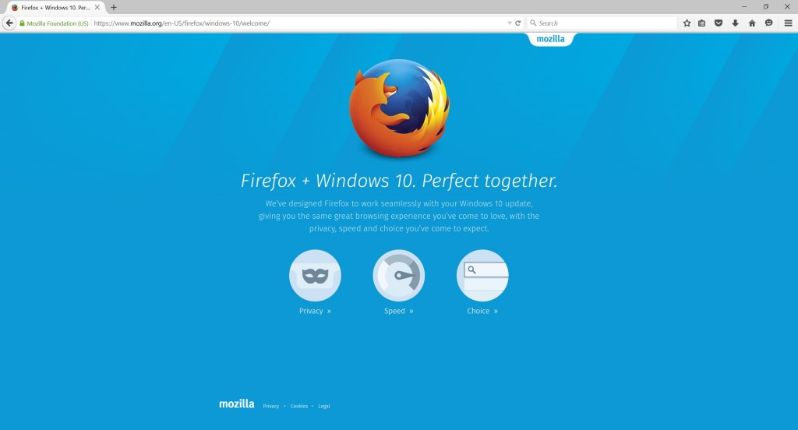

搭配嶄新外觀，並可保留使用者所設定的搜尋引擎的 Firefox for Windows 10 目前已正式上線，使用者現在就能[下載或更新此一最新版本](https://mozilla.com.tw/firefox/desktop/)，體驗更精簡、更順暢的 Firefox 經驗。使用者也將發現更大、更醒目的設計元素，有更多空間可供上網瀏覽。

#### Firefox 為 Windows 10 提供嶄新面貌

Firefox 使用者現在就能下載或更新為最新版本，看看 Firefox 在 Windows 10 上的新面貌。最新版 Firefox 介面經過仔細微調，提供更精簡、更順暢的經驗。使用者也會發現更大、更醒目的設計元素，有更多空間可供上網瀏覽。

不論使用者是升級為 Windows 10，或是使用已預裝 Windows 10 的裝置，Windows 都會將預設瀏覽器設定為 Microsoft Edge。Mozilla 另提供相關支援素材，可[引導使用者在 Windows 10 中選擇或恢復 Firefox 為你的預設瀏覽器](https://blog.mozilla.com.tw/posts/7714)。

即便你是透過 Windows 10 工作列的搜尋欄位進行搜尋，Firefox 也能協助用戶保留既有的選擇。當使用此搜尋欄位時，Windows 10 仍會啟動預設的瀏覽器，但僅會顯示 Microsoft Bing 的搜尋結果。若使用者已將 Firefox 設定為 Windows 10 的預設瀏覽器，則搜尋欄位所顯示的結果，均來自於使用者為 Firefox 所選擇的預設搜尋引擎。

#### Firefox 讓第三方附加元件 (Add-on) 更安全

就 Firefox 所重視的控制權與可自訂特色來說，附加元件 (Add-on) 扮演了很重要的角色。附加元件將持續為 Firefox 的外觀與功能提供無限可能，Mozilla 今日更須務實確保使用者的安全經驗。在提供給附加元件開發者的指南中，我們也[公布了完整的附加元件驗證流程](https://blog.mozilla.org/addons/2015/02/10/extension-signing-safer-experience/)。

在未來的 Firefox 版本中，任何未經驗證的第三方附加元件，均將預設為停用狀態。從今天起，只要在 Firefox 中出現尚未簽章的附加元件，就會在該元件旁邊看到警告提示，但尚不會自動停用該附加元件。這類警告文字是要提醒使用者此一附加元件尚未通過 Mozilla 驗證。Mozilla 現正與附加元件開發者合作，協助這些人依照 Mozilla 的規範，為使用者開發出更安全的附加元件。

#### 更多資訊

[下載 Firefox](https://mozilla.com.tw/firefox/desktop/)

[Windows、Mac、Linux 版的 Firefox 版本說明](https://www.mozilla.org/en-US/firefox/40.0/releasenotes/)

[Firefox for Android 版本說明](https://www.mozilla.org/en-US/firefox/40.0/releasenotes/)
