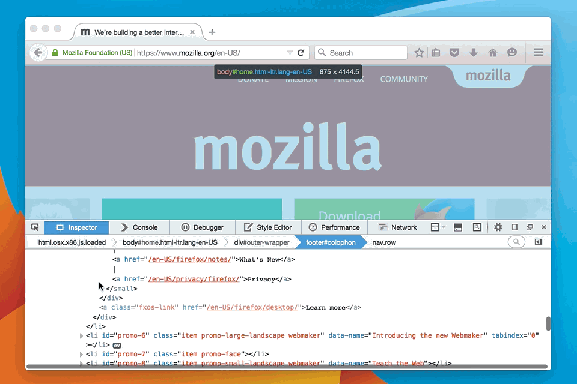
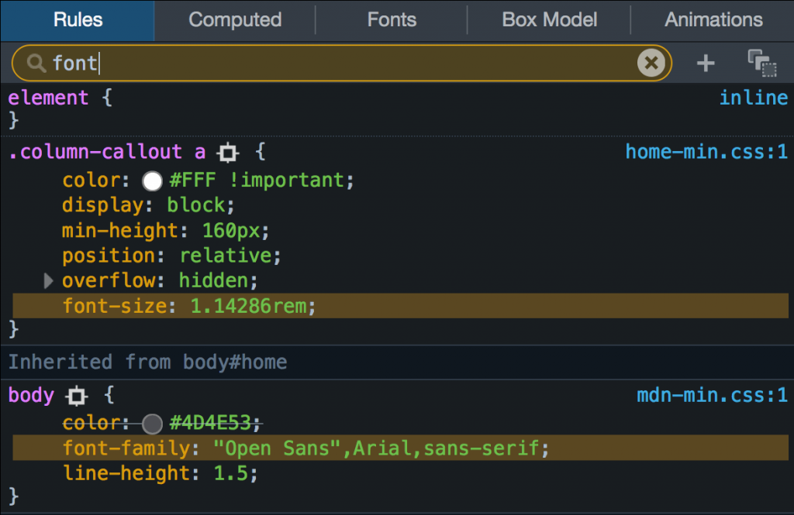
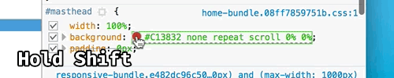
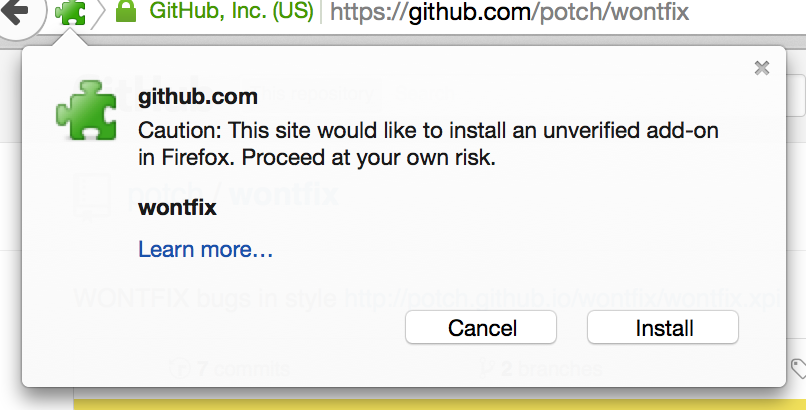

〈Trainspotting〉系列文章將重點提示 Firefox 最新版本的已上線功能。Firefox 現固定每六個星期釋出新版本，而我們稱此種模式為「Release trains」。

新版 Firefox 就如同大型噴射機一樣再度起飛！來看看哪些有趣的新東西可給使用者與開發者享受的吧。

若要完整知道相關細節，請參閱 [Firefox 40 版本說明](https://www.mozilla.org/en-US/firefox/40.0/releasenotes/)。

#### 開發者工具

你可曾在「檢測器 (Inspector)」中找到自己需要的東西，卻不知道位在網頁的何處嗎？現在可透過檢測器中的「Markup View」，直接捲動找到所需的元素：

透過 CSS 規則篩選，可更輕鬆找出複雜的樣式表 (Stylesheets)：

在「規則 (Rule)」檢視面板中，只要按住 Shift 再於色彩之上點擊滑鼠，就能看到色彩的呈現方式：

若在 return 陳述式之後有任何程式碼，「網頁主控台 (Web Console)」將警告有某段執行不到 (Unreachable) 的程式碼。

開發者工具另加入了強大的「Performance」效能分析工具集，並已透過[此篇文章](https://blog.mozilla.com.tw/posts/7600/)搭配 Firefox 40 開發者工具來展示相關範例。

#### 已簽署的附加元件

對所有瀏覽器來說，惡意的擴充套件一直是揮之不去的問題。因為 Firefox 附加元件 (Add-on) 功能強大，所以應該要有更好的方式保護使用者，避免惡意程式碼自行偷跑。而從 Firefox 42 開始，所有 Firefox 附加元件都必須完成簽署，才得以讓消費者安裝。在目前的 Firefox 40 中，使用者會收到未簽署擴充套件的警示，但仍可繼續逕自安裝。你可以進一步了解[為何需要簽署擴充套件](https://blog.mozilla.org/addons/2015/04/15/the-case-for-extension-signing/)，並透過[整體規劃](https://wiki.mozilla.org/Addons/Extension_Signing)來產出已簽署的擴充套件。

#### offsetX 與 offsetY 事件

有時候好東西就是好東西，即便耗時 [14 年](https://bugzilla.mozilla.org/show_bug.cgi?id=69787)也還是好東西！Firefox 現可支援[MouseEvents](https://developer.mozilla.org/en-US/docs/Web/API/MouseEvent) 的 [offsetX](https://developer.mozilla.org/en-US/docs/Web/API/MouseEvent/offsetX) 與 [offsetY](https://developer.mozilla.org/en-US/docs/Web/API/MouseEvent/offsetX) 屬性。往後只要是滑鼠於網頁元素中的位移事件，能更容易透過程式碼進行追蹤，而不用先取得該元素在網頁中的位置。一如既往，應先執行功能檢查以確保程式碼可跨瀏覽器運作：

		
		

el.addEventListener(function (e) {
  var x, y;
  if ('offsetX' in e) {
     x = e.offsetX;
     y = e.offsetY;
  } else {
    // addition needed for every offsetParent up the chain
    x = e.clientX + e.target.offsetLeft /* ... */;
    y = e.clientY + e.target.offsetTop /* ... */;
  }
  addGlitterMouseTrails(x, y);
}
			
				
					
				
					123456789101112
				
						el.addEventListener(function (e) {  var x, y;  if ('offsetX' in e) {     x = e.offsetX;     y = e.offsetY;  } else {    // addition needed for every offsetParent up the chain    x = e.clientX + e.target.offsetLeft /* ... */;    y = e.clientY + e.target.offsetTop /* ... */;  }  addGlitterMouseTrails(x, y);}
					
				
			
		

#### 還沒完呢！

新版本 Firefox 釋出之前，往往先修正了許多錯誤並進行多項更正，只為了提供更好的瀏覽與開發經驗 (我當然只舉出其中兩個例子而已)。最後要提到 [55 名首次貢獻此版本 Firefox 的開發者](https://blog.mozilla.org/community/2015/08/10/firefox-40-new-contributors/)，而且其中 49 位還是真正第一次加入的貢獻者。謝謝大家！

若要了解所有細節，請參閱[開發者 (Developer) 版本說明](https://developer.mozilla.org/en-US/Firefox/Releases/40)，也有[已修復錯誤的完整清單](https://bugzilla.mozilla.org/buglist.cgi?j_top=OR&f1=target_milestone&o3=equals&v3=Firefox%2040&o1=equals&resolution=FIXED&o2=anyexact&query_format=advanced&f3=target_milestone&f2=cf_status_firefox40&bug_status=RESOLVED&bug_status=VERIFIED&bug_status=CLOSED&v1=mozilla40&v2=fixed%2Cverified&limit=0)。祝瀏覽愉快！

原文連結：[Trainspotting: Firefox 40](https://hacks.mozilla.org/2015/08/trainspotting-firefox-40/)
