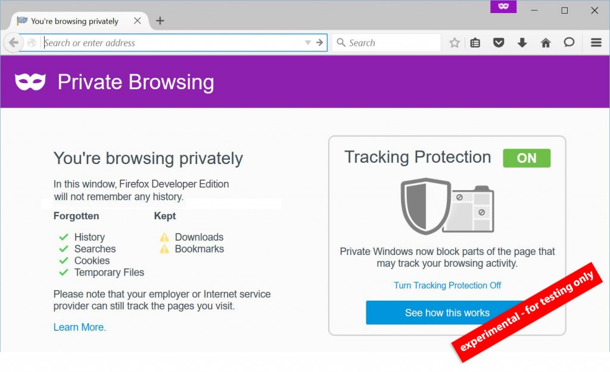

我們現正透過 Windows、Mac、Linux 版的 Firefox 開發者 (Developer) 版本，以及 Firefox for Android 的 Aurora 版本 (此兩版本統稱為 Pre-Beta 版本) 實驗新功能，要讓你能進一步控制自己的隱私權。另有更新過的隱私瀏覽 (Private Browsing) 模式，亦可進行 Pre-Beta 測試。

所有主流瀏覽器均提供所謂的「隱私」經驗，但往往只是解決「本端 (Local)」的隱私需求，也就是避免他人在公共電腦上看到你曾進行過的線上活動。雖然這對許多使用者來說已經是頗為受用的解決方案，但我們現正實驗其他方式，要讓使用者在開啟隱私瀏覽視窗時能掌握更多控制權。

#### 隱私瀏覽

我們假設：在你開啟 Firefox 的隱私瀏覽視窗時，也就代表「與目前隱私瀏覽功能所實際提供的相較，你希望能獲得更多隱私控制權」。針對用以記錄使用者跨網站行為的網頁元件，此實驗性的隱私瀏覽強化功能將主動封鎖之。這類網頁元件即如內容、分析、社交，以及可在使用者不知情狀態下蒐集資料的其他服務。在某些條件下，只要封鎖這類追蹤行為的元素，網頁顯示就可能出問題。若你要正常瀏覽網站，則隨時都能自行[解除封鎖](https://support.mozilla.org/kb/tracking-protection-pbm)。在 Firefox Pre-date 版本中的隱私瀏覽視窗亦具備控制中心，其內提供重要網站的安全與隱私控制功能。若你願意加入 Pre-beta 測試行列，請不吝提供各樣的反饋意見，以利我們讓未來版本達到更好的體驗。請到[意見反饋頁面](https://input.mozilla.org/feedback/firefox/)分享實驗性隱私瀏覽的使用經驗。

#### Firefox 讓附加元件更安全

附加元件 (Add-on) 是另個讓你得以在 Firefox 中掌握自己 Web 經驗的重要方法，因此我們也讓附加元件更安全。當說到自訂 Firefox 的外觀與功能之時，附加元件幾乎可提供無限的可能。然而，附加元件也能夠存取 Firefox 所管理的資訊，因此我們正努力協助第三方附加元件能提供更安全的自訂經驗。附加元件可建立不必要的工具列＼按鈕、蒐集資訊、更改搜尋設定，甚或將廣告＼惡意程式帶入你的裝置。我們與開發者密切合作，[制定](https://blog.mozilla.org/addons/2015/02/10/extension-signing-safer-experience/)出已安裝附加元件的驗證程序，讓這些附加元件必須符合我們所訂立的指南與準則，以確保使用者的安全。從此一版本開始，即已預設強制驗證附加元件。若使用者早已了解未驗證附加元件的風險，則可自行停用此功能 (可參閱[附加元件部落格](https://blog.mozilla.org/addons/2015/06/18/compatibility-for-firefox-40/))。

#### 透過 Electrolysis 測試多重執行程序 (Multi-process)

「[Electrolysis](https://wiki.mozilla.org/Electrolysis)」可提升效能與安全性，並已於 Firefox 的 Pre-beta 版本中預設啟用。Electrolysis 用以執行 Web 內容的程序，即獨立於主瀏覽器的執行程序之外。在內容執行程序運作時，主瀏覽器執行程序仍然可處理你的輸入，進而提升整體效能。某些 Firefox 附加元件目前尚不能相容於 Electrolysis，且可能完全無法達到預期作業。同樣的，我們極為看重 Pre-beta 測試人員對這些實驗性功能所提出的意見。如果你對 Electrolysis 經驗有任何想法，請透過[意見反饋頁面](https://input.mozilla.org/feedback/firefox/)分享給我們。

#### 敬請期待最新消息

我們即將提出更多新功能進行測試，如協助父母控制孩童的上網經驗、更多 Firefox Hello Beta 的連線方式，並要將完整的 Firefox 經驗帶入 iOS。

#### 更多資訊：

- [下載 Firefox 開發者 (Developer) 版本](https://mozilla.com.tw/firefox/developer/)

- [Windows、Mac、Linux 版的 Firefox 開發者版本之版本說明](https://www.mozilla.org/firefox/40.0/releasenotes/)

- 下載 [Firefox Aurora for Android 版本](https://mozilla.com.tw/firefox/channel/)

- [Firefox Aurora for Android](https://www.mozilla.org/firefox/android/42.0a2/auroranotes/) 版本說明

原文連結：[New Experimental Private Browsing and Add-ons Features Ready for Pre-Beta Testing in Firefox](https://blog.mozilla.org/futurereleases/2015/08/14/new-experimental-private-browsing-and-add-ons-features-ready-for-pre-beta-testing-in-firefox/)
