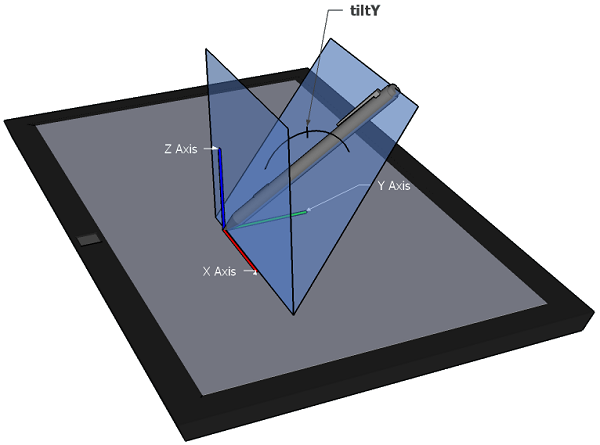

就在今年二月，[Pointer Events](https://www.w3.org/TR/pointerevents/) 已正式列入 W3C 的「建議 (Recommendation)」公告。而在這段期間，[Mozilla](https://www.mozilla.org/) 與 [Microsoft Open Tech](https://msopentech.com/) 一同合作建構其規格。隨著消費者以越來越多樣的裝置探索網路，所搭配的輸入機制 (如觸控、滑鼠、觸控筆) 也更顯豐富。所以讓開發者能在自己的 App 中使用一致的 API 就更顯重要。我們在努力之下達到了重要里程碑：Pointer event 現已進入 [Firefox 每夜更新版 (Nightly)](https://nightly.mozilla.org/)。此代表了多家瀏覽器供應商投入心力共同合作，要能產生高品質的業界標準 API 並拓展其支援範圍。

圖片來源：http://www.w3.org

但請確實下載 Firefox Nightly 版本才得以實際體驗。另請透過 [dev-platform](https://lists.mozilla.org/listinfo/dev-platform) 郵件群組或 [mozilla.dev.platform](https://groups.google.com/forum/#%21forum/mozilla.dev.platform) 不吝提供意見。如果你想針對規格提出建議，請寄送至 [public-pointer-events@w3.org](mailto:public-pointer-events@w3.org)。

此一規格是希望能讓 Open Web 支援更多樣的輸入機制，並能繼續相容絕大多數以 [Mouse events](https://developer.mozilla.org/en-US/docs/Web/API/MouseEvent) 所打造的 Web 架構內容。此 API 將可透過單一解決方案處理多樣的輸入裝置，且著重於點擊裝置 (如滑鼠、觸控筆、觸控手勢)。Pointer 的規格定義不限於特定硬體 (Hardware-agnostic) 裝置，因此可支援特定的螢幕座標集合。Pointer events 是刻意要近似於現有 Mouse events 的相關事件集合。

目前的 Nightly 版本已針對滑鼠輸入而支援了 Pointer events。此外，如果你正好在使用 Windows，則只要設定 2 組偏好，就會一併啟用 Touch events。在將 layers.async-pan-zoom.enabled 的 Firefox [組態偏好](https://developer.mozilla.org/en-US/docs/Mozilla/Preferences/A_brief_guide_to_Mozilla_preferences#Modifying_preferences)設定為「true」之後，即可啟用第一組 Async Pan & Zoom ([APZ](https://wiki.mozilla.org/Platform/GFX/APZ)) 屬性。另在自己的偏好中，將 dom.w3c_touch_events.enabled 值設定為 1 即可啟用之。

本篇文章將提及新 API 的某些基本功能。

#### 使用 Pointer API

在開始 Pointer API 之前，必須先確認你所用的瀏覽器可支援此 API。下列範例程式碼即可測試：

if (window.PointerEvent) {
  .....
}else{
  // use mouse events
}

					12345

						if (window.PointerEvent) {  .....}else{  // use mouse events}

看到這裡，如果你早就對 Pointer events 有著極高的興趣也躍躍欲試，請千萬別錯過[原文及其中的範例程式碼](https://hacks.mozilla.org/2015/08/pointer-events-now-in-firefox-nightly/)。

原文連結：[Pointer Events now in Firefox Nightly](https://hacks.mozilla.org/2015/08/pointer-events-now-in-firefox-nightly/)
