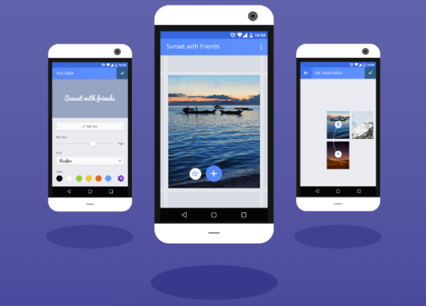
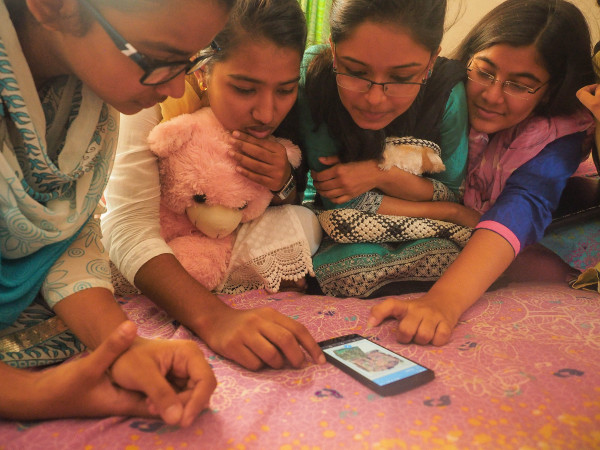

Mozilla 很高興宣佈 Webmaker for Android 版本現已開放測試。你可從 Google Play 的 [mzl.la/webmaker](https://mzl.la/webmaker) 免費下載此開放源碼的新版 App。

Mozilla 之所以打造 Webmaker，是為了協助首次使用智慧型手機，以及行動優先 (Mobile First) 的網路使用者，能更積極的參與 Web。我們太常看到全世界的上網人口都在體驗「唯讀」的行動網路，只能被動消化現有內容，卻無法主動貢獻。而一旦消費者變成創造者，也就能擁有更多社交與經濟方面的機會。只要所有人都能平等的貢獻所長，就會讓 Web 變得更美好。

Mozilla 將透過「Webmaker」補足行動優先市場所缺乏的本地內容。此 App 剛開始先提供英文、印尼文、孟加拉文、巴西葡萄牙文共四種語言版本 (未來也將提供更多)，要讓全球使用者都能用自己的語言建構原始內容，以及其所屬社群的相關文章。我們在[進行全球性的廣泛研究](https://webmaker-dist.s3.amazonaws.com/reports/research.pdf)之後，打造出 Webmaker 並透過數百名志工將之散播出去。Webmaker 是由社群與 Mozilla 所共有，且雙方的持分與重要性均相同。

Webmaker 的特點就是「簡單」：你不需具備任何專業技術、沒有任何艱澀的學習過程，更沒有複雜的工具列。使用者在幾分鐘之內即可建立某一領域的內容，舉凡從剪貼簿到作品集，甚或遊戲到網路爆紅行為。初始設計是要讓使用者能更換如文字、圖片、連結等的 Web 構成基礎。而社群亦已透過這三個基本要件打造出練習本、說明手冊、相片選輯、數位筆記簿＼儲存空間，還有更多。使用者可自由相互混搭或補強他人的 Webmaker 專案，以能緩慢且穩定拓展自己的創造潛力。

孟加拉青少年正使用 Webmaker

此一版本又與我們在 6 月份釋出的 Webmaker Beta 有何不同呢？除了提升的效能與更多最佳化的使用者經驗之外，更能夠在任何平台 (桌機或行動裝置) 上檢視共享專案。若使用者的連線品質不佳，也能在離線時享受更好的效能。同樣的，內容探索將以目前的所在地為基礎，你可看到社群成員所建立或統整的內容。

準備好探索、建立、分享當地內容，並想學習 Web 的基本環節了嗎？立刻到 [mzl.la/webmaker](https://mzl.la/webmaker) 下載 Webmaker 吧！你也能在[這裡](https://secretrobotron.github.io/webmaker-launch/ideas.html)找到自己的第一個專案靈感。

我們很期待看到你的作品！請隨時透過 [@Webmaker](https://twitter.com/Webmaker) 或 [help-webmaker@mozilla.com](mailto:help-webmaker@mozilla.com) 聯絡我們。

原文連結：[Mozilla Webmaker, Meet the World](https://blog.mozilla.org/blog/2015/08/17/mozilla-webmaker-meet-the-world-2/)
