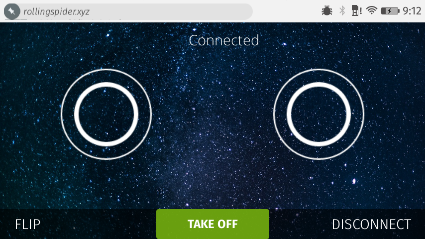

我們周遭有太多的裝置，且整體數字還在攀升。其中具備連線功能的裝置也越來越多，從[登機箱](https://bluesmart.com/)到[盆栽](https://www.parrot.com/usa/products/flower-power/)，甚至冰箱裡面的[蛋盒](https://www.amazon.com/Minder-Wink-App-Enabled-Smart-Tray/dp/B00GN92KQ4)都能連上你的手機！但這也造成新的問題：我們該如何找出四周的裝置，又該如何互動呢？

目前的裝置互動作業，都交由智慧手機所執行的不同 App 處理。但這仍無法解決「可發現性 (Discoverability)」的問題。在我決定要安裝 App 之前，必須先知道周遭到底有哪些裝置。但站在[會議室](https://blog.telenor.io/iot/2015/08/04/smart-meetingroom.html)門口時，其實我才不在乎要安裝哪個 App，甚至會議室的名稱或代碼也不重要。我只想儘快預定會議室，或知道現在到底有沒有人預約使用這個會議室？

#### 藍牙

Google 的 [Scott Jenson](https://twitter.com/scottjenson) 思考可發現性的問題已有一陣子，並想出了「[Physical Web](https://google.github.io/physical-web/)」專案，希望達到「走上街就能使用所有東西」。此一概念就是要透過「[Bluetooth Smart](https://www.bluetooth.com/Pages/Bluetooth-Smart.aspx)」這個藍牙的低耗電變體，將網址廣播出去。你的手機將拾取 advertisment 封包、進行解碼，再對使用者顯示某些資訊。輕輕點擊就會重新導至相關內容的網頁。如此就能應用於多種東西：

- 會議室可廣播其排程行事曆的網址。

- 電影海報可廣播上映時間與預告片段的網址。

- 處方藥品可廣播藥物治療與重新領藥的資訊網址。

- 自己看看周遭是否還有任何等你發掘的使用範例。

但實際情況並非單行道那樣簡單，所以會造成問題。廣播網址當然有助於我獲得如電影放映時間等的資訊，但卻無法用手上裝置進一步互動。如果我想遙控[無人空拍機](https://www.parrot.com/usa/products/rolling-spider/)，當然不能只是找到我附近的空拍機而已，也要能直接與空拍機互動。我們希望找出網頁和裝置的溝通方式。

#### 感謝

感謝台北 WebBluetooth 團隊的[黃慈霖 (Tzu-Lin Huang)](https://github.com/dwi2) 與[李瑋倫 (Sean Lee)](https://github.com/weilonge) 建構了初始的無人機程式碼。而我針對 API 所發的抱怨，台北團隊 (特別是[劉晏如 (Jocelyn Liu)](https://github.com/yrliou)) 都能迅速做出回應並提供修正檔。還有 [Chris Williams](https://twitter.com/voodootikigod) 把無人空拍機放進我的 JSConf.us 禮物袋；[Scott Jenson](https://twitter.com/scottjenson) 不厭其煩的回答我 Physical Web 問題；而且 [Telenor Digital](https://telenordigital.com/) 公司還讓我玩無人機玩了兩個禮拜。

另外再看到 [Web Bluetooth W3C 團隊](https://www.w3.org/community/web-bluetooth/)的工作心血，其內就包含了 Mozilla [藍牙團隊](https://wiki.mozilla.org/B2G/Bluetooth)要將 bluetooth API 帶入瀏覽器的作品。如果 Physical Web 讓我們能靠近任何裝置並取得 Web App 的網址，就能讓 WebBluetooth 接著使 Web App 連上裝置並反過來開始溝通。

講到這裡，還是有一堆事情要完成。像是 bluetooth API 只能接觸 Firefox OS 上[驗證過 (Certified) 的內容](https://developer.mozilla.org/zh-TW/Firefox_OS/Security/Security_model)，因此目前還未能存取一般的網頁內容。在[真正解決](https://bugzilla.mozilla.org/show_bug.cgi?id=1053673)安全性的問題之前，還是得持續目前的狀態。第二個問題就是 Physical Web 將主導網址的廣播作業，那特定的網路資源要如何知道是哪個特定裝置廣播了網址呢？

現在你就知道真的還有一堆事情等著完成了吧？既然這篇[原文文章登上了「Mozilla Hacks」部落格](https://hacks.mozilla.org/2015/08/flying-a-drone-in-your-browser-with-webbluetooth/)，當然就是需要大家動手開發！

如果你對上面描述的東西有著極高興趣，請別錯過[原文內所提的範例程式碼](https://hacks.mozilla.org/2015/08/flying-a-drone-in-your-browser-with-webbluetooth/)，趕快動手打造自己想到的應用吧！說不定下個獲得市場共鳴的應用就是出自於你的手！

#### 結論

Web 真是讓人驚喜不斷！隨著有越來越多裝置上線，我們應該要能輕鬆發現裝置並與之互動。透過 Physical Web 與 WebBluetooth 的整合，我們建構出順暢體驗，要讓使用者願意與實際應用＼新款裝置進行互動。雖然還有很長的一段路要走，但應該已經走上對的方向了。Mozilla 與 Google 正主動開發相關技術。我高度期待本文所提到的東西，在未來一年內都會變成極為普通的常識！

如果一年的時間對你來說太長，那你也能直接開始把玩 Firefox OS 的實驗性版本。此版本已啟用了本文所提過的所有東西，並可於「[Flame](https://developer.mozilla.org/en-US/Firefox_OS/Developer_phone_guide/Flame)」開發者裝置上執行。先升級到 [nightly_v3 base image](https://developer.mozilla.org/en-US/Firefox_OS/Phone_guide/Flame/Updating_your_Flame) 再刷進[此版本](https://rollingspider.xyz/bt-flame.zip)。

原文連結：[Flying a drone in your browser with WebBluetooth](https://hacks.mozilla.org/2015/08/flying-a-drone-in-your-browser-with-webbluetooth/)
