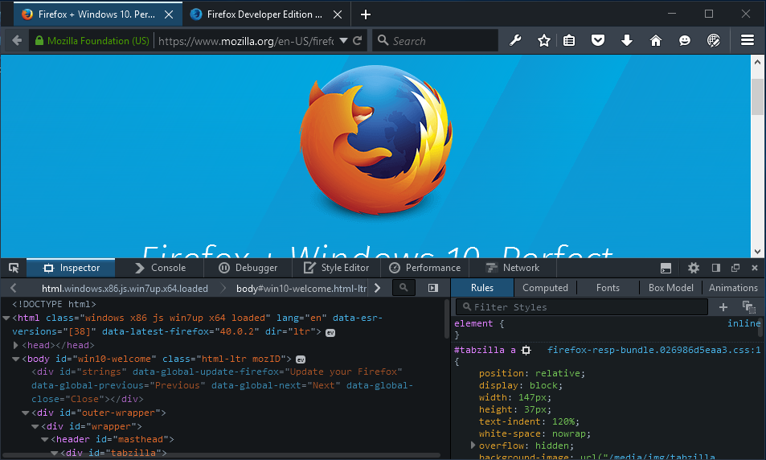
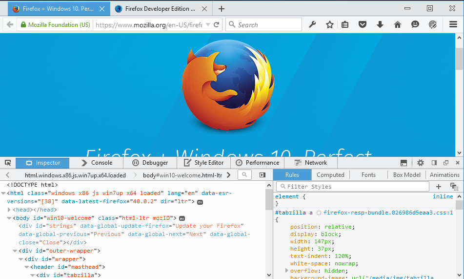

### Win10、Wifi 除錯、ReactJS 工具、多程序 Firefox，還有更多

Firefox 42 已經來了！我們同樣為這個版本耗盡心思，要呈現高品質的 Firefox 開發者 (Developer) 版本瀏覽器。雖然[版本說明](https://www.mozilla.org/en-US/firefox/42.0a2/auroranotes/)中並未詳細載明許多[已解決的問題](https://mzl.la/1DQeEkp)，但這些小幅度修正的確讓開發工具更快、更穩定。仍有許多東西要向大家報告，包含 Firefox 運作方式的重要變化。

#### 透過 Wifi 網路進行除錯

現在透過[遠端網站除錯](https://developer.mozilla.org/docs/Tools/Remote_Debugging/Debugging_Firefox_for_Android_over_Wifi)功能，不再需要 USB 連接線或 ADB，就能用 Wifi 訊號對 Firefox for Android 裝置進行除錯。

#### 現已預設啟用多程序 (Multiprocess)

開發者版本現已預設啟用[多程序 Firefox](https://wiki.mozilla.org/Electrolysis) (Multiprocess，也稱為 E10s)。在啟用之後，Firefox 將於單一的背景程序中繪圖並執行 Web 相關的內容。如果你在更新至 Firefox 42 開發者版本之後，發現附加元件 (Add-on) 有任何問題，則請[停用不相容的附加元件](https://arewee10syet.com/)，或透過 about:preferences [回到單程序模式](https://wiki.mozilla.org/File:E10s-toggle-in-preferences.png)。

#### 支援 Windows 10 的佈景主題

開發者版本的佈景主題，現於 Windows 10 中提供嶄新外觀，以符合作業系統的樣式風格。欣賞一下：

開發者版本的暗主題 – Windows 10

開發者版本的亮主題 – Windows 10

#### React 開發者工具已支援 Firefox

如果你慣用 ReactJS 開發，可能已經注意到 React 最近釋出了開發者工具擴充元件的測試版本，[亦開始支援 Firefox](https://www.infoq.com/news/2015/08/React-Devtools-beta)。目前官方尚未釋出對 Firefox 的正式版本，但可至 [github](https://github.com/facebook/react-devtools/tree/master) 上找到原始碼。

#### 其他變動

- 非同步呼叫堆疊，現可讓你追蹤 setTimeout、DOM 事件處理器、Promise 處理器等的執行流程。([Bug 981514](https://bugzil.la/981514))

- WebIDE 現具備新的 [Firefox OS 模擬器設定頁面](https://developer.mozilla.org/en-US/docs/Tools/WebIDE/Setting_up_runtimes#Configuring_Simulators)。你可使用預先設置的開發參考裝置清單，變更模擬器以執行自訂的設定檔與螢幕尺寸。([Bug 1156834](https://bugzil.la/1156834))

- 檢測器 (Inspector) 現提供[預先設置的 CSS 篩選器](https://developer.mozilla.org/en-US/docs/Tools/Page_Inspector/How_to/Edit_CSS_filters#Saving_filter_presets)。([Bug 1153184](https://bugzil.la/1153184))

- 針對程式碼範例，MDN 提示文字現使用語法強化功能。([Bug 1154469](https://bugzil.la/1154469))

- 當於檢測器中按下「複製」的鍵盤快捷鍵時，就會將所選節點的 outerHTML 複製到剪貼簿中。([Bug 968241](https://bugzil.la/968241))

- 樣式編輯器 (Style editor) 的搜尋功能，現已新提升了使用者經驗。([Bug 1159001](https://bugzil.la/1159001), [Bug 1153474](https://bugzil.la/1153474))

- 檢測器現已將 CSS 變數視為正常的宣告值。([Bug 1142206](https://bugzil.la/1142206))

- 在 CSS 的自動補完選單中，現按下「向下」方向鍵之後，即可於空白欄位中列出所有結果。([Bug 1142206](https://bugzil.la/1142206))

感謝為開發者工具團隊貢獻時間與精力的所有人，讓 Firefox 42 開發者版本更精采！每次版本釋出都有許多人撰寫修正檔、測試、文字記錄、回報臭蟲、寄發反饋意見、討論相關功能等等。你可提出具建設性的意見，讓我們知道[你所期待的 Firefox 開發者工具](https://mzl.la/devtools)，讓我們能了解後續各項功能的開發優先性。

立刻免費[下載 Firefox 開發者版本](https://mozilla.com.tw/firefox/developer/)。

原文連結：[Developer Edition 42: Wifi Debugging, Win10, Multiprocess Firefox, ReactJS tools, and more](https://hacks.mozilla.org/2015/08/developer-edition-42-wifi-debugging-win10-multiprocess-firefox-reactjs-tools-and-more/)
