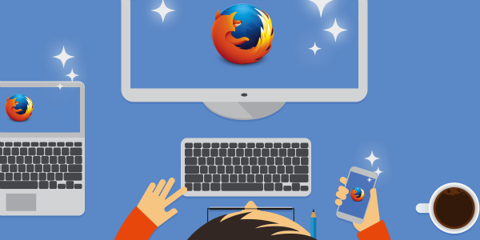

透過「[Sync](https://www.mozilla.org/zh-TW/firefox/sync/)」同步功能，艾瑪就像幫她的 Firefox 注入魔法一樣。在將已設定的首頁、書籤、密碼都同步到 [Android](https://play.google.com/store/apps/details?id=org.mozilla.firefox) 裝置之後，就能在行動電話上輕鬆登入自己最愛的網站。在家中打開個人電腦也同樣能繼續瀏覽在辦公室開啟的分頁，快速收尾未完成的工作。艾瑪本身比較在意家中瀏覽記錄的隱私，因此保留這個部分未同步，當然也就不會在辦公室電腦看到私人的瀏覽記錄。Sync 本身極富彈性，讓艾瑪能依照自己喜歡的方式掌握 Web。

快來為自己的 Firefox 注入魔力吧！[立刻登入「Sync」](https://www.mozilla.org/firefox/sync/)。
