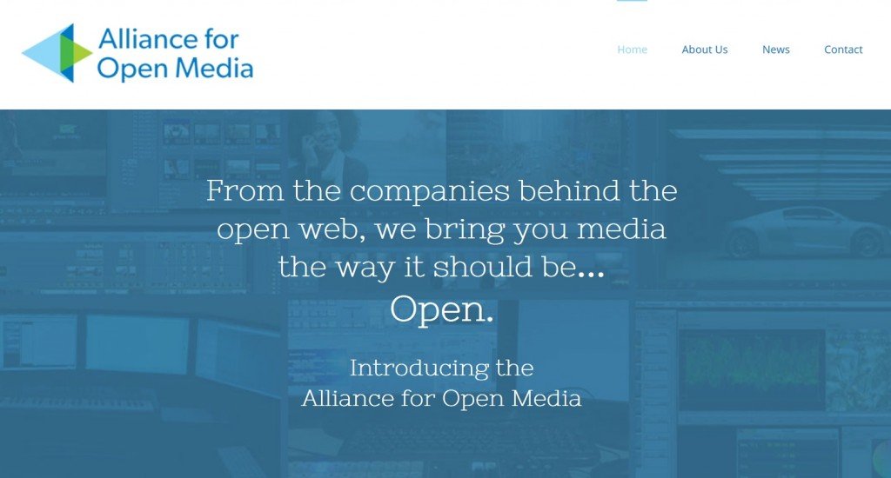

買斷式授權 (Royalty Free) 視訊的編碼 (Codecs) 技術變化極快。不過一個月之前，網際網路工程工作小組 (Internet Engineering Task Force，IETF) 的 [NETVC Working Group](https://datatracker.ietf.org/wg/netvc/charter/) 才舉辦了首次會議。思科 (Cisco) 也在兩週之前[發表了「Thor」](https://blogs.cisco.com/collaboration/world-meet-thor-a-project-to-hammer-out-a-royalty-free-video-codec)。而在此業界的努力成果之下，我們今天也要透過[開放媒體聯盟 (Alliance for Open Media)](https://www.aomedia.org/) 跨出重要的一步。此聯盟創始成員包含目前 Netflix、Amazon、YouTube 等的線上影片重量級廠商；另有 Mozilla、Microsoft、Google 在內的多家瀏覽器供應商；再加上思科與英特爾 (Intel) 的關鍵技術商。聯盟成員將共享技術並執行必要的專利分析，以打造新一代的買斷式授權視訊編碼技術。

Mozilla 長期以來一直支持買斷式授權的編碼技術。Web 本來就不需另外取得許可，即由眾人創新打造而成，而且專利授權體制本來就與某些 Web 最成功的商業模式背道而馳。這也是 Firefox 早已支援如 [VP8](https://bugzilla.mozilla.org/show_bug.cgi?id=559052)、[VP9](https://bugzilla.mozilla.org/show_bug.cgi?id=833023)、[Opus](https://bugzilla.mozilla.org/show_bug.cgi?id=674225) 等絕佳編碼技術的原因。但是我們和 Web 都還未能站穩目前狀態。隨著影片的幀率和解析度不斷提升，高階編碼技術與更佳壓縮比的需求亦有增無減。我們已經啟動自己的[「Daala」專案](https://xiph.org/daala/)並打造 [NETVC](https://datatracker.ietf.org/wg/netvc/charter/) 以設法滿足相關需要，且預見將引起更多關注的眼神。Mozilla 相信自己的「Daala」、思科的「Thor」，以及 Google 的「VP10」，將一同為世界級的買斷式授權編碼技術打下深厚基礎。

為了讓我們能快速因應變化，此聯盟即以[聯合開發基金會 (Joint Development Foundation)](https://www.jointdevelopment.org/) 專案為樣本所設立，希望能成為如 IETF 的開放標準組織並與之互通有無。在視訊編碼領域中開發標準的最大挑戰之一，就是要了解應如何審查專利。此聯盟可讓我們共享大家所蒐集的法律資訊，而不需擔心是否與某法條相互牴觸。如此一來，成員之間可分擔工作，彼此都可加速創新並降低成本，確實讓所有人為買斷式授權的編碼技術而努力。

聯盟將根據 [W3C 的專利規則](https://www.w3.org/Consortium/Patent-Policy/)而運作，並遵守 [Apache 2.0 授權](https://www.apache.org/licenses/LICENSE-2.0)規範來釋出程式碼。這也代表所有成員同時不再收取編碼實作與編碼本身專利所產生的相關權利金。這些創始成員只是起頭。我們未來將邀請對線上＼離線視訊有興趣的任何廠商加入。

若需進一步資訊，可至 www.aomedia.org 或參閱[新聞稿](https://aomedia.org/press-release/alliance-to-deliver-next-generation-open-media-formats/)。

原文連結：[Forging an Alliance for Royalty-Free Video](https://blog.mozilla.org/blog/2015/09/01/forging-an-alliance-for-royalty-free-video/)
