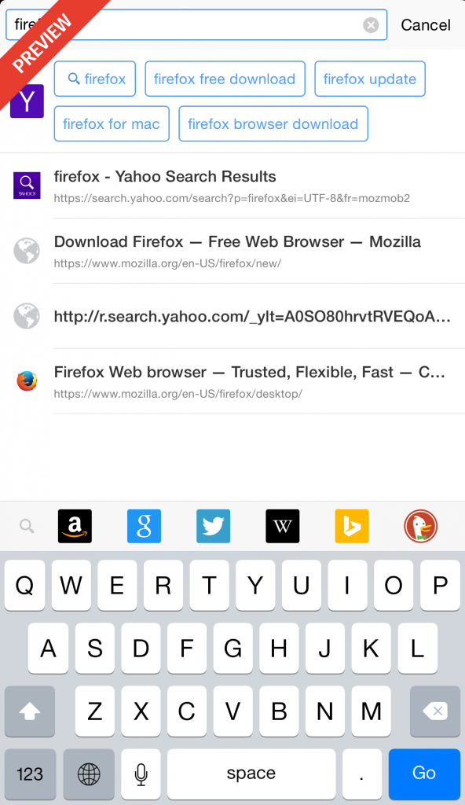
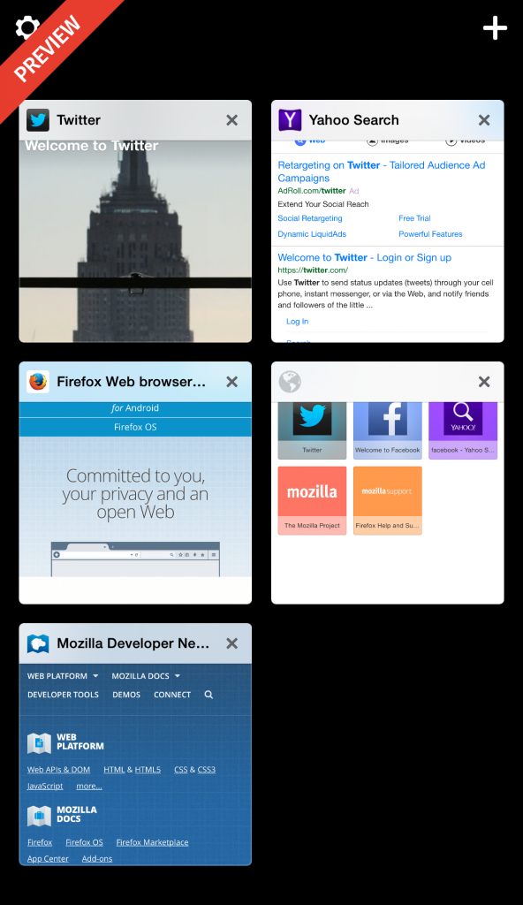
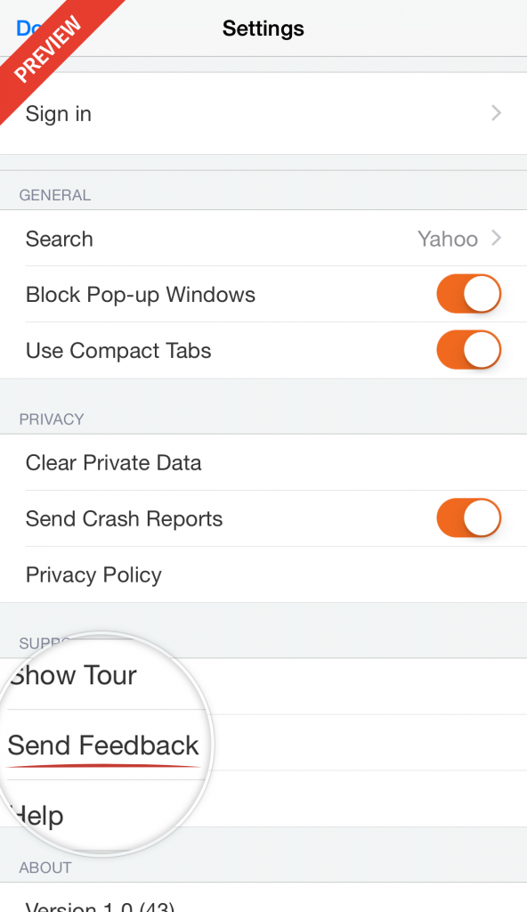

在我們[首次公開](https://blog.mozilla.com.tw/posts/7519) iOS 版 Firefox 瀏覽器的消息之後，今天很高興能在紐西蘭釋出預覽 (Preview) 版本。

#### 提供預覽版本以蒐集反饋意見

Mozilla 希望能以 Firefox 提供 iOS 的絕佳瀏覽經驗。而透過第一次的公開預覽版本，我們要先蒐集單一國家的反饋意見，接著再開放予其他國家並取得更多建議，最後才會完整公開給大家使用。我們將依此預覽版本所獲得的意見來打造新功能，並有助於今年稍晚讓 Firefox for iOS 正式於 App Store 上架。如果你對 Firefox for iOS 有濃厚興趣，也正好身處預覽版本的釋出國家，就請[快來這裡登記](https://www.mozilla.org/firefox/ios)。

#### 我們蒐集反饋意見的重點功能

此預覽版本具備「智慧搜尋 (Intelligent Search，暫譯)」功能，可建議搜尋結果並讓使用者選擇自己所愛用的搜尋服務。

而透過「Firefox Accounts」，使用者同樣可將桌面版 Firefox 瀏覽器的密碼、歷史紀錄、已開啟的分頁帶入 iOS 裝置。Firefox for iOS 預覽版本同樣具體呈現了分頁，讓你能直覺找出已開啟的分頁。

#### 蒐集反饋意見

我們需要多元意見來協助打造絕佳的 Firefox for iOS。你可在 App 中直接向我們提出意見。只要點選 Firefox for iOS 右上方數字顯示的分頁圖示，再點選進入左上方的「Settings」選單，找到其中「Support」區塊就能直接發送出你的寶貴意見。

原文連結：[Firefox for iOS Now Available for Preview](https://blog.mozilla.org/futurereleases/2015/09/03/firefox-for-ios-now-available-for-preview/)
