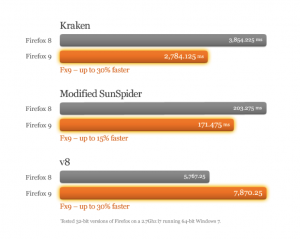

強化JavaScript功能 速度再快30%

(2011/12/21 台灣台北) 致力於網路開放自由的Mozilla，其Firefox瀏覽器在全球擁有數億名愛好者，於今日釋出Firefox 9正式版，特別強化JavaScript功能，上網速度再提升。Firefox 9正式版新功能包括可強化JavaScript效能的「類型推斷」(Type Inference)機制，讓使用者在瀏覽內含大量圖片、影片、遊戲和3D動畫的網站或Web apps時，速度大幅加快感覺流暢。Type Interence是SpiderMonkey JavaScript的核心功能，整合JaegerMonkey JIT 編譯器，可用來提供分析並產生有效程式。經測試，在Kraken和V8針對JavaScript效能實測發現，搭載Type Inference功能的Firefox 9瀏覽器速度快了30%。

 

Firefox Mac OS X Lion 支援二指滑動，Mac的使用者可以輕易的在網頁間瀏覽。新版Firefox for Mac強化介面設計，使其更符合Mac OS X Lion圖示和應用程式工具列的風格，開啟多個視窗瀏覽網頁也能感受流暢。

網站開發者會發現Firefox讓開啟網頁的速度變快許多，尤其是在下載大量資料或使用AJAX時。Firefox支援XHR request，網站在下載檔案時也能同時呈現網站內容，而不需要等待下載完成才呈現畫面。如需更多與開發者相關的Firefox新功能，請上[Firefox for Web developers page](https://market.android.com/details?id=org.mozilla.firefox) 一探究竟。

如需更多產品資訊：

[Download Firefox](https://www.mozilla.org/firefox/)

[Long, technical release notes](https://www.mozilla.org/en-US/firefox/9.0/releasenotes/)

[Future of Firefox](https://www.mozilla.org/firefox/channel/)

[Firefox for Android](https://market.android.com/details?id=org.mozilla.firefox)
