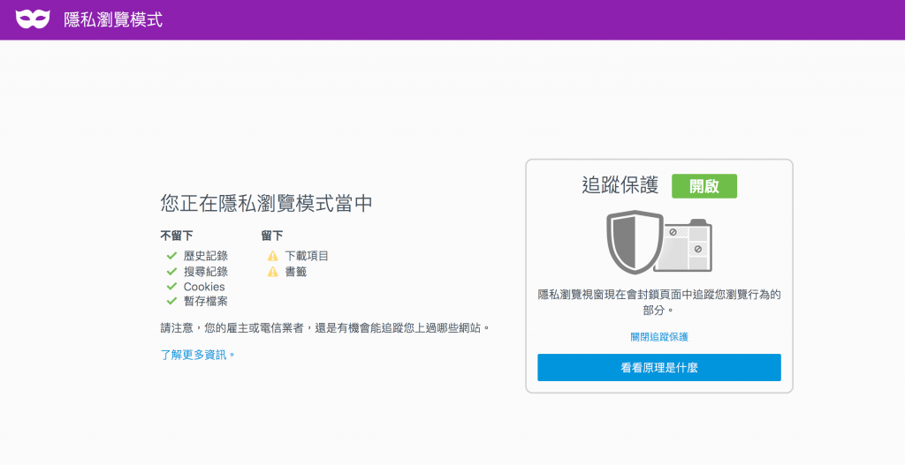
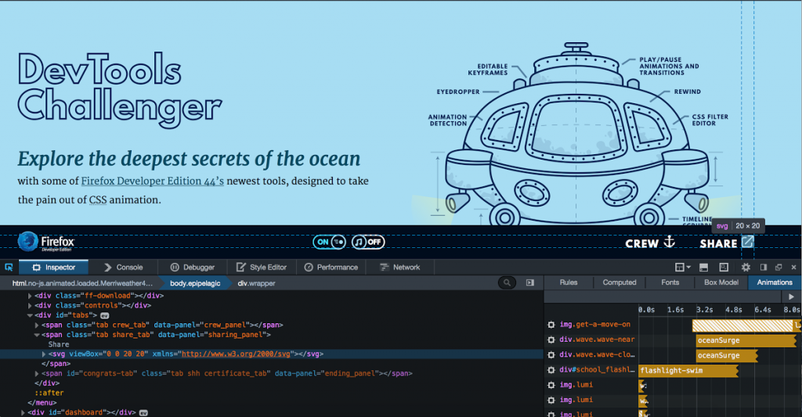

Mozilla 今日發佈了最新版 Firefox。此一版本在隱私瀏覽模式中特別增加了「追蹤保護 (Tracking Protection)」新功能，讓使用者對 Web 使用經驗握有更多自主權與控制權，同時使用者隱私也更進一步獲得保障。

Firefox 隱私瀏覽模式下的「追蹤保護」功能再創業界之先，它讓使用者能自行控制第三方所能接收的線上資料。其他瀏覽器如 Chrome、Safari 的隱私瀏覽模式，都無法達到 Firefox 所提供的保護機制，遑論 Microsoft 的 Edge 或 Internet Explorer了。

#### 隱私瀏覽搭配追蹤保護功能

Firefox 是首款提供隱私瀏覽模式的瀏覽器，使用者關閉了裝置的瀏覽器視窗時，也能在用戶端控制自己的隱私設定，不致讓瀏覽器留下 cookies 與歷史紀錄。然而，使用者瀏覽網頁時，往往會在不知情的狀況下將自己的資訊分享給未知第三方，甚至是從瀏覽中的網站所分流出去的第三方，這個情況在任何瀏覽器的隱私瀏覽模式下皆然。不過，此一現象將在今天劃上句點 。

透過今天正式釋出的 Firefox 桌面版 (Firefox for Windows, Mac, Linux) 以及行動版 (Firefox for Android)，任何如廣告、分析追蹤作業、社交媒體分享按鈕等內容，只要可能在未告知使用者的情況下跨網站記錄使用者的瀏覽行為，隱私瀏覽的追蹤保護 功能都將主動攔截。

Mozilla同時也為 Firefox 增加了新的「控制中心 (Control Center)」，在網址列的固定地方提供網站的安全性與隱私控制功能。一旦 Firefox 攔截到網頁元素的追蹤行為，就可能無法正確顯示網頁。這時只要透過控制中心，就可針對特定網站停用隱私瀏覽模式的追蹤保護功能。

#### Firefox 開發者 (Developer) 版本新增動畫工具 (Animation Tools)

Mozilla 今日同時釋出 Firefox 開發者 (Developer) 版本的新工具，其中「動畫工具 (Animation Tools)」可依照動畫設計師所需要的方式執行。

Mozilla 持續打造有趣的「DevTools Challenger」實機操作教學，讓網頁設計師了解該如何徹底利用這些新的視覺效果編輯工具。Mozilla 認為開發者版本中的新工具，可減少動畫設計過程中「撰寫指令碼」的感覺，過程更像是在後製電影一樣有趣。實際到底如何，就留給使用者去判斷了！開發者可參閱 Firefox 工程總監 Dave Camp [發表於 Mozilla Hacks 部落格上的 Firefox 開發者版本文章](https://hacks.mozilla.org/2015/11/developer-edition-44-creative-tools-and-more/)。

#### 更多資訊

- 下載 [Windows、Mac、Linux 版本的 Firefox](https://mozilla.com.tw/firefox/new/)

- [Windows、Mac、Linux 版 Firefox 的版本說明](https://www.mozilla.org/firefox/42.0/releasenotes/)

- 下載 [Firefox 行動版 (Firefox for Android)](https://mozilla.com.tw/firefox/android/)

- [Firefox for Android 版本說明](https://www.mozilla.org//firefox/android/notes/)

原文連結：[Firefox Now Offers a More Private Browsing Experience](https://blog.mozilla.org/blog/2015/11/03/firefox-now-offers-a-more-private-browsing-experience/)
