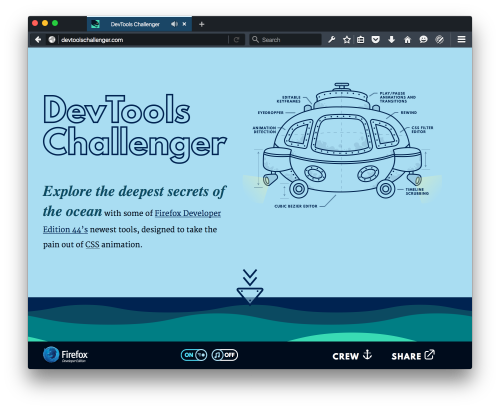
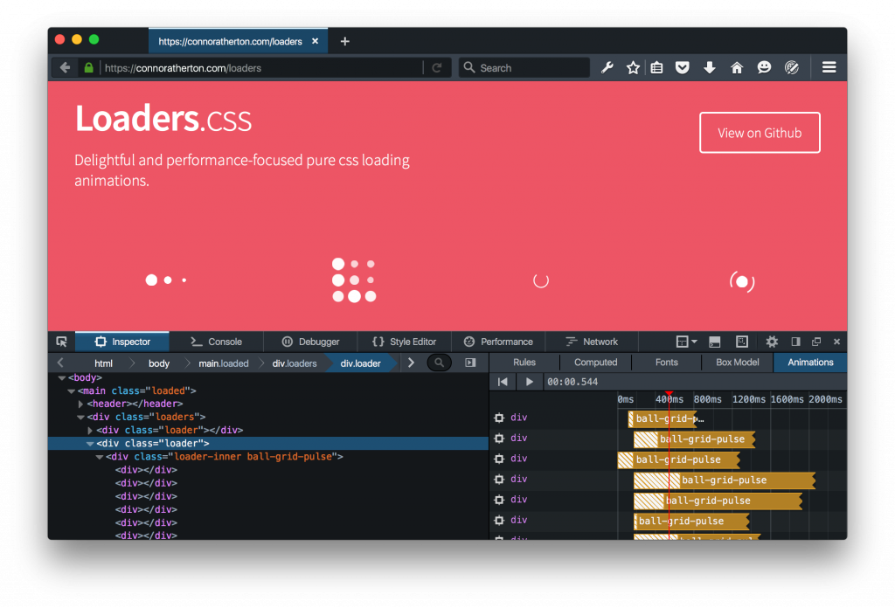
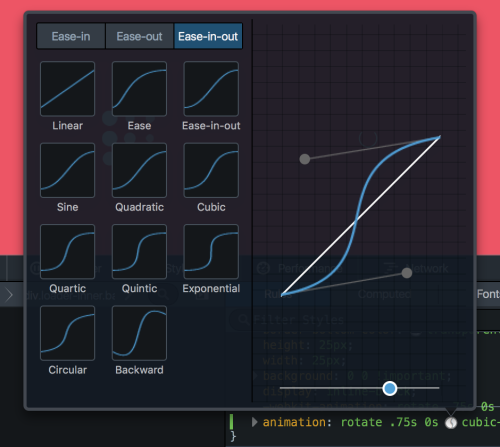
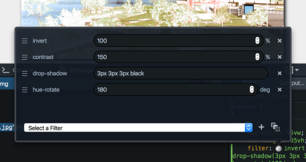
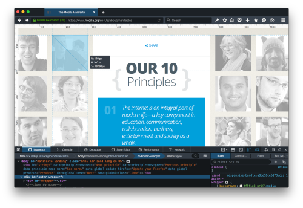
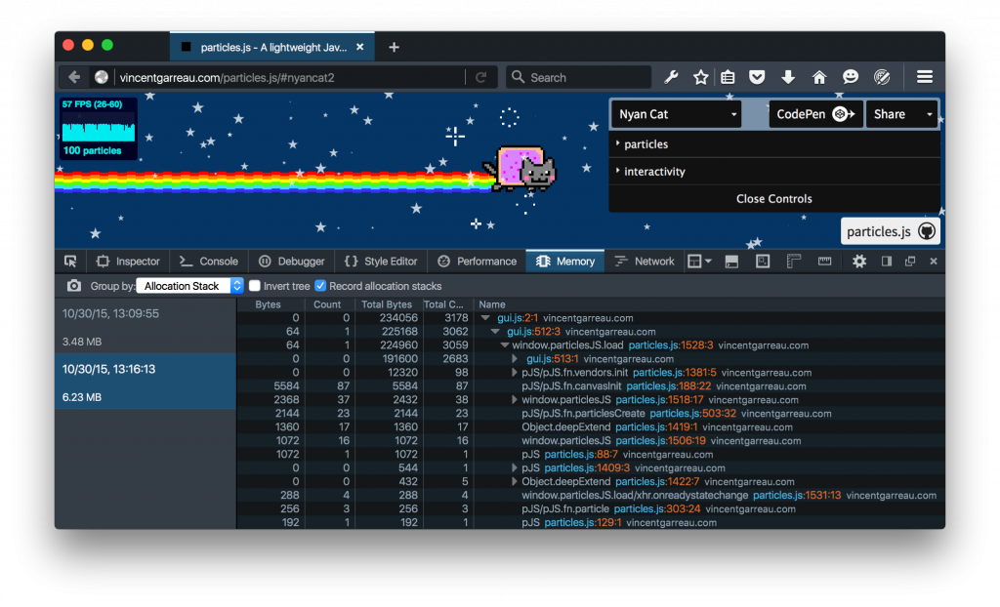
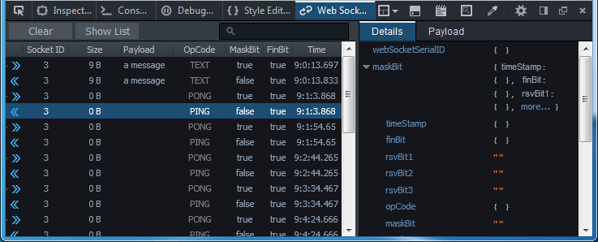

## 新的視覺編輯與記憶體管理工具

本月就是 [Firefox 開發者 (Developer) 版本](https://firefox.com/developer)推出滿一週年。我們很高興能向大家介紹新工具，而既有工具也另有改善之處，要讓你能用更直覺、更視覺化的方式開發 Web。

隨著 Web 越來越活潑、互動性高、更注重行動使用經驗，視覺設計師必須實驗更多動畫效果；而最新版的 Firefox 開發者 (Developer) 版本即提供相關工具，可更快、更順利的設計動畫。Firefox 開發者版本現提供一組視覺編輯工具，讓動畫師與視覺設計師使用起來就像日常工作一般。我們也內建一組可互動的強大工具，希望能讓設計師輕鬆使用並解決動畫技術上的難題。 視覺編輯工具應該也要讓動畫師能輕鬆上手，而不該只站在工程師的角度設計。

#### DevTools Challenger

你在看的我們對新工具的描述當然很好，但實際體驗就更棒了！為了讓你上手，我們與高知名度的 Web 動畫設計師 Rachel Nabors 合作打造出「DevTools Challenger」。立刻實際體驗 DevTools Challenger 上的全新視覺設計工具。記得要讓潛水艇一直向下到海床為止喔！

#### 動畫與 CSS 篩選器工具

現在網頁檢測器 (Inspector) 上的「[動畫 (Animation)](https://developer.mozilla.org/docs/Tools/Page_Inspector/How_to/Work_with_animations)」面板，能輕鬆消除、暫停、呈現網頁上的各組動畫。多虧此一功能已與 DOM 檢測器緊密整合，讓開發者能各組動畫之間切換完整視圖，亦可擷取其中幾個節點。

在你找出所需的動畫之後，只要輕點滑鼠就能啟動我們的貝茲曲線 (Cubic-bezier) 視覺效果編輯器。我們已經預先設定編輯器的一部分功能，可順暢顯示你的動畫。

我們也針對「[CSS 篩選器 (CSS Filter)](https://developer.mozilla.org/docs/Tools/Page_Inspector/How_to/Edit_CSS_filters)」設計了類似的編輯器，讓你能新增、移除、調整、重設順序，並即時從網頁上看到效果。

#### 測量與色彩

Firefox 開發者版本另提供 2 項全新的配置微調功能：現可沿著網頁邊界啟動「[像素量尺 (Pixel ruler)](https://developer.mozilla.org/docs/Tools/Rulers)」，或以拖曳方式量測網頁的任意多邊形區域。

檢測器現另預設顯示 CSS 色彩「如同原始單位 (As authored)」，且邊按住 Shift 邊於色彩樣本小圈上點擊滑鼠，就能循環顯示對等的「hex」、「rgb」、「hsl」等色彩值。當然也有「[滴管 (Eyedropper) 工具](https://developer.mozilla.org/docs/Tools/Eyedropper)」可從網頁上選取色彩。

#### 記憶體快照

新的「記憶體 (Memory)」工具，可讓前端工程師了解網頁分配＼保留記憶體的方法，再進一步將之最佳化。此工具會先拍攝 heap 的快照，再讓你進一步細分已保留的物件類型 (Object type)、配置堆疊 (Allocation Stack)，或內部表示 (Internal representation)。希望你會喜歡此功能，且我們將續推更多強化功能！

#### WebSocket Debugging API

最後，很高興宣佈 Firefox 現提供可監控 WebSocket frame 的 API (Bug 1203802)，這也是構成完整 WebSocket 檢測工具的第一步。開發者工具工程師 Jan Odvarko 已設計了[實驗性的附加元件](https://github.com/firebug/websocket-monitor/wiki)，可檢測 WebSocket 流量。立刻安裝並體驗此附加元件吧！我們當然歡迎你隨時提供試用意見！

現可到這裡[下載 Firefox 開發者版本](https://mozilla.com.tw/firefox/developer/)。可直接在下方留下意見，或透過 Twitter 上的 @FirefoxDevTools 讓我們知道你對這些功能的想法。

原文連結：[Developer Edition 44: New visual editing and memory management tools](https://hacks.mozilla.org/2015/11/developer-edition-44-creative-tools-and-more/)
