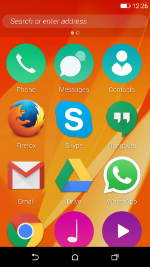
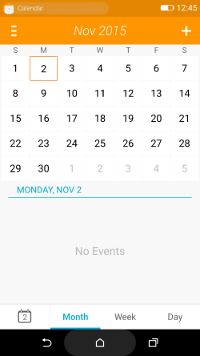
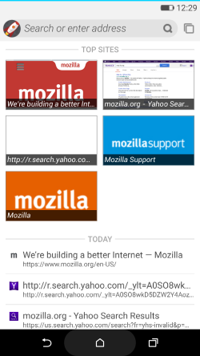

我們已於全球發佈 Firefox OS 2.5 版本，同時亦釋出早期實驗版本 ─「Firefox OS 2.5 開發者預覽 (Developer Preview)」App，可供開發者下載至 Android 裝置上一睹為快。目前最新版本的 Firefox OS 提供以下功能：

- 附加元件： 如同大家在桌面版瀏覽器所愛用的附加元件 (Add-on)，[Firefox OS 附加元件](https://developer.mozilla.org/en-US/Firefox_OS/Add-ons)現可擴增為單一 App、多個 App，甚至可為系統 App。

- 隱私瀏覽模式搭配追蹤保護 (Tracking Protection) 功能： 追蹤保護為 Firefox 的隱私新功能，讓使用者可跨多個網站控制本身瀏覽活動受到追蹤的方式。

- Pin the Web： [「釘選 Web (Pin the Web，暫譯)」](https://wiki.mozilla.org/Pin_the_Web)可除去 Web App 與網站之間的人為差異，讓你直接將網站或網頁釘選到自己的主畫面上，以方便後續使用。

若要了解此版本的所有特色，請參閱[Firefox OS v2.5](https://www.mozilla.org/firefox/os/2.5/)。

Firefox OS 2.5 開發者預覽版就是 App，不需重新刷機或取代既有的 Android 系統，卻是在 Android 裝置上提供額外的主畫面以利大家體驗。若你有興趣嘗試，就立刻用自己的 Android 裝置造訪 [Firefox OS 2.5 Developer Preview](https://d2yw7jilxa8093.cloudfront.net/B2GDroid-mozilla-central-nightly-latest.apk)。

主畫面上的 Android Apps 與 Web App

Firefox OS 行事曆搭配 Android 的瀏覽列

Firefox OS 瀏覽器首頁

#### 什麼是 Firefox OS 2.5 開發者預覽版？

你一定想問該如何參與 Firefox OS 開放源碼專案？目前仍是只能透過特定硬體 (如 Flame 手機) 下載最新版 Firefox OS，但我們現正努力讓更多人能輕鬆取得 Firefox OS。任何人都能到[Firefox OS Participation Hub](https://firefoxos.mozilla.community/) 取得最新的 Firefox OS 相關資訊。[B2G-installer 附加元件](https://github.com/mozilla-b2g/b2g-installer)則可讓你將完整的 Firefox OS 刷到 Android 裝置之上 (特別說明：Firefox OS 仍屬開發階段。請勿期待系統能完全不出錯或可穩定執行)。

若以現有硬體刷機，也可能遺失使用者資料或找不到你所慣用的 Android App。且刷機亦必須承擔裝置變磚的風險。Firefox OS 2.5 開發者預覽版則是以 Firefox OS 的[Gaia (UI) 層](https://developer.mozilla.org/en-US/docs/Mozilla/Firefox_OS/Platform/Gaia/Introduction_to_Gaia)取代 Android 主畫面，避免上述的潛在風險。你可使用 Firefox OS 並同時完整保留自己的 Android App。Firefox OS 2.5 開發者預覽版將能接觸全世界更多 Open Web 的開發者、測試人員、翻譯人員、擁護群眾。

如果你急於一窺 Firefox OS 或體驗新功能，則 Firefox OS 2.5 開發者預覽版也可輕鬆讓你入門並省去所有麻煩。只要下載此 App，不需刷機即可體驗 Firefox OS 的功能。一旦體驗完畢，也只要像其他 App 一樣將之移除即可。如果你意欲貢獻程式碼或回報錯誤，則此 App 也能讓你輕鬆參與。

#### 目的為何？

如同其他的完整作業系統，Firefox OS 亦具備本身的作業管理程式、公用程式、瀏覽按鈕、相關設定，還有更多。而要附在 Android 之上執行，則代表這些 OS 元素可能會與相同的 Android 系統功能衝突。當初設計 Android 啟動器之時，並未考量到要取代這些 OS 功能。因此我們盡可能佈署了多樣的迂迴替代方案，藉以提升整體的使用者經驗。舉例來說，Android 主要的瀏覽方式之一就是「退回」鍵；但 Firefox OS 則無。我們正努力減少類似的問題，因此目前的 Firefox OS 2.5 開發者預覽版既然歸為實驗性質，也就難免發生錯誤。Mozilla 希望能集思廣益，透過大家發現更多問題並修復錯誤。

#### 在 Firefox OS 2.5 開發者預覽版上進行開發

不論是要滿足好奇心、測試自己的想法、提升效能以貢獻專案，或是針對上述的 Android 系統功能解決衝突問題，我們都希望你盡情把玩 Firefox OS 2.5 開發者預覽版。你可到[這裡找到從無到有的 App 開發指南](https://wiki.mozilla.org/B2gdroid)。或可利用 [Firefox 開發者 (Developer) 版本](https://www.mozilla.org/en-US/firefox/developer/)瀏覽器中的 [WebIDE](https://developer.mozilla.org/en-US/docs/Tools/WebIDE)，直接修改 Firefox OS 開發者預覽版的 App 配置與組合。

#### 不寫程式也能參與

就算不貢獻程式碼也同樣能參與。最簡單的方法，就是在自己的 Android 裝置上安裝 Firefox OS 2.5 開發者預覽版。一旦發現問題或任何無法運作的功能，歡迎立刻[提報錯誤](https://bugzilla.mozilla.org/enter_bug.cgi?product=B2GDroid)。另可至 [Firefox OS Participation Hub](https://firefoxos.mozilla.community/) 找到其他參與方式。

#### 已支援的裝置

目前版本僅能於[搭載 ARM](https://www.wikiwand.com/en/ARM_architecture) 的裝置中運作。無法安裝於 x86 裝置之上。

#### 最後提醒

Mozilla 很高興能發佈「Firefox OS 2.5 Developer Preview」App。我們一直努力要讓 Android 使用者獲得 Firefox OS 經驗。一如 Mozilla 的傳統，感謝社群鼎力襄助，也歡迎任何有建設性的反饋意見。

如果有新款硬體或裝置上的 Firefox OS 執行問題，可透過[dev-fxos 郵件群組](https://lists.mozilla.org/listinfo/dev-fxos)或 IRC 上的 #fxos 踴躍提出。

原文連結：[Firefox OS 2.5 Developer Preview, an experimental Android app](https://hacks.mozilla.org/2015/11/firefox-os-2-5-developer-preview-an-experimental-android-app/)
